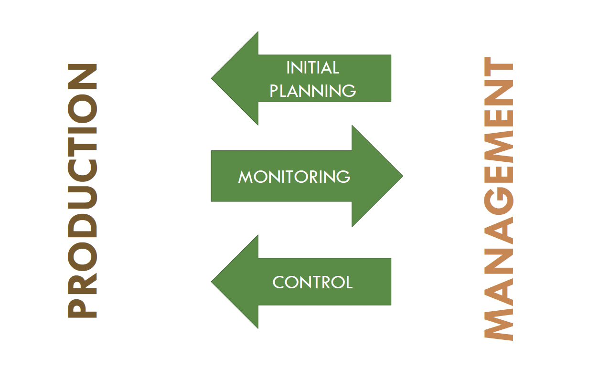
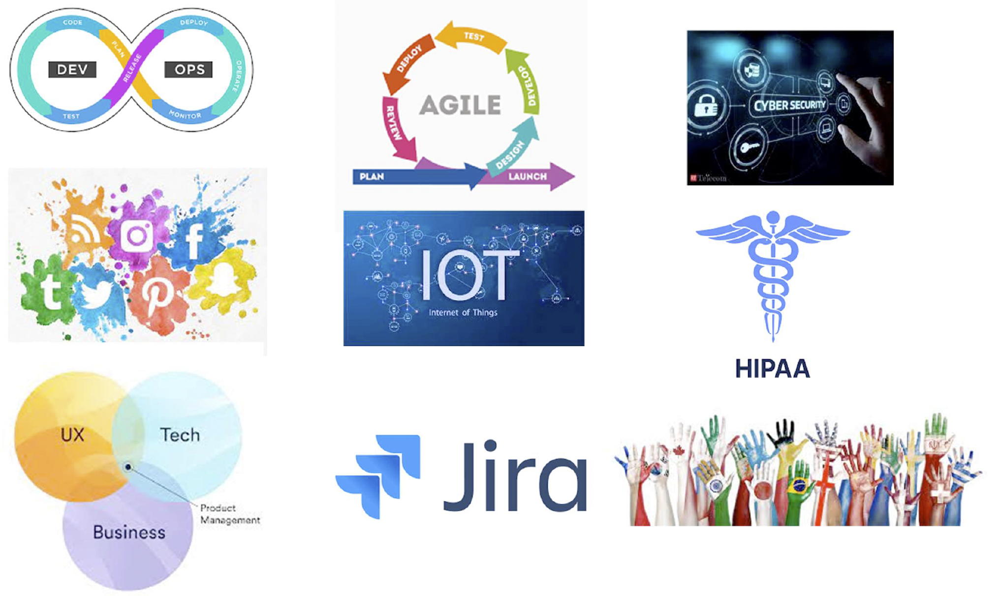
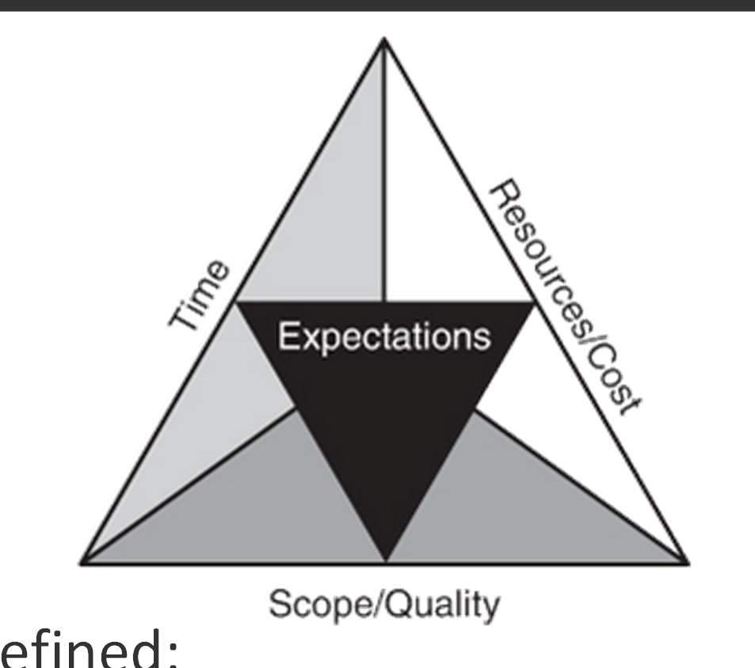
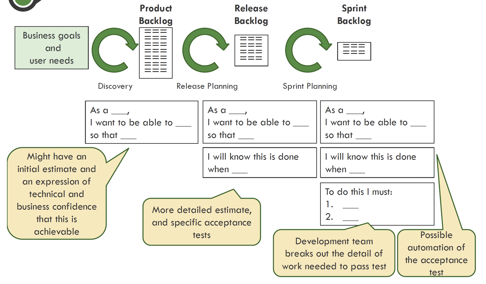
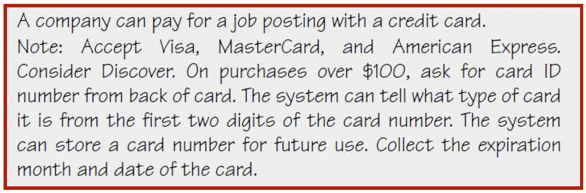
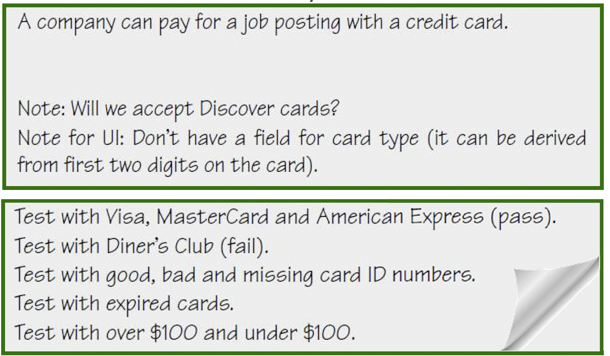
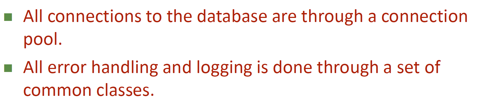
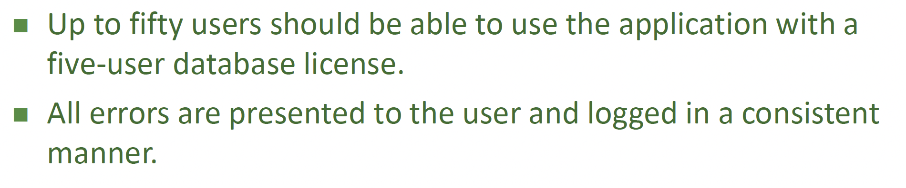

# 01. Introduction to Project Management

- [01. Introduction to Project Management](#01-introduction-to-project-management)
  - [D1. Market research and SWOT](#d1-market-research-and-swot)
    - [Executive Summary](#executive-summary)
    - [SWOT Analysis](#swot-analysis)
      - [Understanding SWOT Components](#understanding-swot-components)
      - [Strengths (Internal, Positive)](#strengths-internal-positive)
      - [Weaknesses (Internal, Negative)](#weaknesses-internal-negative)
      - [Opportunities (External, Positive)](#opportunities-external-positive)
      - [Threats (External, Negative)](#threats-external-negative)
      - [Conducting an Effective SWOT Analysis for Software Projects](#conducting-an-effective-swot-analysis-for-software-projects)
      - [SWOT Analysis Matrix Example for a Web Application Project](#swot-analysis-matrix-example-for-a-web-application-project)
      - [Beyond SWOT: Advanced Analysis Techniques](#beyond-swot-advanced-analysis-techniques)
  - [D2. Areas, tasks and modalities in project management](#d2-areas-tasks-and-modalities-in-project-management)
    - [Introduction to Project Management](#introduction-to-project-management)
    - [Knowledge Areas of Project Management](#knowledge-areas-of-project-management)
    - [Predictive vs Adaptive Management](#predictive-vs-adaptive-management)
      - [Predictive Management](#predictive-management)
      - [Adaptive Management](#adaptive-management)
      - [Comparison Table: Predictive vs Adaptive](#comparison-table-predictive-vs-adaptive)
      - [Hybrid Approach](#hybrid-approach)
    - [Development vs Management](#development-vs-management)
    - [Project Management Overview](#project-management-overview)
      - [Essential elements for a successful project](#essential-elements-for-a-successful-project)
      - [What is a project?](#what-is-a-project)
      - [Trends in Project Management](#trends-in-project-management)
      - [Balancing the competing demands](#balancing-the-competing-demands)
    - [Roles and Skills of a Project Manager](#roles-and-skills-of-a-project-manager)
      - [The Multiple Roles of a Project Manager](#the-multiple-roles-of-a-project-manager)
      - [Essential Skills for Project Management Excellence](#essential-skills-for-project-management-excellence)
        - [Hard Skills: The Technical Foundation](#hard-skills-the-technical-foundation)
        - [Soft Skills: The Human Element](#soft-skills-the-human-element)
      - [Common Mistakes to Avoid](#common-mistakes-to-avoid)
      - [Developing Your Project Management Capabilities](#developing-your-project-management-capabilities)
    - [Involvement vs commitment](#involvement-vs-commitment)
  - [D3. Product Backlog](#d3-product-backlog)
    - [User Stories](#user-stories)
      - [What Are User Stories?](#what-are-user-stories)
      - [Examples of Well-Written User Stories](#examples-of-well-written-user-stories)
      - [The Value of User Stories](#the-value-of-user-stories)
      - [Writing Effective User Stories - Practical Tips](#writing-effective-user-stories---practical-tips)
      - [Common User Story Pitfalls to Avoid](#common-user-story-pitfalls-to-avoid)
      - [Linking User Stories to Business Goals](#linking-user-stories-to-business-goals)
    - [Roles and Responsibilities](#roles-and-responsibilities)
    - [Acceptance Tests](#acceptance-tests)
    - [User Story Lifecycle](#user-story-lifecycle)
    - [Advantages and Disadvantages of User Stories](#advantages-and-disadvantages-of-user-stories)
    - [Writing Effective User Stories (INVEST Criteria)](#writing-effective-user-stories-invest-criteria)
      - [Independent](#independent)
      - [Negotiable](#negotiable)
      - [Valuable](#valuable)
      - [Estimable (Handling Uncertainty)](#estimable-handling-uncertainty)
      - [Small (Splitting Epics)](#small-splitting-epics)
      - [Testable](#testable)
      - [Practical Exercise: Applying INVEST to Improve User Stories](#practical-exercise-applying-invest-to-improve-user-stories)
    - [Real-world Example: Bookshop Application](#real-world-example-bookshop-application)
    - [Study Notes \& Good Practices](#study-notes--good-practices)
    - [Recommended Reading (for deeper study):](#recommended-reading-for-deeper-study)

## D1. Market research and SWOT

This section provides a detailed overview of market research methodologies, including an outline of SWOT (Strengths, Weaknesses, Opportunities, and Threats) analysis. The following content integrates essential points from our reference material on market research and SWOT, expanded with updated insights relevant to today's competitive landscape.

---

### Executive Summary

A clear, concise description of the business idea is crucial for establishing the context and objectives of the project. The product or service should be described in terms of its innovative aspects, primary functions, target audience, and projected benefits. In this stage, it is helpful to detail:

- **Product/Business Description**: Provide a clear explanation of what your product or service is, how it addresses market needs, and what unique value it offers.
- **State of the art, market and competition**: Analyze the current market landscape, including competitors, trends, and potential opportunities.
- **Financial projection**: Estimate the financial viability of your project, including funding requirements, revenue projections, and potential return on investment.
- **Objectives**: Outline specific goals you aim to achieve, such as market share, profit margins, or social impact.
- **Development team**: Introduce key team members, their roles, and how their skills contribute to the project's success.
- **Scope and Constraints**: Define boundaries like budget, time, and resources.
- **Stakeholders**: Identify key stakeholders and their interests in the project. Clients, users, investors, and regulatory bodies are examples of stakeholders who may influence project outcomes.

**Market Research**

Market research involves systematically gathering, analyzing, and interpreting data about a market. It encompasses understanding consumer needs, preferences, behaviors, and market size, as well as spotting key trends.

- **State of the Art**: Examine the current trends and innovations in your industry. Identify leading competitors and analyze best practices.
- **Market and Competition**: Assess market size, growth rates, barriers to entry, and potential partners or collaborators. Understanding market dynamics ensures your product or service remains competitive.
- **Financial Projection**: Estimate the financial viability of your product or service, including funding opportunities, projected revenues, pricing models, and potential return on investment.

**Development Team**

- **Team Members**: Highlight the skills and roles of each contributor (e.g., IT specialists, designers, consultants).
- **Stakeholders**: Identify users, clients, and any regulatory or public organizations influencing your project.

**SMART Goals**

Your project's objectives should follow the SMART criteria:

- **Specific**: Clearly defined and unambiguous.
- **Measurable**: Quantifiable indicators to track progress.
- **Achievable and Agreed to**: Realistic and supported by team consensus.
- **Rewarding and Realistic**: Aligned with broader organizational or personal motivations.
- **Time-based**: Defined deadlines to measure success.

### SWOT Analysis

A SWOT Analysis is a structured planning method that evaluates four elements of a project or business venture: Strengths, Weaknesses, Opportunities, and Threats. It provides a comprehensive framework for understanding your project's competitive position and developing strategic planning.

#### Understanding SWOT Components

SWOT elements are categorized along two dimensions:

- **Internal vs. External factors**: Strengths and weaknesses are internal to your organization or project, while opportunities and threats are external factors.
- **Positive vs. Negative factors**: Strengths and opportunities are positive elements, while weaknesses and threats are negative elements.

#### Strengths (Internal, Positive)

Strengths are the characteristics of a **business or project** that give it an **advantage over others** in the market. These are internal attributes and resources that support successful outcomes.

**Key questions to identify strengths:**

- What do we do exceptionally well?
- What unique resources or capabilities do we possess?
- What advantages do we have over our competitors?
- What do our customers/users see as our strengths?

**Examples of strengths in software projects:**

- Highly skilled development team with specialized expertise
- Proprietary algorithms or unique intellectual property
- Strong understanding of target user needs
- Established brand recognition and reputation
- Robust technology infrastructure
- Superior user experience design capabilities
- Efficient development processes

**Case study example:** A software startup developing a machine learning platform might identify strengths in their PhD-level data science team, proprietary algorithms developed during academic research, and existing relationships with potential enterprise clients from previous consulting work.

#### Weaknesses (Internal, Negative)

Weaknesses are characteristics of a **business or project** that place it at a **disadvantage relative to others**. These are internal factors that might hinder achievement of objectives.

**Key questions to identify weaknesses:**

- What could we improve?
- What resources or capabilities do we lack?
- What do our competitors do better than us?
- Where are we most vulnerable?

**Examples of weaknesses in software projects:**

- Limited funding or financial resources
- Gaps in technical expertise in crucial areas
- Technical debt in existing systems
- Inadequate testing processes
- Poor documentation practices
- Limited market presence or brand recognition
- High staff turnover or key person dependencies

**Case study example:** The same machine learning startup might identify weaknesses in their limited experience with enterprise sales cycles, lack of a dedicated DevOps team, and insufficient capital to sustain a long sales cycle before generating revenue.

#### Opportunities (External, Positive)

Opportunities are elements in a company's **external environment** that could be **exploited to its advantage**. These are favorable external factors that could enhance performance.

**Key questions to identify opportunities:**

- What favorable circumstances are we facing?
- What interesting trends are we aware of?
- What changes in technology offer new possibilities?
- What changes in market needs align with our capabilities?

**Examples of opportunities in software projects:**

- Emerging markets or untapped customer segments
- New technologies that can be leveraged
- Changes in regulations that create demand for solutions
- Competitors' weaknesses that can be exploited
- Industry pain points lacking adequate solutions
- Strategic partnership possibilities
- Economic or social trends creating new needs

**Case study example:** The machine learning startup might identify opportunities in the growing demand for AI solutions in healthcare compliance, recent regulatory changes requiring more sophisticated data analysis, and the trend of enterprises increasing their AI implementation budgets.

#### Threats (External, Negative)

Threats are elements in a company's **external environment** that could cause **challenges** to the business or project. These are unfavorable external factors that might present challenges.

**Key questions to identify threats:**

- What obstacles do we face?
- What is our competition doing?
- Are quality standards or specifications for our job, products, or services changing?
- Is changing technology threatening our position?
- Do we have cash-flow or debt problems?

**Examples of threats in software projects:**

- Emerging competitors or market saturation
- Changing regulatory requirements
- Rapid technological changes making current solutions obsolete
- Economic downturns affecting client budgets
- Cybersecurity vulnerabilities and threats
- Changes in customer expectations or behavior
- Talent shortage in critical technical areas

**Case study example:** The machine learning startup might identify threats in large tech companies entering the same market segment, potential regulatory changes regarding algorithmic accountability, and the general shortage of data science talent that could affect hiring and retention.

#### Conducting an Effective SWOT Analysis for Software Projects

**Step 1: Preparation**

- Define the objective of your analysis clearly
- Assemble a diverse team representing different perspectives
- Gather relevant market research, competitive analysis, and internal performance data

**Step 2: Brainstorming**

- Use structured brainstorming techniques to identify factors in each category
- Encourage open and honest input from all participants
- Focus on specific, relevant factors rather than generic statements

**Step 3: Analysis and Prioritization**

- Review all items and eliminate duplicates
- Group related items together
- Rank items by importance and impact
- Focus on the most significant factors that will truly influence success

**Step 4: Strategy Development**

- Develop strategies to:
  - Build on strengths
  - Address weaknesses
  - Capitalize on opportunities
  - Mitigate threats
- Create specific action plans for implementing these strategies

**Step 5: Integration with Project Planning**

- Incorporate SWOT insights into your project planning documents
- Use the analysis to inform risk management plans
- Review and update the SWOT analysis at key project milestones

#### SWOT Analysis Matrix Example for a Web Application Project

| Strengths                                                                                                                                                                                                             | Weaknesses                                                                                                                                                             |
| --------------------------------------------------------------------------------------------------------------------------------------------------------------------------------------------------------------------- | ---------------------------------------------------------------------------------------------------------------------------------------------------------------------- |
| • Experienced UX design team • Proprietary frontend framework • Strong relationships with existing clients • Scalable cloud infrastructure                                                                   | • Limited mobile development expertise • Technical debt in legacy API • Understaffed QA team • Dependency on third-party payment processor                    |
| **Opportunities**                                                                                                                                                                                                     | **Threats**                                                                                                                                                            |
| • Growing demand for contactless solutions • Potential partnership with complementary service provider • International market expansion possibilities • New API standards creating integration opportunities | • New competitor with significant funding • Potential privacy regulation changes • Rising cloud infrastructure costs • Customer hesitancy about data security |

#### Beyond SWOT: Advanced Analysis Techniques

While SWOT provides a valuable foundation, consider these advanced techniques for deeper analysis:

1. **TOWS Matrix**: Takes SWOT a step further by explicitly mapping strategies that:

   - Use strengths to take advantage of opportunities (S-O strategies)
   - Use strengths to avoid threats (S-T strategies)
   - Overcome weaknesses by taking advantage of opportunities (W-O strategies)
   - Minimize weaknesses and avoid threats (W-T strategies)

2. **PEST Analysis**: Examines Political, Economic, Social, and Technological factors that might influence your project.

3. **Porter's Five Forces**: Analyzes competitive intensity and market attractiveness.

By conducting a thorough SWOT analysis and using it to inform strategic planning, project managers can significantly improve their project's chances of success in a competitive environment.

---

**Instructions to update the project tracking [excel](Tracking.xlsx) file**

- TEAM

  - Add team members and assign a user (short name) to each of them

- WBS

  - Always use two levels (Task-Subtask)
  - Use significant names
  - Do not mix tasks and subtasks in the same row
  - Add an estimation for each subtask
  - Do not write in blue cells

- TRACKING

  - Add date and times
  - Select task, subtask and author from the lists
  - Add one row for each member-subtask pair

- Dynamic tables and graphs
  - Update

---

## D2. Areas, tasks and modalities in project management

### Introduction to Project Management

Project Management (PM) involves planning, organizing, motivating, and controlling resources to achieve specific goals.

### Knowledge Areas of Project Management

Project Management is organized into ten major knowledge areas, each representing a set of concepts, terms, and activities that make up a professional field or area of specialization. Understanding these areas is crucial for effective project management:

1. **Integration Management**: Coordinates and unifies all project elements and processes.

   - _What it involves_: Project charter development, project management plan, directing and managing project work, monitoring and controlling project work, managing change control, closing project phases or the project.
   - _Example_: A software development project manager creates a unified project plan that integrates the requirements, schedule, budget, quality measures, and resource allocation into a coherent whole, ensuring all project components work together seamlessly.

2. **Scope Management**: Ensures the project includes all the work required, and only the work required, to complete the project successfully.

   - _What it involves_: Requirements collection, scope definition, creating work breakdown structure (WBS), scope validation, and scope control.
   - _Example_: For a mobile app development project, the project manager creates a detailed WBS that breaks down all necessary features and components, while actively preventing scope creep when stakeholders request additional features not in the original plan.

3. **Time Management**: Focuses on the processes required to ensure timely completion of the project.

   - _What it involves_: Activity definition, sequencing, resource estimation, duration estimation, schedule development and control.
   - _Example_: Using critical path analysis, a construction project manager identifies that foundation work and electrical installations are critical activities that must be completed on schedule to avoid delaying the entire project.

4. **Quality Management**: Ensures the project will satisfy the stated or implied needs for which it was undertaken.

   - _What it involves_: Quality planning, quality assurance, and quality control.
   - _Example_: A medical device development project implements rigorous testing protocols at various stages of development to ensure the final product meets FDA approval standards and patient safety requirements.

5. **Resource Management**: Involves organizing, managing, and leading the project team and physical resources.

   - _What it involves_: Human resource planning, acquiring team members, developing the team, and managing the team.
   - _Example_: An IT infrastructure project manager assigns specialized roles based on expertise, schedules regular skill development sessions, and balances workload to prevent burnout while ensuring hardware resources are available when needed.

6. **Communications Management**: Ensures proper generation, collection, distribution, storage, retrieval, and disposition of project information.

   - _What it involves_: Communications planning, information distribution, performance reporting, and stakeholder management.
   - _Example_: For a global software implementation project, the manager establishes a communication plan with regular status meetings, an online project portal for documentation, and tailored reporting for different stakeholder groups across multiple time zones.

7. **Procurement Management**: Covers the processes needed to purchase or acquire products, services, or results from outside the project team.

   - _What it involves_: Procurement planning, solicitation planning, solicitation, source selection, contract administration, and contract closure.
   - _Example_: A large event management project requires contracting specialized audio-visual services, catering, and venue rental, all of which the project manager handles through formal RFP processes and vendor selection criteria.

8. **Stakeholder Management**: Identifies and engages with people, groups, or organizations that could impact or be impacted by the project.

   - _What it involves_: Stakeholder identification, planning stakeholder management, engaging stakeholders, and monitoring stakeholder engagement.
   - _Example_: During a hospital information system upgrade, the project manager identifies and analyzes all stakeholders (doctors, nurses, administrators, IT staff, patients) and develops specific engagement strategies for each group to address their concerns and ensure buy-in.

9. **Risk Management**: Involves identifying, analyzing, and responding to project risks.

   - _What it involves_: Risk management planning, risk identification, qualitative and quantitative risk analysis, risk response planning, and risk monitoring and control.
   - _Example_: For an outdoor festival project, the manager creates contingency plans for weather disruptions, including tenting options, schedule flexibility, and insurance coverage, assigning specific team members to monitor weather forecasts as the event approaches.

10. **Cost Management**: Involves processes in planning, estimating, budgeting, financing, funding, and controlling costs.
    - _What it involves_: Cost estimation, cost budgeting, and cost control.
    - _Example_: A residential construction project manager develops a detailed budget with separate cost centers for materials, labor, permits, and subcontractors, implementing an earned value management system to track actual costs against planned expenditures throughout the project.

These knowledge areas interact and overlap throughout the project lifecycle. Effective project managers develop competency across all these areas while recognizing when to emphasize particular aspects based on the project's unique characteristics and challenges.

### Predictive vs Adaptive Management

Project management approaches generally fall into two major categories: predictive and adaptive. Understanding when to apply each approach is fundamental to project success.

#### Predictive Management

Predictive management (also known as traditional, conventional, or waterfall project management) works best when:

- The **scope** of work **and requirements** for the project **are clear, stable, and well-understood**
- The technology and methods used are proven and familiar
- Similar projects have been done before, providing historical data
- Regulatory or compliance requirements demand detailed documentation upfront

This approach involves comprehensive planning at the beginning, with the expectation that the plan will remain relatively stable throughout the project lifecycle.

**Key characteristics:**

- Sequential phases with clear deliverables
- Detailed documentation
- Formal change control processes
- Emphasis on following the plan
- Progress measured against the baseline plan

**Popular methodologies:**

- **PMBOK (Project Management Body of Knowledge)**: A comprehensive framework from the Project Management Institute (PMI)
- **PRINCE2 (Projects in Controlled Environments)**: A process-based method widely used in government and private sectors
- **Waterfall**: A linear sequential approach where each phase must be completed before the next begins

**Real-world example**: Building a bridge would typically use a predictive approach. The requirements are clear (span the river, support certain weight), the technology is well-established, and changes midway through construction would be extremely costly and potentially dangerous.

#### Adaptive Management

Adaptive management (also known as responsive, iterative, or agile project management) is preferable when:

- The **scope** of work and requirements for the project are difficult to define upfront
- The business environment or technology is rapidly changing
- Innovation and discovery are central to the project
- Quick delivery of business value is prioritized over comprehensive documentation

This approach involves planning in shorter cycles, with the expectation that plans will evolve as more is learned through project execution.

**Key characteristics:**

- Iterative and incremental development
- Requirements clarified in short cycles
- Embraces change as a reality and opportunity
- Emphasizes working deliverables over documentation
- Progress measured by working functionality

**Popular frameworks:**

- **Scrum**: Defines roles, events, and artifacts to guide teams in delivering value in short iterations
- **Kanban**: Visualizes workflow and limits work in progress to optimize flow
- **XP (Extreme Programming)**: Emphasizes technical excellence and customer satisfaction
- **DSDM (Dynamic System Development Method)**: Provides a framework for rapid application development
- **Crystal**: A family of methodologies tailored to team size and project criticality
- **FDD (Feature-Driven Development)**: Focuses on developing features that clients value

**Real-world example**: Developing a new mobile application often uses an adaptive approach. User preferences may change, technology evolves quickly, and releasing early versions allows for valuable user feedback to guide future development.

#### Comparison Table: Predictive vs Adaptive

| Aspect               | Predictive (Traditional)       | Adaptive (Agile)                |
| -------------------- | ------------------------------ | ------------------------------- |
| Requirements         | Defined upfront                | Emerge and evolve               |
| Documentation        | Comprehensive                  | Just enough                     |
| Planning             | Detailed upfront planning      | Progressive elaboration         |
| Change               | Formal change control          | Embraces change                 |
| Delivery             | Single delivery at project end | Frequent incremental deliveries |
| Team structure       | Hierarchical                   | Self-organizing                 |
| Customer involvement | Mainly at beginning and end    | Continuous throughout           |
| Risk management      | Risk mitigation plans upfront  | Continuous adaptation           |
| Measure of success   | Conformance to plan            | Business value delivered        |

#### Hybrid Approach

In reality, many projects benefit from a thoughtful combination of both approaches. A hybrid approach recognizes that:

- There is no "better" approach, only what fits the specific project you're working on
- Every project is unique and requires a tailored approach with differences in scale, scope, and requirements
- Considering the project characteristics first and _then_ selecting the right methodology is key

**When to consider a hybrid approach:**

- Complex projects with some well-defined requirements and some emerging requirements
- When parts of the project need strict compliance while others benefit from flexibility
- When transitioning from traditional to agile methodologies
- When different teams within the same project have different working styles

**Example of a hybrid approach**: A financial services company developing a new customer portal might use:

- Predictive approach for security features and regulatory compliance components
- Adaptive approach for user interface and customer experience features
- The PMI's PMBOK Guide framework includes considerations for Agile, acknowledging that elements of adaptive approaches can be incorporated into otherwise predictive projects

Remember that methodologies are tools, not dogmas. The best project managers understand the principles behind different approaches and apply them appropriately based on the specific needs of each project.

### Development vs Management

**Interactions between Development and Management:**

### Project Management Overview

#### Essential elements for a successful project

- Delivers as promised.
- Completes on time.
- Completes within budget.
- Delivers quality.
- Achieves original purpose.
- Meets all stakeholder expectations.
- Maintains "win-win" relationships.

#### What is a project?

A project is the work performed by an organization **one time** to produce a **unique** outcome.

- By _one time_, we mean the work has a definite beginning and a definite end.
- By _unique_, we mean the work result is different in one or more ways from anything the organization has produced before.

Examples of projects include the following:

- Building a new house
- Developing a new software application
- Performing an assessment of current manufacturing processes
- Improving an organizational business process
- Writing a book
- Relocating a company's technology infrastructure to a new location or to a cloud platform
- Merging two organizations
- Developing a new medical device

**What is not a project?**

Operational work (operations of an organization) is the ongoing, repetitive set of activities that sustain the organization.

Examples of ongoing operations include the following:

- Processing customer orders
- Performing accounts receivable and accounts payable activities
- Executing daily manufacturing orders
- Performing recommended equipment maintenance procedures
- Conducting customer account maintenance

#### Trends in Project Management

Project management continues to evolve in response to changing business environments, technological advancements, and organizational needs. Understanding these trends is essential for modern project managers who need to adapt their approaches and develop relevant skills.

**1. Agile Approaches**

Agile methodologies have fundamentally transformed project management, especially in software development and increasingly in other sectors.

- **Key drivers:**

  - Increasing pace of change in business requirements and market conditions
  - Need to adapt quickly and deliver value incrementally
  - Difficulty in developing detailed upfront plans in complex or innovative domains
  - Customer desire for earlier delivery and more frequent feedback opportunities

- **Real-world impact:**
  A healthcare technology company adopted Scrum for their patient portal development, shifting from 18-month release cycles to 2-week sprints. This allowed them to gather user feedback early, adjust priorities based on changing regulations, and deliver valuable features much sooner than competitors using traditional approaches.

**2. DevOps and DevSecOps Integration**

The integration of development, operations, and security has transformed how technology projects are managed and delivered.

- **Key characteristics:**

  - Continuous integration and continuous delivery (CI/CD) pipelines
  - Automated testing and deployment processes
  - Collaboration between traditionally separate teams (development, operations, security)
  - Emphasis on process automation and transparency

- **Real-world impact:**
  A financial services firm implemented DevSecOps practices, embedding security controls into their deployment pipeline rather than treating security as a final gate. This reduced security-related delays by 70%, allowed for more frequent releases, and improved the overall security posture of their applications.

**3. Product Management Orientation**

Organizations are increasingly shifting from project-based to product-based management approaches for long-lived digital offerings.

- **Key shifts:**

  - Teams organized around products rather than temporary projects
  - Focus on the entire product lifecycle, not just initial development
  - Continuous improvement and evolution rather than fixed endpoints
  - Strategic alignment of resources around product groups

- **Real-world impact:**
  A retail company reorganized from project-based teams to persistent product teams responsible for specific customer journeys (e.g., checkout experience, account management). This eliminated knowledge transfer issues between projects, increased feature delivery speed by 40%, and improved customer satisfaction as teams developed deeper domain expertise.

**4. Cybersecurity Integration**

As cyber threats continue to grow in frequency, scale, and impact, project managers must incorporate security considerations throughout the project lifecycle.

- **Key considerations:**

  - Security requirements integrated into initial planning
  - Regular security assessments during development
  - Security-focused testing prior to deployment
  - Ongoing monitoring and update strategies
  - Compliance with evolving regulations (GDPR, CCPA, etc.)

- **Real-world impact:**
  After a data breach affected a competitor, an e-commerce company made cybersecurity a core aspect of all projects. They implemented security checkpoints at each project phase, assigned security champions to each team, and developed a rapid response process for vulnerabilities. When a critical security flaw was discovered in a third-party component, they were able to patch all affected systems within hours rather than days.

**5. Mobile and Internet of Things (IoT) Expansion**

The proliferation of mobile devices and IoT sensors is creating new project opportunities and challenges.

- **Key trends:**

  - Growing use of mobile and wearable technologies across industries
  - Accelerating deployment of smart sensors in physical environments
  - Edge computing for processing data closer to its source
  - Design for multiple devices and form factors

- **Real-world impact:**
  A manufacturing company launched a project to implement IoT sensors throughout their production facilities. The project manager had to coordinate hardware installation, networking infrastructure, data analytics, and integration with existing systems. The resulting system provided real-time monitoring that reduced downtime by 23% and improved quality control.

**6. Social Media Integration**

Social media has become both a project management tool and a consideration in many projects' communication strategies.

- **Considerations:**

  - External communication and marketing channels
  - Customer feedback and engagement mechanisms
  - Internal collaboration platforms
  - Security and privacy implications

- **Real-world impact:**
  A government agency responsible for emergency management developed a comprehensive social media strategy as part of their public communications project. During a natural disaster, they were able to use these channels to distribute critical information, gather on-the-ground reports from affected areas, and coordinate volunteer efforts—reaching citizens much faster than through traditional channels.

**7. Project Management Collaboration Tools**

The shift to virtual and hybrid teams has accelerated the adoption of dedicated collaboration platforms.

- **Key capabilities:**

  - Cloud-based access for distributed teams
  - Real-time document collaboration
  - Task assignment and tracking
  - Video conferencing and chat integration
  - Automated reporting and dashboards

- **Real-world impact:**
  When the COVID-19 pandemic forced a sudden shift to remote work, an architectural firm rapidly adopted cloud-based collaboration tools for their ongoing projects. This enabled team members to access project files from home, conduct virtual design reviews with clients, and maintain productivity despite physical separation. They subsequently maintained a hybrid model even after reopening offices.

**8. Work Management Platforms**

Organizations are adopting comprehensive work management solutions that capture all aspects of project and product work.

- **Key features:**

  - Unified systems for tracking all work elements
  - Integration across the technology stack
  - Customizable workflows and approval processes
  - Advanced analytics and reporting
  - Support for multiple work methodologies

- **Real-world impact:**
  A marketing agency implemented a work management platform that integrated their project management, resource allocation, time tracking, and client approval workflows. This reduced administrative overhead by 30%, improved visibility into project status, and allowed them to better forecast resource needs for upcoming work.

**9. Privacy Compliance Requirements**

Regulations like GDPR and HIPAA are creating new project requirements and constraints.

- **Key impacts:**

  - Privacy by design principles integrated into project planning
  - Data protection impact assessments
  - User consent mechanisms
  - Data minimization strategies
  - Right to be forgotten functionality

- **Real-world impact:**
  A healthcare technology startup launching in the European market had to redesign their patient communication app to comply with GDPR requirements. This required implementing granular consent mechanisms, data encryption, and automated data retention policies. The project manager coordinated with legal experts, developers, and UI designers to ensure compliance without compromising usability.

**10. Virtual, Cross-functional, and Multicultural Teams**

Modern project teams increasingly span locations, departments, and cultural backgrounds.

- **Key challenges and opportunities:**

  - Coordinating across time zones and cultural differences
  - Leveraging diverse perspectives for innovation
  - Building team cohesion without physical proximity
  - Managing communication across functional boundaries
  - Adapting leadership styles to diverse team needs

- **Real-world impact:**
  A global pharmaceutical company formed a cross-functional team with members from R&D, manufacturing, regulatory affairs, and marketing to launch a new product simultaneously in multiple markets. The project manager implemented structured communication protocols, cultural awareness training, and collaborative decision-making processes that enabled the diverse team to deliver a successful global launch.

**11. Project Managers as Change Agents**

Project managers increasingly serve as organizational change leaders, not just technical project deliverers.

- **Key responsibilities:**

  - Stakeholder resistance management
  - Organizational readiness assessment
  - Change impact analysis
  - Training and support planning
  - Benefits realization tracking

- **Real-world impact:**
  When implementing a new enterprise resource planning (ERP) system, an experienced project manager recognized that technical implementation was only part of the challenge. They developed a comprehensive change management strategy that included early stakeholder engagement, departmental champions, tailored training programs, and post-implementation support. This approach significantly reduced resistance and accelerated adoption of the new system.

**12. Servant Leadership Approach**

The most effective project managers are adopting servant leadership principles to support their teams.

- **Key characteristics:**

  - Focus on removing obstacles for the team
  - Emphasis on team empowerment rather than control
  - Understanding stakeholder needs deeply
  - Facilitating collaboration rather than directing
  - Managing expectations proactively

- **Real-world impact:**
  A software development project manager shifted from a directive approach to a servant leadership model. Instead of detailed task assignments, they focused on clarifying goals, securing necessary resources, removing impediments, and supporting team decision-making. Team satisfaction increased, voluntary overtime increased during critical periods, and productivity improved as team members took greater ownership of their work.

**13. Vendor Management Complexity**

Projects increasingly rely on multiple external partners and service providers.

- **Key trends:**

  - Increased outsourcing of non-core activities
  - Growing use of specialized cloud services
  - Global supply chains for physical components
  - Contractual and relationship management needs

- **Real-world impact:**
  For a major IT infrastructure project, a telecommunications company had to coordinate five different vendors providing hardware, software, installation services, training, and ongoing support. The project manager developed a vendor coordination plan with clear interfaces between providers, joint milestone reviews, and integrated testing procedures to ensure all components worked together seamlessly.

**14. PMO and Governance Evolution**

Project Management Offices are evolving from enforcement bodies to strategic enablers.

- **Key shifts:**

  - From rigidity to flexibility in methodology
  - From administrative oversight to strategic portfolio management
  - From process compliance to value delivery
  - From controlling to enabling

- **Real-world impact:**
  A technology company transformed their traditional PMO into a Value Management Office focused on aligning projects with strategic objectives, providing coaching to project teams, and measuring business outcomes rather than just project outputs. This shift increased project success rates, reduced bureaucratic overhead, and improved the PMO's reputation within the organization.

**Implications for Project Managers**

These trends require project managers to continuously develop new skills and adapt their approaches. To succeed in this evolving landscape, project managers should:

1. **Develop versatility** in multiple project management approaches (predictive, adaptive, hybrid)
2. **Build technical literacy** even if not in technical roles
3. **Enhance communication skills** for virtual and diverse teams
4. **Strengthen strategic thinking** to connect projects to business value
5. **Cultivate change management** expertise
6. **Learn continuously** as new tools and methodologies emerge

By staying aware of these trends and proactively adapting, project managers can position themselves as valuable strategic assets to their organizations and increase the likelihood of project success in rapidly changing environments.

#### Balancing the competing demands

Every project is defined:

- to produce one or more deliverables (_scope_)
- within a defined time period (_time_)
- under an approved budget (_cost_) with a specified set of resources.

The deliverables must achieve a certain performance level (_quality_) and meet the approval of the key stakeholders (_expectations_).

### Roles and Skills of a Project Manager

The project manager (PM) is the driving force behind successful project delivery. This role demands a diverse set of skills and the ability to wear many different "hats" throughout the project lifecycle. Understanding these multifaceted roles is essential for anyone aspiring to excel in project management.

#### The Multiple Roles of a Project Manager

**Planner + Organizer**

The PM establishes the roadmap that will guide the entire project journey. In this role, the project manager:

- **Ensures that:**

  - The project is defined properly and completely for success
  - All stakeholders are identified and engaged appropriately
  - The work effort approach is determined and documented
  - Required resources are available when needed
  - Processes are in place to properly execute and control the project

- **Determines:**
  - The complete work effort for the project through detailed work breakdown structures
  - The proper sequence of the work activities, including dependencies and critical path
  - Realistic timelines for when the work will be accomplished
  - Resource allocation - who will do the work and what skills they need
  - Accurate budget estimates for how much the work will cost

_Real-world example:_ When planning a software implementation project, an effective PM will create a comprehensive project plan that includes a detailed WBS, resource-loaded schedule, risk register, communication plan, and quality management approach - all aligned with organizational objectives and stakeholder expectations.

**Police Officer + Bulldog**

The PM must ensure accountability and follow-through. In this role, the project manager:

- **Performs the follow-up to ensure that:**

  - Team member commitments are maintained and deadlines are met
  - Issues are identified early and resolved promptly
  - Action items are tracked and completed according to schedule

- **Consistently:**
  - Measures actual progress against the plan using appropriate metrics
  - Develops corrective actions when deviations occur
  - Reviews the quality of both project processes and deliverables
  - Enforces established project protocols and standards

_Real-world example:_ When a critical deliverable is at risk due to a team member's competing priorities, the PM must constructively address the situation, perhaps by negotiating with the functional manager, adjusting resource allocations, or revising the project schedule while maintaining focus on project objectives.

**Coach + Facilitator**

The PM must develop and empower the team. In this role, the project manager:

- **Is the one who:**

  - Determines each team member's role and helps them understand its importance to project success
  - Identifies motivational factors for each individual and applies them appropriately
  - Seeks opportunities to develop team members' skills and capabilities
  - Provides constructive, specific, and timely feedback on individual performances
  - Creates an environment where team members feel safe to contribute ideas and raise concerns

- **Ensures that stakeholders and team members who come from different perspectives:**
  - Understand each other despite differences in background, expertise, or priorities
  - Collaborate effectively to accomplish shared project goals
  - Resolve conflicts constructively when different viewpoints emerge
  - Build mutual respect that transcends departmental boundaries

_Real-world example:_ During a cross-functional project implementing a new CRM system, the PM might facilitate workshops where IT staff and sales representatives collaborate on requirements, ensuring technical constraints and user needs are both addressed while managing potential tensions between groups with different priorities.

**Insurance Agent + Problem Solver + Umbrella**

The PM must anticipate challenges and protect the team. In this role, the project manager:

- **Continuously works to:**

  - Identify potential risks before they materialize
  - Develop proactive response strategies for high-priority risks
  - Create contingency plans and reserves for uncertain events
  - Monitor risk triggers and warning signs

- **Resolves:**

  - Unforeseen technical issues that arise during execution
  - Interpersonal conflicts within the team
  - Resource constraints and competing priorities
  - Scope clarification questions
  - Takes necessary corrective actions to keep the project on track

- **Works to shield the project team from:**
  - Organizational politics that could distract from project work
  - Excessive administrative burden
  - Unnecessary meetings and interruptions
  - Scope creep and unreasonable demands
  - Allowing the team to stay focused and productive

_Real-world example:_ When an enterprise software project faces unexpected technical limitations, the PM might coordinate solution-finding sessions with technical experts, manage stakeholder expectations about potential impacts, and buffer the development team from immediate pressure while alternatives are explored.

**Persuader + Salesperson**

The PM must build consensus and champion the project. In this role, the project manager:

- **Gains agreement on:**

  - Project definition, approach, and success criteria
  - Balancing competing demands like scope, time, cost, and quality
  - Resource allocation decisions when multiple projects compete for limited resources
  - Resolution approaches for complex issues where stakeholders have different preferences

- **Functions as:**
  - The project's advocate in organizational priority discussions
  - A "change agent" helping stakeholders adapt to new processes or systems
  - An inspirational leader who motivates team members through challenges
  - A persuasive communicator who can explain project value to various audiences

_Real-world example:_ When seeking funding for a critical project enhancement, the PM must craft compelling business cases tailored to different stakeholders - emphasizing ROI to finance executives, strategic alignment to business leaders, and technical benefits to IT decision-makers.

**Point Person, Librarian, and Quartermaster**

The PM serves as the central coordinator for all project aspects:

- **Point Person** — Serves as:

  - The central contact for all project communications
  - The go-to resource for questions about any project aspect
  - The liaison between the project team and external stakeholders

- **Librarian** — Manages all:

  - Project documentation and knowledge repositories
  - Communications records and decision logs
  - Historical information that may inform future decisions
  - Lessons learned throughout the project

- **Quartermaster** — Ensures the project has:
  - The right human resources with appropriate skills
  - Necessary materials, equipment, and facilities
  - Access to required systems and information
  - Appropriate tools and infrastructure to support project work

_Real-world example:_ For a complex product launch, the PM maintains a comprehensive project portal with up-to-date documentation, coordinates cross-functional resources from marketing, sales, and product teams, and ensures all members have the tools, access, and information they need to execute their responsibilities.

#### Essential Skills for Project Management Excellence

To effectively fulfill these roles, project managers must develop a balanced combination of hard and soft skills.

##### Hard Skills: The Technical Foundation

1. **Budgeting and Financial Management**

   - Creating and tracking detailed project budgets
   - Understanding earned value management concepts (CPI, SPI)
   - Managing cash flow and resource utilization
   - Conducting cost-benefit analysis for project decisions

   _Development tip:_ Take financial courses specifically for project managers; practice creating and managing budgets for personal projects before tackling larger organizational initiatives.

2. **Project Management Methodologies and Tools**

   - Understanding various frameworks (PMBOK, PRINCE2, Agile methodologies)
   - Selecting appropriate approaches based on project characteristics
   - Adapting methodologies to fit organizational context
   - Utilizing PM software tools effectively (MS Project, JIRA, etc.)

   _Development tip:_ Pursue certifications like PMP, PRINCE2, or Certified Scrum Master; experiment with different PM tools through free trials to find what works best for your projects.

3. **Resource Management**

   - Forecasting resource requirements accurately
   - Balancing resource allocation across competing priorities
   - Tracking utilization and addressing over/under-allocation
   - Managing both human and material resources effectively

   _Development tip:_ Practice resource leveling exercises; shadow experienced resource managers; learn capacity planning techniques.

4. **Documentation and Reporting**

   - Creating clear, concise project documentation
   - Designing effective dashboards and visual reports
   - Tailoring communication to different stakeholder needs
   - Ensuring regulatory and compliance requirements are met

   _Development tip:_ Study examples of excellent project documentation; practice creating various report types; seek feedback on clarity and effectiveness of your documentation.

##### Soft Skills: The Human Element

1. **Adaptability and Problem-Solving**

   - Responding constructively to changing requirements
   - Identifying creative solutions to unexpected challenges
   - Making decisive calls with incomplete information
   - Maintaining composure during project crises

   _Development tip:_ Practice scenario planning; seek out challenging situations outside your comfort zone; develop a structured approach to problem-solving that you can apply under pressure.

2. **Emotional Intelligence**

   - Recognizing your own emotions and their impact on others
   - Understanding team members' motivations and concerns
   - Managing challenging personalities effectively
   - Building trust through consistency and empathy

   _Development tip:_ Seek feedback on your emotional responses; practice active listening; take EQ assessments and work on areas for improvement.

3. **Attention to Detail While Maintaining Strategic Vision**

   - Balancing tactical details with strategic objectives
   - Identifying critical details that could impact project success
   - Maintaining quality standards across all deliverables
   - Noticing early warning signs of potential issues

   _Development tip:_ Develop checklists for critical processes; practice "zooming in and out" between details and the big picture; review completed work with a critical eye.

4. **Decision-Making Under Uncertainty**

   - Evaluating options systematically
   - Understanding risk-reward tradeoffs
   - Making timely decisions without perfect information
   - Taking responsibility for outcomes

   _Development tip:_ Study decision-making frameworks; practice documenting decision criteria; conduct post-decision reviews to improve your process.

5. **Time Management and Prioritization**

   - Breaking complex projects into manageable tasks
   - Estimating time requirements realistically
   - Prioritizing effectively when everything seems urgent
   - Managing personal productivity to lead by example

   _Development tip:_ Use time-tracking tools to understand where your time goes; practice techniques like Pomodoro or time-blocking; regularly review and adjust priorities.

6. **Communication Across Different Levels and Functions**

   - Translating technical concepts for non-technical stakeholders
   - Presenting information with clarity and confidence
   - Listening actively to understand underlying concerns
   - Adapting communication style to different audiences

   _Development tip:_ Record and review your presentations; practice explaining complex concepts in simple terms; seek opportunities to communicate with diverse stakeholders.

7. **Negotiation and Conflict Resolution**

   - Finding win-win solutions to competing interests
   - Managing disagreements before they become conflicts
   - Facilitating productive discussions between opposing viewpoints
   - Building consensus among diverse stakeholders

   _Development tip:_ Study negotiation techniques like BATNA; practice mediating minor conflicts; reflect on your natural conflict style and work to expand your repertoire.

#### Common Mistakes to Avoid

Even experienced project managers can fall into these common traps:

1. **Strategic Misalignment**

   - Not ensuring that the project is aligned with organizational objectives
   - Failing to connect project activities to business value
   - Pursuing technical excellence without confirming business relevance

   _Prevention tip:_ Regularly revisit the business case and project charter; create a traceability matrix linking deliverables to strategic objectives.

2. **Stakeholder Expectation Mismanagement**

   - Not clearly documenting and agreeing on project goals and success criteria
   - Allowing scope creep without proper change control
   - Failing to manage competing stakeholder priorities
   - Not communicating limitations and constraints effectively

   _Prevention tip:_ Document expectations explicitly; implement formal change management; conduct regular stakeholder satisfaction checks.

3. **Schedule and Resource Optimism**

   - Creating unrealistic timelines without adequate input from the team
   - Not accounting for dependencies and constraints
   - Failing to build in contingency for inevitable uncertainties
   - Not considering team capacity and productivity realistically

   _Prevention tip:_ Use historical data to inform estimates; involve the team in planning; apply appropriate buffer based on project risk profile.

4. **Unclear Accountability**

   - Not clearly deciding and communicating who is responsible for what
   - Creating ambiguous ownership of deliverables or decisions
   - Failing to document and track action items systematically

   _Prevention tip:_ Create RACI matrices for project responsibilities; document and distribute action items with clear owners and deadlines.

5. **Communication Breakdowns**

   - Not communicating consistently with all key stakeholders
   - Relying on a single communication channel or format
   - Failing to confirm understanding of important messages
   - Not adapting communication to stakeholder preferences

   _Prevention tip:_ Develop and follow a communication plan; use multiple formats (written, verbal, visual); confirm understanding of critical information.

6. **Resource Management Challenges**

   - Not obtaining the right resources with the right skills at the right time
   - Overcommitting team members across multiple projects
   - Failing to address performance issues promptly

   _Prevention tip:_ Secure key resources before project launch; maintain awareness of team members' workload across all commitments; address performance concerns early and directly.

7. **Inadequate Change Control**

   - Not utilizing formal change control procedures
   - Allowing informal scope changes without impact assessment
   - Failing to update project baselines after approved changes

   _Prevention tip:_ Implement a formal change control process; educate stakeholders on the importance of change management; document all changes and their impacts.

8. **Reactive Risk Management**

   - Not proactively identifying risks at project start and throughout lifecycle
   - Failing to develop contingency plans for major risks
   - Not monitoring risk triggers and addressing emerging issues

   _Prevention tip:_ Conduct thorough risk assessment at project initiation; review risks regularly; develop specific mitigation strategies for high-impact risks.

#### Developing Your Project Management Capabilities

Project management mastery comes through deliberate practice and continuous improvement:

1. **Seek Mentorship**: Connect with experienced project managers who can provide guidance and feedback.

2. **Pursue Formal Education**: Consider certifications like PMP, PRINCE2, or Agile certifications to build foundational knowledge.

3. **Reflect on Experiences**: After each project, conduct honest self-assessment of what went well and what could be improved.

4. **Build a Toolbox**: Develop personal templates, checklists, and processes that work for your management style.

5. **Expand Domain Knowledge**: Learn about the business and technical domains of your projects to better understand context and constraints.

6. **Study Failure**: Analyze failed projects (yours and others') to understand what went wrong and how to avoid similar pitfalls.

7. **Practice Deliberately**: Identify specific skills to improve and create opportunities to develop them.

8. **Embrace Feedback**: Actively seek input from team members, stakeholders, and peers about your performance.

The journey to project management excellence is ongoing, with each project providing new learning opportunities and challenges to overcome.

### Involvement vs commitment

In a bacon-and-egg breakfast, what's the difference between the chicken and the pig?

- The chicken is **involved**, but the pig is **committed**.

Is this the reason why this course is called PIGS?

---

## D3. Product Backlog

### User Stories

User stories are a foundational component of agile methodologies, providing a simple yet powerful way to capture requirements from the user's perspective. Unlike traditional requirement documents, user stories emphasize the value delivered to the user and encourage conversation rather than comprehensive documentation.

#### What Are User Stories?

User stories are short, simple descriptions of features told from the perspective of the person who desires the new capability, usually a user or customer of the system. They typically follow a simple template:

> "As a (user role), I want to (action), so that (benefit)."

A complete user story has three essential components, known as the **CCC model**:

- **Card**: A written description of the story, typically on an index card or digital equivalent, serving as a reminder for conversation.
- **Conversation**: Discussions about the story that build shared understanding between the development team and customer, clarifying:
  - **Who**: The specific user role (who will use the feature?)
  - **What**: The desired action or functionality (what do they need to do?)
  - **Why**: The benefit or value (why is this important to them?)
- **Confirmation**: Tests and acceptance criteria that define when the story is complete and working as expected.

#### Examples of Well-Written User Stories

**Simple User Story:**

> "As an online shopper, I want to pay with my credit card, so that I can complete my purchase quickly."

**More Detailed Examples:**

1. **E-commerce Application:**

   > "As a returning customer, I want to save my payment information, so that I can check out faster next time."

   _Acceptance Criteria:_

   - User can opt to save payment information during checkout
   - Saved information is securely stored using encryption
   - User can select saved payment method in future transactions
   - User can delete saved payment information from their account

2. **Task Management App:**

   > "As a project manager, I want to assign tasks to team members, so that responsibilities are clearly defined."

   _Acceptance Criteria:_

   - Tasks can be assigned to one or more team members
   - Assigned team members receive notifications
   - Assignment history is visible in task details
   - Assignments can be changed or removed

3. **Healthcare Portal:**

   > "As a patient, I want to view my upcoming appointments, so that I can prepare and attend them on time."

   _Acceptance Criteria:_

   - Appointments appear in chronological order
   - Each appointment shows date, time, doctor name, and location
   - Calendar view and list view options are available
   - Reminders are sent 24 hours before the appointment

#### The Value of User Stories

User stories offer several advantages over traditional requirements documentation:

1. **Focus on User Value**: By explicitly stating the benefit, stories keep the team focused on delivering value rather than just implementing features.

2. **Encourage Collaboration**: The deliberate incompleteness of a user story card encourages conversation between developers and customers.

3. **Manageable Size**: Good stories are small enough to be completed within a single iteration, making progress visible and manageable.

4. **User-Centered Design**: Stories are written from the user's perspective, helping teams maintain focus on user needs rather than technical implementation.

5. **Flexible Prioritization**: Stories can be easily rearranged and reprioritized as business needs change.

#### Writing Effective User Stories - Practical Tips

1. **Start with Epics**: Begin with larger user stories (epics) and progressively break them down as you approach implementation.

2. **Use Personas**: Create detailed user personas to better understand the "As a..." part of your stories.

3. **Focus on Outcomes, Not Features**: Emphasize what the user wants to accomplish, not how the system should be built.

4. **Keep Technical Details Separate**: User stories should focus on user needs; keep implementation details in technical notes.

5. **Use a Story Map**: Organize stories visually to see how they relate to user workflows and each other.

6. **Include Non-Functional Requirements**: Create stories for performance, security, and usability needs too.

7. **Review and Refine Regularly**: Schedule backlog refinement sessions to improve stories before they're selected for implementation.

#### Common User Story Pitfalls to Avoid

1. **Technical Stories**: "As a developer, I want to refactor the authentication module..." focuses on implementation, not user value.

2. **Too Large or Vague**: "As a user, I want a good user experience..." is too abstract to be actionable.

3. **Too Detailed**: Including exact UI specifications in the story limits the team's ability to find the best solution.

4. **Missing Acceptance Criteria**: Without clear confirmation criteria, the team won't know when they've successfully completed the story.

5. **No Clear Value**: If you can't articulate why a user would want a feature, it might not be worth building.

#### Linking User Stories to Business Goals

For maximum effectiveness, user stories should connect to higher-level business objectives:

1. **Themes** → Collections of related user stories
2. **Epics** → Large user stories that need to be broken down
3. **Features** → Groupings of stories that deliver notable user value
4. **User Stories** → Individual slices of functionality
5. **Tasks** → Technical work items needed to implement a story

This hierarchy ensures that even the smallest units of work contribute to the overall business strategy and user needs.

### Roles and Responsibilities

**Developers:**

- Assist customers in formulating clear, valuable stories.
- Clarify how user needs translate into valuable functionality.

**Customers:**

- Write user stories that initiate conversations rather than specifying overly detailed instructions upfront.
- Ensure stories add clear user value, are independent, testable, and well-sized.

**Customer Team:**

- Includes testers, product managers, interaction designers, and real users.
- Writes and prioritizes stories and defines acceptance criteria.
- Writes the story cards because they are in the best position to express the desired features and because they must later be able to work out story details with the developers and to prioritize the stories.

---

### Acceptance Tests

Acceptance tests verify whether the developed feature meets the initial story requirements.

**Example (Online Shopping App):**

- Payment tested successfully with Visa, MasterCard, American Express.
- Payment failed with Diner's Club card (which the system does not support).
- Various scenarios: expired cards, debit cards, incorrect or missing security numbers, over-limit transactions.

**Good Practice**: Clearly define acceptance criteria before development to ensure clarity and efficiency.

---

### User Story Lifecycle

A typical user story evolves through stages:

1. **Discovery** (initial understanding of user needs)
2. **Product Backlog** (prioritized user stories)
3. **Release Planning** (stories selected for specific release)
4. **Sprint Planning** (stories broken into detailed tasks)
5. **Sprint Execution** (development and testing)
6. **Acceptance Testing & Delivery**

**Example**:

> Initial Story: "As a shopper, I want a simple checkout, so I can easily complete my purchases."  
> Sprint Backlog Tasks:
>
> - Implement credit card payment gateway.
> - Integrate cart with payment page.
> - Create user-friendly payment confirmation.

---

### Advantages and Disadvantages of User Stories

**Advantages:**

- Force a shift to **verbal communication**.
- Provides **rapid feedback** cycles.
- Are **comprehensible** by both developers and users.
- Are the **right size** for planning.
- Work well with **iterative** development.
- Encourage **deferring details**.
- Encourage **opportunistic development**, in which the team readily shifts focus between high and low levels of detail as opportunities are discovered.
- Encourage **participatory design**, in which users become active and valued participants.

**Disadvantages:**

- On **large projects** it can be **difficult to keep** hundreds or thousands of stories organized; they may need to be augmented with additional documents for traceability.

- **Conversations do not scale** adequately to entirely replace written documents on large projects.

---

### Writing Effective User Stories (INVEST Criteria)

The INVEST criteria, coined by Bill Wake, provide a powerful framework for creating high-quality user stories. Each letter represents a characteristic that effective user stories should possess:

- **I**ndependent
- **N**egotiable
- **V**aluable to users or customers
- **E**stimatable
- **S**mall
- **T**estable

Understanding and applying these criteria can dramatically improve your user stories and, as a result, your project outcomes.

#### Independent

Stories should be self-contained, with minimal dependencies on other stories. This allows for flexibility in implementation order, prioritization, and delivery.

**Why it matters:**

- Enables flexible prioritization based on business value
- Reduces scheduling and planning complexity
- Allows features to be delivered incrementally
- Facilitates parallel development by different team members

**Techniques for increasing independence:**

1. **Split by alternative paths**: Separate stories for different user workflows
2. **Split by interface**: Separate backend and frontend components when appropriate
3. **Split by data type or operation**: Break down by the type of data being processed
4. **Use technical spikes** to resolve dependencies before implementation

**Example of dependent vs. independent stories:**

_Too dependent:_

- "User can search for products" (depends on having products in the system)
- "User can view product details" (depends on search functionality)
- "User can add products to cart" (depends on product detail view)

_Better independent stories:_

- "Admin can add products to the catalog with basic information"
- "User can view a list of available products"
- "User can search for products by name"
- "User can view detailed product information"
- "User can add a product to their shopping cart"

By making each story more independent, teams gain flexibility to implement them in any order that makes sense for business priorities or technical considerations.

#### Negotiable

Stories should be collaborative, leaving room for conversation rather than prescribing detailed specifications. The card serves as a reminder for a conversation, not a comprehensive contract.

**Why it matters:**

- Encourages collaboration between business and technical team members
- Allows for creative problem-solving during implementation
- Prevents overspecification that might constrain technical solutions
- Adapts to emerging understanding as the project progresses

**Characteristics of negotiable stories:**

1. Capture intent without prescribing implementation details
2. Avoid technical specifications in the story description
3. Focus on outcomes rather than features
4. Remain open to alternative approaches

**Example of non-negotiable vs. negotiable stories:**

_Too prescriptive (non-negotiable):_
| Don't: |
| ------------------------------------------------------------------------- |
|  |

_Better negotiable story:_
| Do: |
| -------------------------------------------------------------------------- |
|  |

The negotiable version focuses on what the user needs to accomplish, leaving room for the team to determine the best implementation approach during development.

#### Valuable

Each story must deliver clear value to end-users or customers. Technical stories should be reframed to emphasize the business or user value they provide.

**Why it matters:**

- Ensures development effort contributes to project goals
- Helps prioritize work based on business impact
- Makes it easier to explain the purpose to stakeholders
- Keeps the team focused on delivering outcomes, not just outputs

**Tips for ensuring stories are valuable:**

1. Always include the "so that..." part explaining the benefit
2. Link stories to business objectives or key performance indicators
3. Consider who benefits from the story and how
4. Avoid technical implementation details unless they directly provide user value

**Example of technical vs. valuable stories:**

_Too technical (not clearly valuable):_
| Don't: |
| ------------------------------------------------------------------------- |
|  |

_Better value-focused story:_
| Do: |
| -------------------------------------------------------------------------- |
|  |

The valuable version clearly explains why this capability matters to users, while the technical version only describes an implementation approach without explaining its purpose.

#### Estimable (Handling Uncertainty)

Teams need to be able to estimate the effort required to implement a story with reasonable accuracy. If a story cannot be estimated, it typically indicates deeper issues.

**Why estimation might be difficult:**

- Lack of clarity on requirements or acceptance criteria
- Developers lack domain knowledge about the business problem
- Development team lacks technical expertise in the required area
- The story is too large or complex (an epic rather than a story)

**Approaches to make stories more estimable:**

1. **Break down complex stories** into smaller, more manageable pieces
2. **Conduct research spikes** before estimation:

   - **Functional Spike** (focused on _what?_): Analyzes solution behavior to determine:

     - How to break down the work
     - How to organize implementation
     - Where risk and complexity exist
     - How to influence implementation decisions

   - **Technical Spike** (focused on _how?_): Researches technical approaches to:
     - Evaluate build-versus-buy decisions
     - Assess performance implications
     - Test technical implementation approaches
     - Build confidence in solution paths

**Example of estimation challenges and solutions:**

_Difficult to estimate (epic):_

> "As a consumer, I want to see my daily energy use in a histogram so that I can quickly understand my past, current, and projected energy consumption."

_Research spikes to improve estimability:_

> "Prototype energy usage histogram to validate visual clarity." (Functional Spike)
> "Test API response times for historical energy data to assess real-time dashboard feasibility." (Technical Spike)

_Resulting more estimable stories:_

> "As a consumer, I want to view a simple histogram of my daily energy usage for the current month."
> "As a consumer, I want to compare my current month's energy usage with the previous month."
> "As a consumer, I want to see predicted energy usage based on my consumption patterns."

#### Small (Splitting Epics)

Stories should be right-sized—large enough to deliver meaningful value but small enough to complete within a single iteration. Large stories (epics) should be split into smaller, manageable pieces.

**Benefits of smaller stories:**

- More accurate estimation
- Faster feedback cycles
- Greater flexibility in planning
- Increased visibility of progress
- Reduced risk of "90% done" syndrome

**Patterns for splitting user stories:**

1. **Split by workflow steps**: Break a complex workflow into individual steps
2. **Split by user roles**: Separate functionality by different types of users
3. **Split by CRUD operations**: Create, Read, Update, Delete as separate stories
4. **Split by happy path vs. edge cases**: Main functionality first, then special cases
5. **Split by data variations**: Different types of data processed by the same function
6. **Split by quality attributes**: Core functionality first, then performance or security enhancements

**Real-world example of splitting epics:**

_Original epic (too large):_

> "User can manage job search profiles."

_Split by operations:_

- "A user can **create** resumes, which include education, prior jobs, salary history, publications, presentations, community service, and an objective."
- "A user can **edit** a resume."
- "A user can **delete** a resume."
- "A user can **have multiple** resumes."
- "A user can **activate and inactivate** resumes."

_Split by data elements:_

- "A user can add and edit **education information**."
- "A user can add and edit **job history information**."
- "A user can add and edit **salary history information**."
- "A user can add and edit **publications**."
- "A user can add and edit **presentations**."
- "A user can add and edit **community service**."
- "A user can add and edit **an objective**."

_Another example of splitting an epic:_

_Original epic:_

> "A user can search for jobs."

_Breaking down the epic requires considering:_

- What attributes can users search on? Location? Salary? Job title?
- Does the user need to be registered?
- Can search parameters be saved for future use?
- What information is displayed in search results?

_Resulting smaller stories:_

- "A user can search for jobs by location (city, state, country)."
- "A user can search for jobs by salary range."
- "A user can search for jobs by job title, company name, and posting date."
- "A user can view a list of jobs matching their search criteria."
- "A user can view detailed information about a job from search results."
- "A registered user can save search criteria for future use."

#### Testable

Every story must have clear criteria that determine when it is complete and functioning correctly. If a story cannot be tested, it cannot be verified as done.

**Characteristics of testable stories:**

- Clear acceptance criteria defined before development begins
- Specific, measurable outcomes that can be verified
- Objective rather than subjective criteria
- Automated tests can be written to verify functionality

**Making stories more testable:**

1. Define acceptance criteria using Given-When-Then format
2. Include specific examples of expected behavior
3. Consider both positive and negative test cases
4. Specify quantifiable metrics for non-functional requirements

**Example of non-testable vs. testable stories:**

_Not sufficiently testable:_

> "The system should feel fast and responsive to users."

_Better testable version:_

> "User can export order history as CSV, with the export completing in under 3 seconds for up to 1,000 orders."
>
> Acceptance Criteria:
>
> - Given a user with 1,000 orders, when they export order history, then a CSV file downloads in less than 3 seconds
> - The CSV includes order ID, date, total, and status for each order
> - Column headers are included in the first row of the CSV
> - Orders are sorted by date (newest first)

The testable version provides specific, measurable criteria that can be verified through automated or manual testing.

#### Practical Exercise: Applying INVEST to Improve User Stories

To practice applying the INVEST criteria, follow these steps with your existing or new user stories:

1. **Evaluate** each story against all six INVEST criteria
2. **Identify** which criteria are not being met
3. **Rewrite** the story to address the deficiencies
4. **Review** with team members to ensure the improved story is understood

**Before INVEST application:**

> "Implement password reset functionality."

**After INVEST application:**

> "As a registered user who has forgotten my password, I want to securely reset my password through email verification, so that I can regain access to my account without contacting support."
>
> Acceptance Criteria:
>
> - User can request password reset from login screen
> - System sends email with secure, time-limited reset link (valid for 1 hour)
> - User can create a new password that meets security requirements
> - User is notified upon successful password change
> - Old password no longer works after reset

The improved story is independent, clearly negotiable, valuable to users, estimable by the team, appropriately sized, and has testable acceptance criteria.

By consistently applying the INVEST criteria to your user stories, you'll create a more effective product backlog that leads to better planning, development, and ultimately, a more successful product.

---

### Real-world Example: Bookshop Application

**Example User Stories:**

- **Search**:

  - "User searches books by title, author, ISBN."
  - "User views detailed book info (pages, description)."

- **Purchase**:

  - "User adds/removes books from cart."
  - "User completes checkout with credit card."

- **User Accounts**:

  - "User creates account with saved payment and shipping details."
  - "User edits account info."

- **Additional Features**:
  - "User creates visible wish lists."
  - "User writes and submits book reviews."

**Constraints (special considerations)**:

- "System supports peak use of up to 50 concurrent users."
- "Order records integrate seamlessly with telephone orders."

---

### Study Notes & Good Practices

- Keep user stories concise; use conversations to elaborate.
- Always prioritize stories by user value.
- Regularly review acceptance criteria clarity and completeness.
- Use spikes for uncertainty; they're an essential agile practice.
- Document essential details clearly to avoid misunderstandings.

---

### Recommended Reading (for deeper study):

- _Project Manager Absolute Beginner's Guide_, Gregory M. Horine
- _Ingeniería del software_, Salvador Sánchez, Miguel Ángel Sicilia, Daniel Rodríguez
- _User Stories Applied: For Agile Software Development_, Mike Cohn. (Highly recommended for comprehensive understanding and practical application)

- _Project Manager Absolute Beginner's Guide_, Gregory M. Horine
- _Ingeniería del software_, Salvador Sánchez, Miguel Ángel Sicilia, Daniel Rodríguez
- _User Stories Applied: For Agile Software Development_, Mike Cohn. (Highly recommended for comprehensive understanding and practical application)
