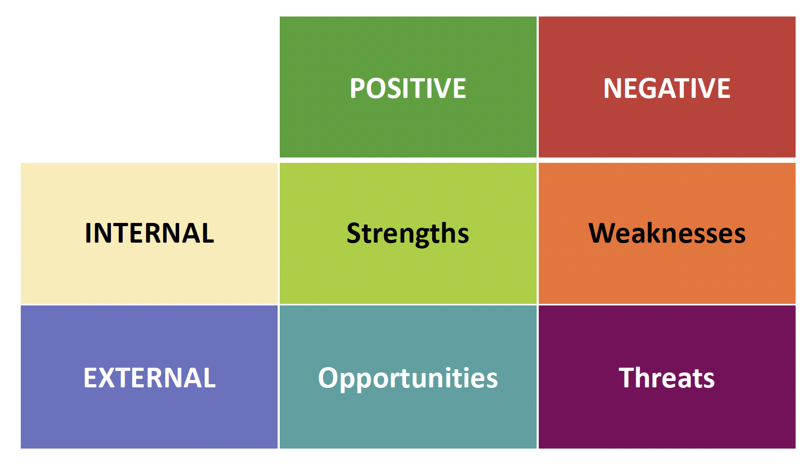

# 01. Introduction to Project Management

Proyectos de Ingeniería y Gestión del Software

## Índice

- [01. Introduction to Project Management](#01-introduction-to-project-management)
  - [Índice](#índice)
  - [D1. Market research and SWOT](#d1-market-research-and-swot)
    - [Executive Summary](#executive-summary)
    - [SWOT Analysis](#swot-analysis)
      - [Strengths (Internal, Positive)](#strengths-internal-positive)
      - [Weaknesses (Internal, Negative)](#weaknesses-internal-negative)
      - [Opportunities (External, Positive)](#opportunities-external-positive)
      - [Threats (External, Negative)](#threats-external-negative)
  - [D2. Areas, tasks and modalities in project management](#d2-areas-tasks-and-modalities-in-project-management)
    - [Introduction to Project Management](#introduction-to-project-management)
    - [Knowledge Areas of Project Management](#knowledge-areas-of-project-management)
    - [Predictive vs Adaptive Management](#predictive-vs-adaptive-management)
      - [Predictive Management](#predictive-management)
      - [Adaptive Management](#adaptive-management)
      - [Hybrid Approach](#hybrid-approach)
    - [Development vs Management](#development-vs-management)
    - [Project Management Overview](#project-management-overview)
    - [Trends in Project Management](#trends-in-project-management)
    - [Roles and Skills of a Project Manager](#roles-and-skills-of-a-project-manager)
    - [Common Project Management Mistakes](#common-project-management-mistakes)
    - [Commitment vs Involvement](#commitment-vs-involvement)
    - [Recommended Reading](#recommended-reading)
  - [D3. Product Backlog](#d3-product-backlog)
    - [User Stories](#user-stories)
      - [Example User Story Structure:](#example-user-story-structure)
    - [Roles and Responsibilities](#roles-and-responsibilities)
    - [Acceptance Tests](#acceptance-tests)
    - [User Story Lifecycle](#user-story-lifecycle)
    - [Advantages and Disadvantages of User Stories](#advantages-and-disadvantages-of-user-stories)
    - [Writing Effective User Stories (INVEST Criteria)](#writing-effective-user-stories-invest-criteria)
    - [Clarifying Examples (INVEST Criteria Applied)](#clarifying-examples-invest-criteria-applied)
    - [Real-world Example: Bookshop Application](#real-world-example-bookshop-application)
    - [Study Notes \& Good Practices](#study-notes--good-practices)
    - [Recommended Reading (for deeper study):](#recommended-reading-for-deeper-study)

## D1. Market research and SWOT

This section provides a detailed overview of market research methodologies, including an outline of SWOT (Strengths, Weaknesses, Opportunities, and Threats) analysis. The following content integrates essential points from our reference material on market research and SWOT, expanded with updated insights relevant to today’s competitive landscape.

---

### Executive Summary

A clear, concise description of the business idea is crucial for establishing the context and objectives of the project. The product or service should be described in terms of its innovative aspects, primary functions, target audience, and projected benefits. In this stage, it is helpful to detail:

- **Product/Business Description**: Provide a clear explanation of what your product or service is, how it addresses market needs, and what unique value it offers.
- **State of the art, market and competition**: Analyze the current market landscape, including competitors, trends, and potential opportunities.
- **Financial projection**: Estimate the financial viability of your project, including funding requirements, revenue projections, and potential return on investment.
- **Objectives**: Outline specific goals you aim to achieve, such as market share, profit margins, or social impact.
- **Development team**: Introduce key team members, their roles, and how their skills contribute to the project’s success.
- **Scope and Constraints**: Define boundaries like budget, time, and resources.
- **Stakeholders**: Identify key stakeholders and their interests in the project. Clients, users, investors, and regulatory bodies are examples of stakeholders who may influence project outcomes.

**Market Research**

Market research involves systematically gathering, analyzing, and interpreting data about a market. It encompasses understanding consumer needs, preferences, behaviors, and market size, as well as spotting key trends.

- **State of the Art**: Examine the current trends and innovations in your industry. Identify leading competitors and analyze best practices.
- **Market and Competition**: Assess market size, growth rates, barriers to entry, and potential partners or collaborators. Understanding market dynamics ensures your product or service remains competitive.
- **Financial Projection**: Estimate the financial viability of your product or service, including funding opportunities, projected revenues, pricing models, and potential return on investment.

**Development Team**

- **Team Members**: Highlight the skills and roles of each contributor (e.g., IT specialists, designers, consultants).
- **Stakeholders**: Identify users, clients, and any regulatory or public organizations influencing your project.

**SMART Goals**

Your project’s objectives should follow the SMART criteria:

- **Specific**: Clearly defined and unambiguous.
- **Measurable**: Quantifiable indicators to track progress.
- **Achievable and Agreed to**: Realistic and supported by team consensus.
- **Rewarding and Realistic**: Aligned with broader organizational or personal motivations.
- **Time-based**: Defined deadlines to measure success.

### SWOT Analysis

A SWOT Analysis assesses both internal and external factors that can shape your project’s success.

#### Strengths (Internal, Positive)

Characteristics of a **business** that give it an **advantage over others in the market.

- Qualities that differentiate you from competitors.
- Skilled, knowledgeable team members.
- Proprietary technologies or intellectual property.
- Examples of advantages: specialized expertise, unique processes, or robust financial resources.

#### Weaknesses (Internal, Negative)

Characteristics of a **business** that put it at a disadvantage relative to its competitors.

- Resource limitations or lack of certain skills.
- Vulnerabilities in your approach that competitors might exploit.
- Areas needing improvement, such as training, technology, or funding.

#### Opportunities (External, Positive)

Elements in a company's **external** environment that allow it to formulate and implement strategies to **improve** its performance.

- Emerging consumer needs or underserved markets.
- Potential for partnerships or expansion into new niches.
- Regulatory changes that could create demand for your service.

#### Threats (External, Negative)

Elements in a company's **external** environment that could cause **endanger** the business, its profitability, or its competitive position.

- Strong emerging competitors.
- Changing regulations or industry standards that may add complexity.
- Evolving technologies that might disrupt your business model.

---

**Instructions to update the project tracking [excel](Tracking.xlsx) file**

- TEAM

  - Add team members and assign a user (short name) to each of them

- WBS

  - Always use two levels (Task-Subtask)
  - Use significant names
  - Do not mix tasks and subtasks in the same row
  - Add an estimation for each subtask
  - Do not write in blue cells

- TRACKING

  - Add date and times
  - Select task, subtask and author from the lists
  - Add one row for each member-subtask pair

- Dynamic tables and graphs
  - Update

---

## D2. Areas, tasks and modalities in project management

### Introduction to Project Management

Project Management (PM) involves planning, organizing, motivating, and controlling resources to achieve specific goals.

### Knowledge Areas of Project Management

Top 10 PM Knowledge Areas:

1. **Integration Management**: Coordinate project activities across all areas.
2. **Scope Management**: Ensure all necessary project elements are included.
3. **Time Management**: Timely completion of project activities.
4. **Quality Management**: Ensure outputs meet user needs and standards.
5. **Resource Management**: Efficiently manage and monitor project resources.
6. **Communications Management**: Effective planning and implementation of communications.
7. **Procurement Management**: Manage purchasing and contracts.
8. **Stakeholder Management**: Actively engage stakeholders.
9. **Risk Management**: Identify and mitigate potential risks.
10. **Cost Management**: Control financial resources effectively.

### Predictive vs Adaptive Management

#### Predictive Management

- The **scope** of work **and requirements** for the project **are clear** and justify the detailed upfront planning.
- Also called traditional, conventional or waterfall project management.
- Popular methodologies:
  - PMBOK (Project Management Body of Knowledge)
  - PRINCE2 (Projects in Controlled Environments)
  - Waterfall

#### Adaptive Management

The **scope** of work and requirements for the project are difficult to define.

- Rapidly changing environment.
- Requirements are clarified in short iterations.
- Also referred to as responsive, iterative or agile project management.
- Frameworks include:
  - Scrum
  - Kanban
  - XP (Extreme programming)
  - DSDM (Dynamic system development method)
  - Crystal
  - FDD (Feature-driven development)

#### Hybrid Approach

Integrating predictive and adaptive methods for optimal outcomes.

### Development vs Management

- **Initial Planning**
- **Production**
- **Management** (Control & Monitoring)

### Project Management Overview

- Timely, quality delivery within budget and scope.
- Clear distinction between unique projects and repetitive operational tasks.

### Trends in Project Management

- Agile methodologies
- DevOps and DevSecOps
- Product lifecycle management
- Enhanced cybersecurity measures
- Increasing use of IoT and mobile technologies
- Effective use of social media
- Advanced collaboration tools
- GDPR/HIPAA compliance
- Management of diverse, global teams
- Servant leadership
- Enhanced vendor management
- Integration with PMOs and governance frameworks

### Roles and Skills of a Project Manager

**Roles:**

- Planner & Organizer
- Risk Manager
- Coach & Facilitator
- Communicator
- Negotiator
- Resource Manager

**Key Skills:**

- Hard Skills: Financial budgeting, PM methodologies, resource optimization, accurate documentation.
- Soft Skills: Adaptability, emotional intelligence, problem-solving, clear communication, effective negotiation.

### Common Project Management Mistakes

- Misaligned organizational objectives
- Poor stakeholder communication
- Unrealistic scheduling
- Resource mismanagement
- Neglecting change control
- Inadequate risk planning

### Commitment vs Involvement

Illustrated by the chicken and pig analogy: "The chicken is involved, but the pig is committed."

### Recommended Reading

- _Project Manager Absolute Beginner's Guide_, Gregory M. Horine
- _Ingeniería del software_, Salvador Sánchez, Miguel Ángel Sicilia, Daniel Rodríguez

## D3. Product Backlog

### User Stories

User stories are simple descriptions of features from the user's perspective, emphasizing value to the user. A complete user story has three components, known as the **CCC** (Card, Conversation, Confirmation):

- **Card**: Written description.
- **Conversation**: Discussions for clarity and detail.
- **Confirmation**: Tests ensuring completion criteria are met.

#### Example User Story Structure:

> “As a (user role), I want to (action), so that (benefit).”

- **Example**: “As an online shopper, I want to pay with my credit card, so that I can complete my purchase quickly.”

### Roles and Responsibilities

**Developers:**
- Assist customers in formulating clear, valuable stories.
- Clarify how user needs translate into valuable functionality.

**Customers:**
- Write user stories that initiate conversations rather than specifying overly detailed instructions upfront.
- Ensure stories add clear user value, are independent, testable, and well-sized.

**Customer Team:**
- Includes testers, product managers, interaction designers, and real users.
- Writes and prioritizes stories and defines acceptance criteria.

---

### Acceptance Tests

Acceptance tests verify whether the developed feature meets the initial story requirements.

**Example (Online Shopping App):**
- Payment tested successfully with Visa, MasterCard, American Express.
- Payment failed with Diner’s Club card (which the system does not support).
- Various scenarios: expired cards, debit cards, incorrect or missing security numbers, over-limit transactions.

**Good Practice**: Clearly define acceptance criteria before development to ensure clarity and efficiency.

---

### User Story Lifecycle

A typical user story evolves through stages:

1. **Discovery** (initial understanding of user needs)
2. **Product Backlog** (prioritized user stories)
3. **Release Planning** (stories selected for specific release)
4. **Sprint Planning** (stories broken into detailed tasks)
5. **Sprint Execution** (development and testing)
6. **Acceptance Testing & Delivery**

**Example**:

> Initial Story: “As a shopper, I want a simple checkout, so I can easily complete my purchases.”  
> Sprint Backlog Tasks:
> - Implement credit card payment gateway.
> - Integrate cart with payment page.
> - Create user-friendly payment confirmation.

---

### Advantages and Disadvantages of User Stories

**Advantages:**
- Encourages direct communication and rapid feedback.
- Understandable by technical and non-technical stakeholders.
- Suited for iterative (agile) development.
- Encourages user participation and detail flexibility.

**Disadvantages:**
- Challenging to scale for large projects.
- Additional documentation might be needed for traceability in extensive projects.

---

### Writing Effective User Stories (INVEST Criteria)

Created by Bill Wake, the INVEST criteria help ensure high-quality user stories:

| Criterion    | Explanation                                               | Example                                                        |
|--------------|-----------------------------------------------------------|----------------------------------------------------------------|
| Independent  | Minimal dependency on other stories.                      | Separate payment by Visa, MasterCard, AMEX into individual stories. |
| Negotiable   | Details finalized through customer-developer conversations. | Acceptance criteria detailed on story cards.                       |
| Valuable     | Delivers clear value to end-user or customer.             | Storing payment info speeds future checkouts.                    |
| Estimatable  | Team can estimate effort accurately.                      | Conduct technical/functional spikes for unclear areas.           |
| Small        | Sized appropriately; too large (epics) should be split.   | “User can manage resume” → “User can create/edit/delete resume.” |
| Testable     | Can clearly define pass/fail criteria.                    | “User can export order history as CSV.”                          |

---

### Clarifying Examples (INVEST Criteria Applied)

- **Independent**:  
  Instead of "User can pay by credit card," create independent stories like:  
  - "User pays by Visa"  
  - "User pays by MasterCard"

- **Negotiable**:  
  Initially vague "User manages account details" refined after discussions:  
  - "User updates shipping address"  
  - "User changes saved payment method"

- **Valuable**:  
  Avoid vague technical requirements. Instead:  
  - "User can view error messages easily (user value)"  
  Rather than "System uses common logging classes (technical detail)."

- **Estimatable** (Handling Uncertainty):  
  Use spikes (research-oriented tasks):  
  - **Functional Spike**: Prototype UI to gather user feedback.  
  - **Technical Spike**: Research third-party APIs for integration feasibility.

**Spike Examples**:  
- "Prototype energy usage histogram to validate visual clarity." (Functional Spike)  
- "Test API response times to assess real-time dashboard feasibility." (Technical Spike)

- **Small** (Splitting Epics):  
  Large stories ("epics") divided into smaller stories:  
  Original epic: "User can manage job search profiles."  
  Smaller stories:  
  - "User creates new job search profiles."  
  - "User edits existing profiles."  
  - "User deletes profiles."

- **Testable**:  
  Clearly defined acceptance criteria:  
  - Good: "User can export order history as CSV."  
  - Poor: "System feels fast and responsive."

---

### Real-world Example: Bookshop Application

**Example User Stories:**

- **Search**:
  - "User searches books by title, author, ISBN."
  - "User views detailed book info (pages, description)."

- **Purchase**:
  - "User adds/removes books from cart."
  - "User completes checkout with credit card."

- **User Accounts**:
  - "User creates account with saved payment and shipping details."
  - "User edits account info."

- **Additional Features**:
  - "User creates visible wish lists."
  - "User writes and submits book reviews."

**Constraints (special considerations)**:  
- "System supports peak use of up to 50 concurrent users."  
- "Order records integrate seamlessly with telephone orders."

---

### Study Notes & Good Practices

- Keep user stories concise; use conversations to elaborate.
- Always prioritize stories by user value.
- Regularly review acceptance criteria clarity and completeness.
- Use spikes for uncertainty; they're an essential agile practice.
- Document essential details clearly to avoid misunderstandings.

---

### Recommended Reading (for deeper study):

- **"User Stories Applied: For Agile Software Development"** by Mike Cohn. (Highly recommended for comprehensive understanding and practical application)
