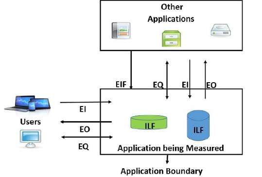

# 02. Estimation

- [02. Estimation](#02-estimation)
  - [D4. Metrics and Techniques](#d4-metrics-and-techniques)
    - [Basic Concepts](#basic-concepts)
      - [Real-Life Cases of Estimation](#real-life-cases-of-estimation)
      - [Software vs Other Industries](#software-vs-other-industries)
      - [Challenges in Software Estimation](#challenges-in-software-estimation)
      - [Precision and Accuracy](#precision-and-accuracy)
    - [Estimation Phases](#estimation-phases)
      - [Key Estimations](#key-estimations)
      - [Main Sections in Estimation](#main-sections-in-estimation)
      - [Productivity Estimation](#productivity-estimation)
      - [Factors Affecting Duration](#factors-affecting-duration)
    - [Metrics in Software Estimation](#metrics-in-software-estimation)
      - [Definitions](#definitions)
      - [Scales](#scales)
      - [Types of Metrics in Software Estimation](#types-of-metrics-in-software-estimation)
      - [Size-Based Metrics](#size-based-metrics)
      - [Function-Based Metrics](#function-based-metrics)
    - [Estimation Techniques](#estimation-techniques)
      - [Techniques Overview](#techniques-overview)
      - [Expert Judgment](#expert-judgment)
      - [Delphi Method](#delphi-method)
      - [Heuristic/Historical/Analogous Estimation](#heuristichistoricalanalogous-estimation)
      - [Parametric Estimation](#parametric-estimation)
      - [Decomposition Technique](#decomposition-technique)
      - [Phased Estimation](#phased-estimation)
      - [Pricing to Win](#pricing-to-win)
    - [Scrum and Agile Estimations](#scrum-and-agile-estimations)
      - [Scrum Principles](#scrum-principles)
      - [User Story Estimation](#user-story-estimation)
        - [Developer Responsibilities](#developer-responsibilities)
        - [Customer Responsibilities](#customer-responsibilities)
      - [Planning Poker (Scrum Poker)](#planning-poker-scrum-poker)
      - [Estimating user stories](#estimating-user-stories)
    - [Practical Example: Online Bookshop](#practical-example-online-bookshop)
  - [D5. Cost Estimation](#d5-cost-estimation)
    - [Cost and Effort Models](#cost-and-effort-models)
      - [Objectives](#objectives)
      - [Costs to Estimate](#costs-to-estimate)
    - [Cost Estimation Techniques](#cost-estimation-techniques)
      - [Top-down Estimation](#top-down-estimation)
      - [Bottom-up Estimation](#bottom-up-estimation)
    - [Factors Affecting Earnings in Software Roles](#factors-affecting-earnings-in-software-roles)
    - [Pricing Models](#pricing-models)
      - [Cost vs Price](#cost-vs-price)
      - [Types of Pricing Models](#types-of-pricing-models)
    - [Calculating Per-person-hour Cost](#calculating-per-person-hour-cost)
      - [Overhead Calculation](#overhead-calculation)
    - [Additional Costs to Consider](#additional-costs-to-consider)
    - [Employee Cost Analysis](#employee-cost-analysis)
      - [Gross vs Net Salary Example](#gross-vs-net-salary-example)
      - [Self-employed Costs](#self-employed-costs)
      - [Example of Self-employed Cost Breakdown](#example-of-self-employed-cost-breakdown)
    - [References](#references)

---

## D4. Metrics and Techniques

### Basic Concepts

#### Real-Life Cases of Estimation

- **Case 1: Underestimating**

  - Customer: "How much will you charge for the described app?"
  - Response: "1,000 euros."
  - Result: Underestimated effort leads to potential financial strain.

- **Case 2: Overestimating**

  - Response: "54,000 euros."
  - Result: Overestimating could lead to losing potential projects.

- **Case 3: Budget Constraints**
  - Situation: Budgeting issues arise due to unforeseen expenses (e.g., electricity bill).
  - Lesson: Highlighting the importance of accurate budgeting.

#### Software vs Other Industries

- **Example:** Estimating cost/time for sewing 2,000 jeans:
  - Productivity: 5 jeans/hour per worker
  - Costs: Direct (€12/hr), Indirect (€8/hr), Transportation (€1,500)
  - Example scenario demonstrates variability with the number of workers.

#### Challenges in Software Estimation

- How is the required effort estimated?
- How is the productivity of a software architect, a software designer or a programmer measured?
- Estimating effort in software development is challenging due to:
  - Wide deviations in the productivity of a worker.
  - Same functionality but different attributes imply different costs (encryption, modularity…).
  - Software requirements volatility.
  - Constant innovation.

#### Precision and Accuracy

- **Accuracy** is the closeness of agreement between a measured value and a true or accepted value. Measurement error is the amount of inaccuracy.

- **Precision** is a measure of how well a result can be determined (without reference to a theoretical or true value).

- The uncertainty estimate associated with a measurement should account for both the accuracy and precision of the measurement.

---

- **Accuracy:** Closeness of measurement to true value.
- **Precision:** Consistency of measurement.
- **Note:** Estimations must consider both accuracy and precision.

- **Tom Cargill’s Ninety-Ninety Rule:**
  - First 90% of development takes 90% of the time; last 10% also takes another 90%.
  - Reflects common optimism in software project estimation.

Are our estimates usually optimistic or pessimistic? How can we improve our estimation accuracy?
Do we assess the most complex parts in a appropriate way?

| Estimation precision and accuracy                       |
| ------------------------------------------------------- |
|  |
|  |

### Estimation Phases

#### Key Estimations

Projects typically require estimation of:

- Effort required
- Team size
- Software/hardware resources
- Project duration
- Total cost
- Risks

#### Main Sections in Estimation

- **Size Estimation:** Determining project scale and complexity. How much do I have to develop? How complex is it?
- **Effort Estimation:** Estimating required time and personnel. How long will it take? How many people do I need?
- **Cost Estimation:** Budgeting for resources and quotations. Identification of third-party resources, cost of the resources, budget and quotation.

#### Productivity Estimation

- Productivity assessment is crucial and based on measurable attributes (e.g., team experience, complexity).

#### Factors Affecting Duration

- Project size, complexity, experience, quality processes, technological support, work environment, and uncertainty.

> Even though, individual differences are among the most important factors affecting productivity, they are not the only ones. The work environment, the quality of the processes, the technological support, the experience of the team, the complexity of the project, and the uncertainty are also important factors.

### Metrics in Software Estimation

> Measure what can be measured, and make measurable what cannot be measured. - Galileo Galilei

#### Definitions

- **Entity:** Object being characterized.
- **Attribute:** Measurable characteristic.
- **Measurement:** Process of assigning values.
- **Measure:** Assigned value or symbol.

#### Scales

- **Nominal:** Languages (Java, Python)
- **Dichotomic:** Boolean (Yes/No)
- **Ordinal:** Ordered categories (Few, Many)
- **Interval:** Numerical ranges (0-10, 11-20)
- **Absolute/Ratio:** Direct numerical measures (0,1,2,3…)

#### Types of Metrics in Software Estimation

- **Products:** Size, complexity, reusability, coupling, test cases, quality, reliability, maintenance…
- **Processes:** Time, effort, cost.
- **Resources:** Persons, salaries, productivity, experience, HW technical specifications…

#### Size-Based Metrics

Measure a product according to the amount of a physical aspect or a software artifact (source code lines, instructions in the object code, number of pages in the system documentation, number of attributes in a table...).

- Measures physical/software artifacts (e.g., lines of code).
- Pros: Easy counting, direct evaluation.
- Cons: Language/style-dependent, difficult to predict.

#### Function-Based Metrics

"Amount" of useful functionality generated:

- Function points (inputs, outputs, inquiries, files, interfaces).
- Object points (screens, reports, interfaces, data entities).
- Use case points (actors, use cases, transactions).
- Story points (complexity, effort, risk).

- Measures useful functionality (function points, object points, use case points).
- Pros:
  - Can be applied from early development stages.
  - Independent of the language, tools or methodologies used.
- Cons: More subjective.

### Estimation Techniques

#### Techniques Overview

- Expert judgment
- Historical/Analogous
- Parametric/Algorithmic
- Decomposition
- Phased Estimation
- Pricing to Win
- Delphi Method

#### Expert Judgment

1. Several experts provide independent estimates.
2. These estimates are compared and analyzed
3. The process is repeated until a consensus is reached.

- Pros:
  - Experts take into account some "subjective" factors which are not considered in other techniques.
- Cons:
  - Requires experts
  - not reproducible.

#### Delphi Method

- Structured expert consensus with anonymous feedback loops.
- Facilitator manages iterative estimations until consensus.

#### Heuristic/Historical/Analogous Estimation

Based on similarity, historical data or experience

1. Reliable data from previous projects are available.
2. Project attributes are identified.
3. Projects with similar attributes are selected.
4. Estimates are adapted to the current project.
5. Experts are required for the previous steps.

- Uses data from similar past projects.
- Pros:
  - Based on past experience, which includes subjective factors.
- Cons:
  - Requires similar past projects.
  - How is similarity measured?
  - What was valid in the past may not be valid now.

#### Parametric Estimation

1. Based on predictive functions
2. These functions are obtained by fitting with different parameters from previous projects.

- Uses mathematical models from historical data.

- Pros:
  - The reproducible calculations which can be refined.
  - The problem is reduced to the estimation of certain parameters.
  - Based on past experience with statistical significance.
- Cons:
  - Difficulties adapting to unique circumstances.

#### Decomposition Technique

1. An estimate is given for each lower level unit.
2. Estimates are more detailed.

- Breaking down project into smaller estimable units.
- Pros:
  - Manages high-risk scenarios well.
  - Quite exact.
- Cons: Time-consuming.

#### Phased Estimation

1. Estimate the project phase by phase.
2. The estimation is more complete and detailed for the next phase.
3. A more general estimate is given for the rest of phases.
4. Incorporates the re-estimation.

- Estimates phase-by-phase, detailed upfront for immediate tasks, broader for future phases.

- Pros: Useful for high-risk projects.
- Cons: No initial full-project estimate.

#### Pricing to Win

1. The client has a limited budget.
2. The client cannot provide a clear and detailed description of what
   they want.
3. The price of the product is set to the amount the client can pay.
4. The software requirements are identified.
5. The requirements are implemented in such a way that they match
   the price.
6. Some requirements can be left undone.

- Budget-centric; adapts scope to client’s financial limit.

- Pros: Meets budget constraints.
- Cons:
  - Risks omitting key features. Some requirements may be left undone.

### Scrum and Agile Estimations

#### Scrum Principles

- Iterative, incremental, agile methodology; flexible to requirement changes.

#### User Story Estimation

- Estimate stories in story points, which are relative estimates of the complexity, effort or duration of a story.
- Estimating stories needs to be done by the team, and the estimates are owned by the team rather than individuals.
- Triangulate an estimate by comparing it to other estimates.
- Whether or not a team programs in pairs has no impact on story point estimates. **Pair programming affects the team’s velocity, not their estimates**.

##### Developer Responsibilities

- Defining story points in a manner that is relevant and usable by your team and consistently sticking to that definition.
- Giving honest estimates and not giving in to temptation or pressure to give low estimates.
- Estimating as a team.
- Giving estimates that are consistent with other estimates (e.g., all the two-point stories should be similar).

##### Customer Responsibilities

- Participating in estimation meetings, answering questions and clarifying stories, not estimating stories yourself.

#### Planning Poker (Scrum Poker)

- Team consensus method using Fibonacci numbers for estimating complexity.
- Encourages dialogue, improves estimation accuracy.

#### Estimating user stories

- Actual days will differ from ideal days
- It is common to start with an expected velocity that is somewhere between one-third and one-half the number of developer-days in an iteration.

### Practical Example: Online Bookshop

- Must have
- Should have
- Could have
- Won’t have

Example:

| Description                                                                                                                                      | Estimation | Priority |
| ------------------------------------------------------------------------------------------------------------------------------------------------ | ---------- | -------- |
| A user can do a basic simple search that searches for a word or phrase in both the author and title fields.                                      | 1          | Must     |
| A user can search for books by entering values in any combination of author, title and ISBN.                                                     | 1          | Must     |
| A user can view detailed information on a book. For example, number of pages, publication date and a brief description.                          | 1          | Must     |
| A user can put books into a "shopping cart" and buy them when they are done shopping.                                                            | 1          | Must     |
| A user can remove books from their cart before completing an order.                                                                              | ½          | Must     |
| To buy a book the user enters their billing address, the shipping address and credit card information.                                           | 2          | Must     |
| A user can view a history of all of their past orders.                                                                                           | 1          | Should   |
| A user can easily re-purchase items when viewing past orders.                                                                                    | ½          | Should   |
| The site always tells a shopper what the last 3 items they viewed are and provides links back to them (this works even between sessions).        | 1          | Could    |
| A user can see what books we recommend on a variety of topics.                                                                                   | 3          | Could    |
| A user can choose to have items gift wrapped.                                                                                                    | ½          | Should   |
| A user can choose to enclose a gift card and can write their own message for the card.                                                           | ½          | Should   |
| A user can rate books from 1 (bad) to 5 (good). The book does not have to be one the user bought from us.                                        | 2          | Should   |
| A user can write a review of a book. They can preview the review before submitting it. The book does not have to be one the user bought from us. | 5          | Could    |
| An administrator needs to approve or reject reviews before they are published.                                                                   | 2          | Should   |
| A Report Viewer can see reports of daily purchases broken down by book category, traffic, best- and worst-selling books and so on.               | 8          | Could    |
| A user must be properly authenticated before viewing reports.                                                                                    | 1          | Must     |
| Orders made on the website have to end up in the same order database as telephone orders.                                                        | 0          | Must     |
| An administrator can add new books to the site.                                                                                                  | 1          | Must     |
| An administrator can delete a book.                                                                                                              | ½          | Must     |
| An administrator can edit the information about an existing books.                                                                               | 1          | Must     |
| The system must support peak usage of up to 50 concurrent users.                                                                                 | 0          | Must     |

- Demonstrates how user stories are prioritized (Must, Should, Could, Won’t have).
- Practical scenario highlighting estimation and scope management.

---

## D5. Cost Estimation

### Cost and Effort Models

#### Objectives

- Estimate accurate software development costs.
- Manage and control income and expenditures to match cost estimations.

#### Costs to Estimate

- **Direct Costs:** Effort (staff salaries), hardware, software, travel, training.
- **Indirect Costs:** Office space, support staff, communication networks.
- **Contingency Buffer:** Provision for unexpected expenses.
- **Final Pricing Formula:** `Final Price = Total Cost + Profit`

### Cost Estimation Techniques

#### Top-down Estimation

- **Overview:** Estimating costs based on global functionalities.
  - The system is evaluated from its global functionalities.
  - Allows a better estimation of global aspects, such as integration and coordination costs.
  - Can be applied with fewer details in early stages.
  - Can underestimate internal costs of certain subsystems.
  - No suitable to make decisions about individual components.
- **Pros:** Good for early stages; captures integration and coordination costs.
- **Cons:** May underestimate detailed subsystem costs; not suited for individual components.

#### Bottom-up Estimation

- **Overview:** Estimating costs from individual components upward.
  - Each component is estimated and then the global system is assessed.
  - Allows analyzing individual details of each component.
  - Usually more precise than top-down estimation.
  - Can underestimate costs related to global activities.
  - Usually more expensive and requires a detailed structure.
- **Pros:** Precise and detailed.
- **Cons:** Potential underestimation of global integration costs; expensive and detailed.

### Factors Affecting Earnings in Software Roles

- Earnings depend on various factors including experience, company size, business model, and geographical location.
- Roles range from backend and frontend developers to specialized positions such as software architects and CTOs.

### Pricing Models

#### Cost vs Price

- **Cost:** How much money is necessary to carry out the project.
- **Price:** How much money the customer will have to pay for the project.

#### Types of Pricing Models

- **Cost-plus Pricing:** Total costs plus reasonable profit margin.
- **Opportunity Pricing:** Pricing based on customer opportunities and market competition.
  - Pricing depends on the opportunity presented by the purchaser.
  - If the customer has no other choice, the price is high.
  - If there is much competition, the price is low.
  - It may even price the project at a loss.
  - Variants:
    - Introductory/Penetration pricing: a new entrant to a market already overflowing with existing providers.
    - Skimming pricing: An early bird in an emerging market charges a higher price before competition enters, then lowers the price.
- **Going Rate Pricing:**:
  - Organizations in fields where there is plenty of competition and the price is well known to purchasers.
  - The organization envisages the price other suppliers are offering.
- **Monopolistic Pricing:**: The seller plays up some unique feature and prices the product either higher or lower than the going rate.
- **Oligopolistic Pricing:** Only a limited number of suppliers are present in the market and they collaborate to establish a fixed price.
- **Transfer Pricing:** Internal cost transfers within organizational departments. Only actual costs are considered.
- **Loss Leader Pricing:** Selling at a loss to attract customers.

### Calculating Per-person-hour Cost

- **Direct Staff Costs (C):** Staff directly involved in production.
- **Yearly Hours (H):** Approximately 1920 hours/year.
- **Indirect Costs (I, F, V, M):** Including support staff, rent, utilities, etc.
- **Overhead Costs (O):** `(I + F + V + M)/H`
- **Total Cost per Person-hour (T):** `K (Direct Staff Cost per Hour) + O`

| Description                                                                 | Symbol | Formula          |
| --------------------------------------------------------------------------- | ------ | ---------------- |
| Yearly cost of direct staff (persons who do not "produce" are not included) | C      | -                |
| Cost per person-hour (H≈1920)                                               | K      | C/H              |
| Yearly cost of indirect staff                                               | I      | -                |
| Yearly cost of fixed costs (e.g. rent)                                      | F      | -                |
| Yearly cost of variable expenses (e.g. electricity)                         | V      | -                |
| Other yearly costs not specific to the project                              | M      | -                |
| Overhead cost per person-hour                                               | O      | (I+F+V+M)/H      |
| Per-person-hour cost                                                        | T      | K+O              |
| Overhead percentage                                                         | P      | (I+F+V+M)/C\*100 |

Not specific to the project: rent, utilities, support staff, etc.

| Descripción                                      | Símbolo | Fórmula        |
| ------------------------------------------------ | ------- | -------------- |
| Coste anual del personal directo                 | C       | -              |
| Coste por persona-hora (H≈1920)                  | K       | C/H            |
| Coste anual del personal indirecto               | I       | -              |
| Costes fijos anuales (ej. alquiler)              | F       | -              |
| Gastos variables anuales (ej. electricidad)      | V       | -              |
| Otros costes anuales no específicos del proyecto | M       | -              |
| Coste de overhead por persona-hora               | O       | (I+F+V+M)/H    |
| Coste total por persona-hora                     | T       | K+O            |
| Porcentaje de overhead                           | P       | (I+F+V+M)/C100 |

#### Overhead Calculation

- Helps in understanding indirect costs relative to direct production staff.

En gestión de proyectos, el término "overhead" se refiere a los gastos generales o costes indirectos que son necesarios para mantener el funcionamiento de la empresa pero que no están directamente relacionados con la producción de un proyecto específico.

Los gastos generales incluyen:

- Salarios del personal de apoyo (administración, RRHH, etc.)
- Alquiler de oficinas
- Servicios como electricidad, agua, internet
- Mantenimiento
- Seguros
- Otros gastos que no se pueden asignar directamente al proyecto

Ejemplo Práctico. Imagina una empresa de desarrollo de software:

- Coste anual de programadores (personal directo): 500.000€ (C)
- Horas anuales: 1920 (H)
- Coste anual de gerentes, RRHH, etc. (personal indirecto): 200.000€ (I)
- Alquiler anual: 100.000€ (F)
- Servicios anuales: 50.000€ (V)
- Otros gastos anuales: 50.000€ (M)

Entonces:

- Coste directo por persona-hora (K) = 500.000€ / 1920h = 260,42€/h
- Overhead por persona-hora (O) = (200.000€ + 100.000€ + 50.000€ + 50.000€) / 1920h = 208,33€/h
- Coste total por persona-hora (T) = 260,42€/h + 208,33€/h = 468,75€/h
- Porcentaje de overhead (P) = 400.000€ / 500.000€ \* 100 = 80%

Esto significa que por cada hora facturada de trabajo directo, necesitas cubrir un 80% adicional de costes indirectos.

### Additional Costs to Consider

- Travel expenses
- Specialized software and hardware
- Training for team members

### Employee Cost Analysis

- What is the gross salary?
- How much does the company pay in Social Security?
- How much does the employee receive after deductions?

#### Gross vs Net Salary Example

**Case 1**: 1500€ gross monthly salary (indefinite contract)

- The company pays another 501€ in Social Security.

  | Amount   | Percentage | Description                                                                  |
  | -------- | ---------- | ---------------------------------------------------------------------------- |
  | 354,00 € | 23,6 %     | Common: pensions                                                             |
  | 82,50 €  | 5,5 %      | Unemployment                                                                 |
  | Variable | Variable   | Eventual work accidents or professional illness (% depends on the workplace) |
  | 52,50 €  | 3,5 %      | FOGASA, severance pay after dismissal of companies in bankruptcy             |
  | 9,00 €   | 0,6 %      | Training                                                                     |

- Total cost for the company: 2001€

- The employee pays 256,25€ from their salary in taxes.

  | Amount   | Percentage | Description                             |
  | -------- | ---------- | --------------------------------------- |
  | 161,00 € | 10,75 %    | IRPF (Income Tax)                       |
  | 95,25 €  | 6,35 %     | Seguridad Social, divided into:         |
  | 70,50 €  | 4,7 %      | Contingencias comunes (mainly pensions) |
  | 23,25 €  | 1,55 %     | Unemployment                            |
  | 1,50 €   | 0,1 %      | Training                                |

- Net salary: 1243,75€

#### Self-employed Costs

- **Social Security Contribution:** Flat rate (initially low, then higher).
- **Tax Contributions (IRPF):** Percentage of net income varies (7%-19%).
- **VAT Management:** VAT collected vs. VAT paid.

Other expenses:

- Consultant
- Office rent
- Vehicle
- Communications
- Employees

#### Example of Self-employed Cost Breakdown

- **Income:** 1590 € (including VAT)
- **Expenses:** Includes withholding taxes, VAT obligations, and self-employment fees.
- **Final Profit Calculation:** Income minus all relevant expenses.

### References

[1] M. Cohn, "User Stories Applied for Agile Software Development," Addison-Wesley, 2009.
[2] M. Chemuturi, "Software Estimation Best Practices, Tools, & Techniques," J. Ross Publishing, 2009.
[3] "¿Qué significan las siglas de los altos cargos? CEO, CFO, CIO, CTO y más," IEB School. [Online]. Available: https://www.iebschool.com/blog/ceo-cfo-cio-cto-digital-business/. [Accessed: May 2023].
