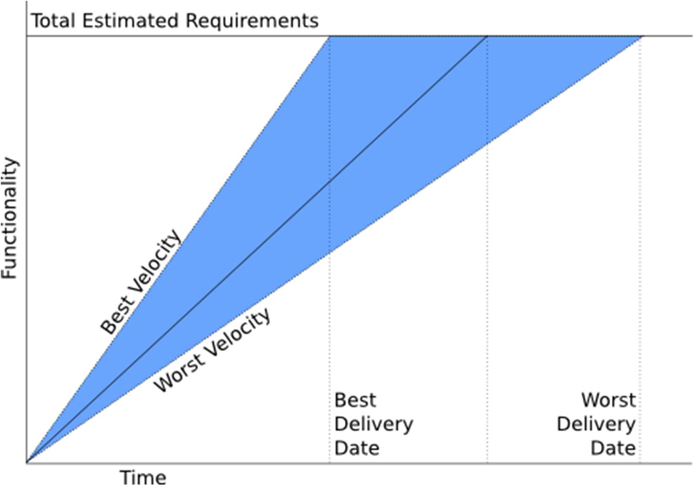

# Estimation 

- [Estimation](#estimation)
  - [D4. Metrics and Techniques](#d4-metrics-and-techniques)
    - [Basic Concepts](#basic-concepts)
      - [Real-Life Cases of Estimation](#real-life-cases-of-estimation)
      - [Software vs Other Industries](#software-vs-other-industries)
      - [Challenges in Software Estimation](#challenges-in-software-estimation)
      - [Precision and Accuracy](#precision-and-accuracy)
    - [Estimation Phases](#estimation-phases)
      - [Key Estimations](#key-estimations)
      - [Main Sections in Estimation](#main-sections-in-estimation)
      - [Productivity Estimation](#productivity-estimation)
      - [Factors Affecting Duration](#factors-affecting-duration)
    - [Metrics in Software Estimation](#metrics-in-software-estimation)
      - [Definitions](#definitions)
      - [Scales](#scales)
      - [Types of Metrics in Software Estimation](#types-of-metrics-in-software-estimation)
      - [Size-Based Metrics](#size-based-metrics)
      - [Function-Based Metrics](#function-based-metrics)
    - [Estimation Techniques](#estimation-techniques)
      - [Techniques Overview](#techniques-overview)
      - [Expert Judgment](#expert-judgment)
      - [Delphi Method](#delphi-method)
      - [Heuristic/Historical/Analogous Estimation](#heuristichistoricalanalogous-estimation)
      - [Parametric Estimation](#parametric-estimation)
      - [Decomposition Technique](#decomposition-technique)
      - [Phased Estimation](#phased-estimation)
      - [Pricing to Win](#pricing-to-win)
    - [Scrum and Agile Estimations](#scrum-and-agile-estimations)
      - [Scrum Principles](#scrum-principles)
      - [User Story Estimation](#user-story-estimation)
      - [Planning Poker (Scrum Poker)](#planning-poker-scrum-poker)
    - [Practical Example: Online Bookshop](#practical-example-online-bookshop)
  - [D5. Cost Estimation](#d5-cost-estimation)
    - [Introduction](#introduction)
      - [Importance of Software Industry in the EU](#importance-of-software-industry-in-the-eu)
      - [Economic Indicators (2018)](#economic-indicators-2018)
      - [R\&D Investment](#rd-investment)
    - [Cost and Effort Models](#cost-and-effort-models)
      - [Objectives](#objectives)
      - [Costs to Estimate](#costs-to-estimate)
    - [Cost Estimation Techniques](#cost-estimation-techniques)
      - [Top-down Estimation](#top-down-estimation)
      - [Bottom-up Estimation](#bottom-up-estimation)
    - [Factors Affecting Earnings in Software Roles](#factors-affecting-earnings-in-software-roles)
    - [Pricing Models](#pricing-models)
      - [Cost vs Price](#cost-vs-price)
      - [Types of Pricing Models](#types-of-pricing-models)
    - [Calculating Per-person-hour Cost](#calculating-per-person-hour-cost)
      - [Overhead Calculation](#overhead-calculation)
    - [Additional Costs to Consider](#additional-costs-to-consider)
    - [Employee Cost Analysis](#employee-cost-analysis)
      - [Gross vs Net Salary Example](#gross-vs-net-salary-example)
      - [Self-employed Costs](#self-employed-costs)
      - [Example of Self-employed Cost Breakdown](#example-of-self-employed-cost-breakdown)
    - [Graphical Analysis of Employee and Self-employed Costs](#graphical-analysis-of-employee-and-self-employed-costs)
    - [Study Tips](#study-tips)
    - [References](#references)

---

## D4. Metrics and Techniques

### Basic Concepts

#### Real-Life Cases of Estimation

- **Case 1: Underestimating**

  - Customer: "How much will you charge for the described app?"
  - Response: "1,000 euros."
  - Result: Underestimated effort leads to potential financial strain.

- **Case 2: Overestimating**

  - Response: "54,000 euros."
  - Result: Overestimating could lead to losing potential projects.

- **Case 3: Budget Constraints**
  - Situation: Budgeting issues arise due to unforeseen expenses (e.g., electricity bill).
  - Lesson: Highlighting the importance of accurate budgeting.

#### Software vs Other Industries

- **Example:** Estimating cost/time for sewing 2,000 jeans:
  - Productivity: 5 jeans/hour per worker
  - Costs: Direct (€12/hr), Indirect (€8/hr), Transportation (€1,500)
  - Example scenario demonstrates variability with the number of workers.

#### Challenges in Software Estimation

- How is the required effort estimated?
- How is the productivity of a software architect, a software designer or a programmer measured?
- Estimating effort in software development is challenging due to:
  - Wide deviations in the productivity of a worker.
  - Same functionality but different attributes imply different costs (encryption, modularity…).
  - Software requirements volatility.
  - Constant innovation.

#### Precision and Accuracy

- **Accuracy** is the closeness of agreement between a measured value and a true or accepted value. Measurement error is the amount of inaccuracy.

- **Precision** is a measure of how well a result can be determined (without reference to a theoretical or true value).

- The uncertainty estimate associated with a measurement should account for both the accuracy and precision of the measurement.

---

- **Accuracy:** Closeness of measurement to true value.
- **Precision:** Consistency of measurement.
- **Note:** Estimations must consider both accuracy and precision.

- **Tom Cargill’s Ninety-Ninety Rule:**
  - First 90% of development takes 90% of the time; last 10% also takes another 90%.
  - Reflects common optimism in software project estimation.

Are our estimates usually optimistic or pessimistic? How can we improve our estimation accuracy?
Do we assess the most complex parts in a appropriate way?

| Estimation precision and accuracy |
| ----- |
|  | 
|  |

### Estimation Phases

#### Key Estimations

Projects typically require estimation of:

- Effort required
- Team size
- Software/hardware resources
- Project duration
- Total cost
- Risks

#### Main Sections in Estimation

- **Size Estimation:** Determining project scale and complexity. How much do I have to develop? How complex is it?
- **Effort Estimation:** Estimating required time and personnel. How long will it take? How many people do I need?
- **Cost Estimation:** Budgeting for resources and quotations. Identification of third-party resources, cost of the resources, budget and quotation.

#### Productivity Estimation

- Productivity assessment is crucial and based on measurable attributes (e.g., team experience, complexity).

#### Factors Affecting Duration

- Project size, complexity, experience, quality processes, technological support, work environment, and uncertainty.

> Even though, individual differences are among the most important factors affecting productivity, they are not the only ones. The work environment, the quality of the processes, the technological support, the experience of the team, the complexity of the project, and the uncertainty are also important factors.

### Metrics in Software Estimation

> Measure what can be measured, and make measurable what cannot be measured. - Galileo Galilei

#### Definitions

- **Entity:** Object being characterized.
- **Attribute:** Measurable characteristic.
- **Measurement:** Process of assigning values.
- **Measure:** Assigned value or symbol.

#### Scales

- **Nominal:** Languages (Java, Python)
- **Dichotomic:** Boolean (Yes/No)
- **Ordinal:** Ordered categories (Few, Many)
- **Interval:** Numerical ranges (0-10, 11-20)
- **Absolute/Ratio:** Direct numerical measures (0,1,2,3…)

#### Types of Metrics in Software Estimation

- **Products:** Size, complexity, reusability, coupling, test cases, quality, reliability, maintenance…
- **Processes:** Time, effort, cost.
- **Resources:** Persons, salaries, productivity, experience, HW technical specifications…

#### Size-Based Metrics

Measure a product according to the amount of a physical aspect or a software artifact (source code lines, instructions in the object code, number of pages in the system documentation, number of attributes in a table...).

- Measures physical/software artifacts (e.g., lines of code).
- Pros: Easy counting, direct evaluation.
- Cons: Language/style-dependent, difficult to predict.

#### Function-Based Metrics

"Amount" of useful functionality generated:

- Function points (inputs, outputs, inquiries, files, interfaces).
- Object points (screens, reports, interfaces, data entities).
- Use case points (actors, use cases, transactions).
- Story points (complexity, effort, risk).

- Measures useful functionality (function points, object points, use case points).
- Pros: 
  - Can be applied from early development stages.
  - Independent of the language, tools or methodologies used.
- Cons: More subjective.

### Estimation Techniques

#### Techniques Overview

- Expert judgment
- Historical/Analogous
- Parametric/Algorithmic
- Decomposition
- Phased Estimation
- Pricing to Win
- Delphi Method

#### Expert Judgment

1. Several experts provide independent estimates.
2. These estimates are compared and analyzed
3. The process is repeated until a consensus is reached.

- Pros:
  - Experts take into account some "subjective" factors which are not considered in other techniques.
- Cons: 
  - Requires experts
  - not reproducible.

#### Delphi Method

- Structured expert consensus with anonymous feedback loops.
- Facilitator manages iterative estimations until consensus.

#### Heuristic/Historical/Analogous Estimation

Based on similarity, historical data or experience

1. Reliable data from previous projects are available.
2. Project attributes are identified.
3. Projects with similar attributes are selected.
4. Estimates are adapted to the current project.
5. Experts are required for the previous steps.

- Uses data from similar past projects.
- Pros:
  - Based on past experience, which includes subjective factors.
- Cons:
  - Requires similar past projects.
  - How is similarity measured?
  - What was valid in the past may not be valid now.

#### Parametric Estimation

1. Based on predictive functions
2. These functions are obtained by fitting with different parameters from previous projects.

- Uses mathematical models from historical data.

- Pros:
  - The reproducible calculations which can be refined. 
  - The problem is reduced to the estimation of certain parameters. 
  - Based on past experience with statistical significance.
- Cons: 
  - Difficulties adapting to unique circumstances.

#### Decomposition Technique

1. An estimate is given for each lower level unit.
2. Estimates are more detailed.

- Breaking down project into smaller estimable units.
- Pros: 
  - Manages high-risk scenarios well.
  - Quite exact.
- Cons: Time-consuming.

#### Phased Estimation

1. Estimate the project phase by phase.
2. The estimation is more complete and detailed for the next phase.
3. A more general estimate is given for the rest of phases.
4. Incorporates the re-estimation.

- Estimates phase-by-phase, detailed upfront for immediate tasks, broader for future phases.

- Pros: Useful for high-risk projects.
- Cons: No initial full-project estimate.

#### Pricing to Win

1. The client has a limited budget.
2. The client cannot provide a clear and detailed description of what
they want.
3. The price of the product is set to the amount the client can pay.
4. The software requirements are identified.
5. The requirements are implemented in such a way that they match
the price.
6. Some requirements can be left undone.

- Budget-centric; adapts scope to client’s financial limit.

- Pros: Meets budget constraints.
- Cons: 
  - Risks omitting key features. Some requirements may be left undone.

### Scrum and Agile Estimations

#### Scrum Principles

- Iterative, incremental, agile methodology; flexible to requirement changes.

#### User Story Estimation

- Estimate stories in story points, which are relative estimates of the complexity, effort or duration of a story.
- Estimating stories needs to be done by the team, and the estimates are owned by the team rather than individuals.
- Triangulate an estimate by comparing it to other estimates.
- Whether or not a team programs in pairs has no impact on story point estimates. **Pair programming affects the team’s velocity, not their estimates**.

#### Planning Poker (Scrum Poker)

- Team consensus method using Fibonacci numbers for estimating complexity.
- Encourages dialogue, improves estimation accuracy.

### Practical Example: Online Bookshop

- Demonstrates how user stories are prioritized (Must, Should, Could, Won’t have).
- Practical scenario highlighting estimation and scope management.

---

## D5. Cost Estimation

### Introduction

#### Importance of Software Industry in the EU

- The software industry significantly contributes to the GDP and employment across the EU.
- Extensive R&D investments showcase the industry's commitment to innovation.

#### Economic Indicators (2018)

- GDP contributions from software-related activities vary significantly by country.
- Employment and salary data indicate a thriving, lucrative field, highlighting the economic importance of software.

#### R&D Investment

- The substantial investments in research and development underline software's strategic value.

### Cost and Effort Models

#### Objectives

- Estimate accurate software development costs.
- Manage and control income and expenditures to match cost estimations.

#### Costs to Estimate

- **Direct Costs:** Effort (staff salaries), hardware, software, travel, training.
- **Indirect Costs:** Office space, support staff, communication networks.
- **Contingency Buffer:** Provision for unexpected expenses.
- **Final Pricing Formula:** `Final Price = Total Cost + Profit`

### Cost Estimation Techniques

#### Top-down Estimation

- **Overview:** Estimating costs based on global functionalities.
- **Pros:** Good for early stages; captures integration and coordination costs.
- **Cons:** May underestimate detailed subsystem costs; not suited for individual components.

#### Bottom-up Estimation

- **Overview:** Estimating costs from individual components upward.
- **Pros:** Precise and detailed.
- **Cons:** Potential underestimation of global integration costs; expensive and detailed.

### Factors Affecting Earnings in Software Roles

- Earnings depend on various factors including experience, company size, business model, and geographical location.
- Roles range from backend and frontend developers to specialized positions such as software architects and CTOs.

### Pricing Models

#### Cost vs Price

- **Cost:** Actual expense required to complete a project.
- **Price:** Amount billed to the client.

#### Types of Pricing Models

- **Cost-plus Pricing:** Total costs plus reasonable profit margin.
- **Opportunity Pricing:** Pricing based on customer opportunities and market competition.
  - **Introductory Pricing:** Low pricing to enter saturated markets.
  - **Skimming Pricing:** High initial pricing before competitors enter the market.
- **Going Rate Pricing:** Aligning prices with competitors.
- **Monopolistic/Oligopolistic Pricing:** Unique features or limited suppliers influence pricing.
- **Transfer Pricing:** Internal cost transfers within organizational departments.
- **Loss Leader Pricing:** Selling at a loss to attract customers.

### Calculating Per-person-hour Cost

- **Direct Staff Costs (C):** Staff directly involved in production.
- **Yearly Hours (H):** Approximately 1920 hours/year.
- **Indirect Costs (I, F, V, M):** Including support staff, rent, utilities, etc.
- **Overhead Costs (O):** `(I + F + V + M)/H`
- **Total Cost per Person-hour (T):** `K (Direct Staff Cost per Hour) + O`

#### Overhead Calculation

- Helps in understanding indirect costs relative to direct production staff.

### Additional Costs to Consider

- Travel expenses
- Specialized software and hardware
- Training for team members

### Employee Cost Analysis

#### Gross vs Net Salary Example

- **Example:** 1500 € gross monthly salary (indefinite contract)
  - Company pays an additional 501 € to Social Security.
  - Employee net salary: 1243 € after deductions (Social Security, IRPF).

#### Self-employed Costs

- **Social Security Contribution:** Flat rate (initially low, then higher).
- **Tax Contributions (IRPF):** Percentage of net income varies (7%-19%).
- **VAT Management:** VAT collected vs. VAT paid.

#### Example of Self-employed Cost Breakdown

- **Income:** 1590 € (including VAT)
- **Expenses:** Includes withholding taxes, VAT obligations, and self-employment fees.
- **Final Profit Calculation:** Income minus all relevant expenses.

### Graphical Analysis of Employee and Self-employed Costs

- Illustrates clearly how different deductions and expenses affect net income for both employed and self-employed scenarios.

### Study Tips

- Clarify understanding by practicing real-world examples.
- Break down complex costs into smaller, manageable elements.
- Regularly update cost parameters (tax rates, overhead percentages) based on current regulations and market conditions.

### References

- "User Stories Applied for Agile Software Development," Mike Cohn, Addison-Wesley, 2009.
- Murali Chemuturi, *Software Estimation Best Practices, Tools, & Techniques*, J. Ross Publishing, 2009.
