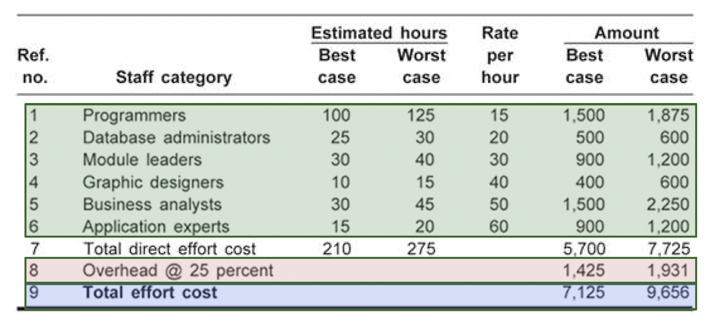

# 02. Estimation

- [02. Estimation](#02-estimation)
  - [D4. Metrics and Techniques](#d4-metrics-and-techniques)
    - [Basic Concepts](#basic-concepts)
      - [Real-Life Cases of Estimation](#real-life-cases-of-estimation)
        - [**Case 1: Underestimation** ⚠️](#case-1-underestimation-️)
        - [**Case 2: Overestimation** ⚠️](#case-2-overestimation-️)
        - [**Case 3: Budget Constraints** ⚠️](#case-3-budget-constraints-️)
      - [Software vs Other Industries](#software-vs-other-industries)
      - [Challenges in Software Estimation](#challenges-in-software-estimation)
      - [Precision and Accuracy](#precision-and-accuracy)
    - [Estimation Phases](#estimation-phases)
      - [Key Estimations](#key-estimations)
      - [Main Sections in Estimation](#main-sections-in-estimation)
        - [Size Estimation](#size-estimation)
        - [Effort Estimation](#effort-estimation)
        - [Cost Estimation](#cost-estimation)
      - [Productivity Estimation](#productivity-estimation)
      - [Factors Affecting Duration](#factors-affecting-duration)
    - [Metrics in Software Estimation](#metrics-in-software-estimation)
      - [Definitions](#definitions)
      - [Scales](#scales)
      - [Types of Metrics in Software Estimation](#types-of-metrics-in-software-estimation)
        - [Product Metrics](#product-metrics)
        - [Process Metrics](#process-metrics)
        - [Resource Metrics](#resource-metrics)
      - [Size-Based Metrics](#size-based-metrics)
      - [Function-Based Metrics](#function-based-metrics)
        - [Function Points (FP)](#function-points-fp)
        - [Object Points](#object-points)
        - [Use Case Points (UCP)](#use-case-points-ucp)
        - [Story Points](#story-points)
    - [Estimation Techniques](#estimation-techniques)
      - [Techniques Overview](#techniques-overview)
      - [Expert Judgment](#expert-judgment)
      - [Delphi Method](#delphi-method)
      - [Heuristic/Historical/Analogous Estimation](#heuristichistoricalanalogous-estimation)
      - [Parametric Estimation](#parametric-estimation)
      - [Decomposition Technique](#decomposition-technique)
      - [Phased Estimation](#phased-estimation)
      - [Pricing to Win](#pricing-to-win)
    - [Scrum and Agile Estimations](#scrum-and-agile-estimations)
      - [Scrum Principles](#scrum-principles)
      - [User Story Estimation](#user-story-estimation)
        - [Developer Responsibilities](#developer-responsibilities)
        - [Customer Responsibilities](#customer-responsibilities)
      - [Planning Poker (Scrum Poker)](#planning-poker-scrum-poker)
      - [Estimating User Stories](#estimating-user-stories)
    - [Practical Example: Online Bookshop](#practical-example-online-bookshop)
      - [Project Context](#project-context)
      - [MoSCoW Prioritization Framework](#moscow-prioritization-framework)
      - [User Story Estimation Example](#user-story-estimation-example)
      - [Analysis of the Example](#analysis-of-the-example)
      - [Release Planning Based on This Example](#release-planning-based-on-this-example)
      - [Velocity-Based Timeline Projection](#velocity-based-timeline-projection)
      - [Cost Estimation](#cost-estimation-1)
  - [D5. Cost Estimation](#d5-cost-estimation)
    - [Cost and Effort Models](#cost-and-effort-models)
      - [Objectives](#objectives)
      - [Costs to Estimate](#costs-to-estimate)
    - [Cost Estimation Techniques](#cost-estimation-techniques)
      - [Top-down Estimation](#top-down-estimation)
      - [Bottom-up Estimation](#bottom-up-estimation)
    - [Factors Affecting Earnings in Software Roles](#factors-affecting-earnings-in-software-roles)
    - [Pricing Models](#pricing-models)
      - [Cost vs Price](#cost-vs-price)
      - [Types of Pricing Models](#types-of-pricing-models)
        - [Cost-plus Pricing](#cost-plus-pricing)
        - [Opportunity Pricing](#opportunity-pricing)
        - [Going Rate Pricing](#going-rate-pricing)
        - [Monopolistic Pricing](#monopolistic-pricing)
        - [Oligopolistic Pricing](#oligopolistic-pricing)
        - [Transfer Pricing](#transfer-pricing)
        - [Loss Leader Pricing](#loss-leader-pricing)
    - [Calculating Per-person-hour Cost](#calculating-per-person-hour-cost)
      - [Overhead Calculation](#overhead-calculation)
    - [Additional Costs to Consider](#additional-costs-to-consider)
    - [Employee Cost Analysis](#employee-cost-analysis)
      - [Gross vs Net Salary Example](#gross-vs-net-salary-example)
      - [Self-employed Costs](#self-employed-costs)
      - [Example of Self-employed Cost Breakdown](#example-of-self-employed-cost-breakdown)
    - [References](#references)

---

## D4. Metrics and Techniques

Accurate estimation is one of the most critical and challenging aspects of software project management. In this section, we'll explore the fundamental concepts, techniques, and best practices for creating reliable estimates that help ensure project success.

### Basic Concepts

#### Real-Life Cases of Estimation

> _"Estimating software is hard. Humans are really bad at estimating in general, and software development is particularly tricky to estimate well."_ — Martin Fowler

Let's examine three common estimation scenarios and their potential consequences:

##### **Case 1: Underestimation** ⚠️

```mermaid
graph TD
    A[Customer: "How much will you charge for the described app?"] --> B[Response: "1,000 euros."]
    B --> C[Actual Effort: Much higher than estimated]
    C --> D[Consequences: Financial loss, missed deadlines, quality compromises]
```

**Root causes of underestimation:**

- Optimism bias (believing everything will go perfectly)
- Pressure to win the contract/project
- Overlooking complexity and potential risks
- Not accounting for non-development tasks (testing, documentation, meetings)

##### **Case 2: Overestimation** ⚠️

```mermaid
graph TD
    A[Customer: "How much will you charge for the described app?"] --> B[Response: "54,000 euros."]
    B --> C[Consequence: Potential loss of business opportunity]
    C --> D[Competitor wins with lower, more realistic estimate]
```

**Root causes of overestimation:**

- Excessive risk aversion
- Padding estimates to account for uncertainty
- Limited understanding of efficient development techniques
- Adding contingency at multiple levels ("padding the padding")

##### **Case 3: Budget Constraints** ⚠️

When unforeseen expenses arise (like an unexpected electricity bill), it highlights the importance of:

- Accurate budgeting
- Maintaining contingency reserves
- Understanding the full scope of possible costs
- Regular budget monitoring and adjustment

**Key Insight:** Most estimation problems stem from either overconfidence or overcaution. The goal is to find the balance that leads to realistic, achievable estimates.

#### Software vs Other Industries

Estimation in manufacturing or traditional industries differs significantly from software development. Let's compare:

**Example: Estimating cost/time for sewing 2,000 jeans:**

| Factor                       | Manufacturing Example                                              | Software Development                                                                   |
| ---------------------------- | ------------------------------------------------------------------ | -------------------------------------------------------------------------------------- |
| **Productivity Measurement** | Tangible: 5 jeans/hour per worker                                  | Intangible: How do we measure "lines of code per hour"?                                |
| **Cost Factors**             | Direct labor (€12/hr), Indirect (€8/hr), Transportation (€1,500)   | Direct labor, infrastructure costs, licensing, technical debt...                       |
| **Process Predictability**   | High: Manufacturing processes are well-established                 | Low: Every software project has unique challenges                                      |
| **Scaling**                  | Linear: Adding more workers generally produces proportional output | Non-linear: "Adding manpower to a late software project makes it later" (Brooks's Law) |

This fundamental difference explains why techniques from traditional industries often fail when applied directly to software development.

#### Challenges in Software Estimation

Software estimation presents unique challenges that don't exist in other fields:

1. **Productivity Variability** 📊

   - Studies show that productivity between the best and worst programmers can vary by a factor of 10x or more
   - The same developer's productivity varies based on familiarity with the domain, technology, and team

2. **Non-functional Requirements Impact** 🛡️

   - Two applications with identical functionality can have vastly different costs:
     - One with military-grade encryption vs. basic security
     - One designed for high modularity vs. quick prototype
     - One with accessibility requirements vs. none

3. **Requirements Volatility** 🔄

   - Software requirements change more frequently than in other engineering disciplines
   - Changes often come mid-development as stakeholders see early versions

4. **Constant Innovation** 🚀

   - New technologies, frameworks, and approaches emerge rapidly
   - Historical data quickly becomes less relevant

5. **Invisibility** 👁️
   - Software development progress is largely invisible compared to physical construction
   - Percentage completion is difficult to assess accurately

#### Precision and Accuracy

Understanding the difference between precision and accuracy is crucial for effective estimation:


**Accuracy** refers to how close an estimate is to the true value. An accurate estimate may not be precise, but it encompasses the actual outcome.

**Precision** refers to how specific or detailed an estimate is. A precise estimate gives a narrow range but may completely miss the actual value.


> **Example:** Saying a project will take "3-6 months" is less precise but may be more accurate than saying "97 days," which sounds precise but could be wildly inaccurate.

**Tom Cargill's Ninety-Ninety Rule:**

> _"The first 90% of the code accounts for the first 90% of the development time. The remaining 10% of the code accounts for the other 90% of the development time."_

This humorous observation highlights a common phenomenon in software projects: we often think we're almost done when we've really only completed the easier parts of the work.

**🤔 Reflection Questions:**

1. In your experience, are your estimates usually optimistic or pessimistic?
2. How can you improve your estimation accuracy?
3. How do you assess the most complex parts of a project appropriately?

**Key Takeaways:**

- Aim for accuracy over false precision
- Use ranges rather than single-point estimates
- Account for known unknowns and unknown unknowns
- Review estimation history to improve future estimates

### Estimation Phases

#### Key Estimations

During a project's lifecycle, several critical aspects require estimation:

<div align="center">


</div>

These estimations are interdependent - changing one often affects the others. For example, adding more team members may reduce duration but increase costs and coordination complexity.

#### Main Sections in Estimation

The estimation process can be divided into three primary areas, each answering fundamental questions:

<div align="center">

| Estimation Area       | Key Questions                                     | Primary Focus                  |
| --------------------- | ------------------------------------------------- | ------------------------------ |
| **Size Estimation**   | How much do I need to develop? How complex is it? | Scope, requirements, features  |
| **Effort Estimation** | How long will it take? How many people do I need? | Person-hours, team composition |
| **Cost Estimation**   | What's the budget? What resources do I need?      | Financial planning, quotation  |

</div>

##### Size Estimation

Size estimation involves determining the scope and complexity of the software to be developed. This is the foundation for all other estimates. Methods include:

- **User Story Count**: Total number of user stories
- **Function Points**: Measuring functionality based on user requirements
- **Source Lines of Code (SLOC)**: Estimated lines of code required
- **Story Points**: Relative complexity measure used in agile development

> **Example**: A mobile banking app's size estimation might include 60 user stories totaling 200 story points, with an estimated 40,000 SLOC.

##### Effort Estimation

Effort estimation translates size into the human resources required. This phase answers:

- How many person-hours/days will the project take?
- How should we distribute work among team members?
- What skills are needed and when?

> **Example**: For the mobile banking app with 200 story points, the team estimates 4 hours per point, resulting in an 800-hour effort estimate. With 5 developers, this suggests approximately 20 weeks of development time.

##### Cost Estimation

Cost estimation converts effort into financial terms and adds additional expenses:

- Direct labor costs (salary, benefits)
- Infrastructure costs (hardware, software, cloud services)
- Operational costs (facilities, utilities)
- External services (third-party APIs, consultants)
- Contingency reserves

> **Example**: The 800-hour mobile banking app, at $60/hour average developer cost, has a $48,000 development labor cost. Adding $12,000 for infrastructure, testing devices, and third-party services, plus a 15% contingency brings the total estimated cost to $69,000.

#### Productivity Estimation

Productivity assessment is a crucial factor in accurate estimation. It's influenced by:

1. **Team Experience** 🧠

   - Domain knowledge
   - Technical expertise
   - Familiarity with tools and methodologies

2. **Project Complexity** 🧩

   - Technical challenges
   - Integration requirements
   - Security considerations

3. **Work Environment** 🏢

   - Available tools
   - Office layout and ergonomics
   - Remote vs. in-office setup

4. **Process Quality** ⚙️

   - Development methodology
   - Code review practices
   - Testing procedures

5. **Team Dynamics** 👥
   - Communication efficiency
   - Collaboration patterns
   - Team cohesion

> **Key Insight**: Individual productivity differences are among the most significant factors affecting estimates. Research suggests that productivity between developers can vary by a factor of 10x or more, even within the same organization.

#### Factors Affecting Duration

Project duration is influenced by various factors beyond just the raw effort estimate:

<div align="center">


</div>

**Critical Duration Considerations**:

1. **Parallel vs. Sequential Work**: Not all tasks can be performed in parallel. Dependencies between tasks can stretch timelines.

2. **Communication Overhead**: As team size increases, communication paths increase exponentially according to the formula n(n-1)/2, where n is the number of team members.

3. **Learning Curve**: New technologies or domain knowledge acquisition can slow initial progress.

4. **External Dependencies**: Reliance on third-party services, client feedback, or other teams can introduce delays beyond your control.

5. **Brooks's Law**: "Adding manpower to a late software project makes it later." Onboarding new team members initially decreases productivity.

> **Real-world Example**: A project estimated at 120 person-days of effort might take 40 calendar days with 4 developers, but this doesn't account for onboarding time, communication overhead, and the fact that not all tasks can be parallelized. A more realistic duration might be 50-60 calendar days.

**🔍 Important Note**: When communicating estimates to stakeholders, distinguish between effort (total person-hours required) and duration (calendar time to completion), as these are often confused.

### Metrics in Software Estimation

> _"Measure what can be measured, and make measurable what cannot be measured."_ — Galileo Galilei

Effective metrics are the cornerstone of reliable software estimation. Without appropriate measurements, estimates become guesswork rather than informed predictions.

#### Definitions

To establish a common understanding, let's define key measurement terminology:

<div align="center">

| Term            | Definition                                       | Example in Software Context                    |
| --------------- | ------------------------------------------------ | ---------------------------------------------- |
| **Entity**      | The object being characterized                   | A module, function, team, or project           |
| **Attribute**   | A measurable characteristic of an entity         | Size, complexity, duration, cost               |
| **Measurement** | The process of assigning values to attributes    | Counting lines of code, timing task completion |
| **Measure**     | The value or symbol assigned through measurement | "5,000 lines of code," "3 story points"        |

</div>

#### Scales

Measurement scales determine how we interpret and manipulate measured values. Each scale has different mathematical properties and appropriate uses:

```mermaid
graph TD
    A[Measurement Scales] --> B[Nominal]
    A --> C[Dichotomic]
    A --> D[Ordinal]
    A --> E[Interval]
    A --> F[Absolute/Ratio]

    B --> B1["Categories without order<br>Example: Languages (Java, Python)"]
    C --> C1["Binary classification<br>Example: Boolean (Yes/No)"]
    D --> D1["Ordered categories<br>Example: Priority (Low, Medium, High)"]
    E --> E1["Numerical ranges<br>Example: Temperature (-10°C to 40°C)"]
    F --> F1["Direct numerical values<br>Example: Code lines (0, 1, 2, 3...)"]

    style A fill:#f9f,stroke:#333,stroke-width:2px
```

<div align="center">



</div>

**Mathematical Operations by Scale Type:**

| Scale Type     | Equality | Rank Order | Addition/Subtraction | Multiplication/Division | Example Metrics                                        |
| -------------- | :------: | :--------: | :------------------: | :---------------------: | ------------------------------------------------------ |
| Nominal        |    ✅    |     ❌     |          ❌          |           ❌            | Programming language, development methodology          |
| Dichotomic     |    ✅    |     ❌     |          ❌          |           ❌            | Bug/no bug, passed/failed test                         |
| Ordinal        |    ✅    |     ✅     |          ❌          |           ❌            | T-shirt sizes (S, M, L), story points, priority levels |
| Interval       |    ✅    |     ✅     |          ✅          |           ❌            | Date ranges, temperature (Celsius)                     |
| Absolute/Ratio |    ✅    |     ✅     |          ✅          |           ✅            | Lines of code, hours, defect count, cost               |

> **Example**: In agile estimation, story points use an ordinal scale. You can say 8 points is larger than 5 points, but you cannot say it's exactly "3 points more difficult" or "60% more effort" since the scale doesn't support these mathematical operations.

#### Types of Metrics in Software Estimation

Software metrics generally fall into three categories:

<div align="center">


</div>

##### Product Metrics

Product metrics measure characteristics of the software artifacts themselves:

- **Size**: Lines of code, number of functions, classes, modules
- **Complexity**: Cyclomatic complexity, nesting depth, coupling
- **Quality**: Defect density, test coverage, maintainability index
- **Technical Characteristics**: Memory usage, response time, throughput

> **Example**: A backend API might be measured as having 12,000 lines of code, 120 endpoints, a cyclomatic complexity of 15 for critical functions, and 87% test coverage.

##### Process Metrics

Process metrics measure aspects of the development process:

- **Time**: Duration of development phases, lead time, cycle time
- **Effort**: Person-hours spent on tasks, activities, phases
- **Efficiency**: Velocity, throughput, burn rate
- **Stability**: Requirement changes, scope creep percentage

> **Example**: A team might measure their velocity at 30 story points per 2-week sprint, with an average code review turnaround of 1.2 days and a deployment frequency of twice per week.

##### Resource Metrics

Resource metrics measure the characteristics of the people and tools involved:

- **Personnel**: Team size, experience levels, skills distribution
- **Productivity**: Story points completed per developer per iteration
- **Tools**: Hardware specifications, software versions, infrastructure capacity
- **Cost**: Hourly rates, infrastructure costs, licensing fees

> **Example**: A development team might be measured as having 7 developers (2 senior, 3 mid-level, 2 junior), an average productivity of 4 story points per person-week, and operating costs of $12,000 per month for cloud infrastructure.

#### Size-Based Metrics

Size-based metrics measure a product according to physical aspects or software artifacts. They provide tangible counts of what has been or will be produced.

<div align="center">

| Metric                       | Description                                             | Best Used For                                  |
| ---------------------------- | ------------------------------------------------------- | ---------------------------------------------- |
| Lines of Code (LOC)          | Physical lines in source files                          | Comparing similar systems in the same language |
| Logical Lines of Code (LLOC) | Executable statements (excluding comments, blank lines) | More accurate comparisons between codebases    |
| Function Count               | Number of functions or methods                          | Assessing functional richness                  |
| Class Count                  | Number of classes or modules                            | Object-oriented systems                        |
| API Endpoints                | Number of external interfaces                           | Service-oriented architectures                 |
| Database Tables/Columns      | Database structure size                                 | Data-intensive applications                    |

</div>

**Advantages:**

- Easy to measure automatically
- Objective and unambiguous
- Directly observable in completed work

**Limitations:**

- Language and coding style dependent
- Difficult to estimate accurately before implementation
- May reward verbose code over efficient solutions
- Doesn't capture functionality or business value

> **Historical Context**: The aerospace industry found that development effort correlated with code size with approximately 50% accuracy. This led to early estimation models like COCOMO using LOC as a primary input.

#### Function-Based Metrics

Function-based metrics attempt to measure the useful functionality delivered, independent of implementation details. They focus on what the software does rather than how it's constructed.

<div align="center">


</div>

##### Function Points (FP)

Function Points measure software size based on functional user requirements:

1. **External Inputs**: Data or control inputs from outside the system
2. **External Outputs**: Data or control information sent out of the system
3. **External Inquiries**: Input/output combinations where input triggers immediate output
4. **Internal Logical Files**: Logical groups of data maintained within the system
5. **External Interface Files**: Data shared with other systems

Each element is rated for complexity (Low/Medium/High) and assigned a weight:

<div align="center">

| Component                | Low | Medium | High |
| ------------------------ | --- | ------ | ---- |
| External Inputs          | 3   | 4      | 6    |
| External Outputs         | 4   | 5      | 7    |
| External Inquiries       | 3   | 4      | 6    |
| Internal Logical Files   | 7   | 10     | 15   |
| External Interface Files | 5   | 7      | 10   |

</div>

The unadjusted function point count is then modified by 14 technical complexity factors to arrive at the final function point count.

> **Example**: A banking system might have 15 inputs (mostly medium complexity), 20 outputs (varying complexity), 10 queries, 8 internal files, and 3 external interfaces. The calculation might yield 250 function points.

##### Object Points

Object Points focus on user interface and data elements:

1. **Screens**: User interfaces with various complexity levels
2. **Reports**: Output formats generated by the system
3. **Components**: Reusable modules to be developed
4. **Data Entities**: Logical data structures

##### Use Case Points (UCP)

Use Case Points are based on use case specifications:

1. **Unadjusted Actor Weight (UAW)**: Complexity of system actors
2. **Unadjusted Use Case Weight (UUCW)**: Complexity of use cases
3. **Technical Complexity Factor (TCF)**: System's technical complexity
4. **Environmental Factor (EF)**: Team's capabilities and environment

The formula is: UCP = (UAW + UUCW) × TCF × EF

##### Story Points

Story Points are a relative measure of effort, complexity, and risk:

- Measured on a relative scale (often Fibonacci: 1, 2, 3, 5, 8, 13, 21...)
- Estimated by the development team through techniques like Planning Poker
- Become more accurate as the team establishes velocity

**Advantages of Function-Based Metrics:**

- Can be applied earlier in the development lifecycle
- Independent of implementation language and technology
- Focus on business value and user functionality
- More stable across different implementation approaches

**Limitations of Function-Based Metrics:**

- More subjective than size-based metrics
- Require training and consistent application
- May not capture technical complexity adequately
- More time-consuming to count manually

> **Key Insight**: Organizations that consistently use function-based metrics typically see estimation accuracy improve over time as they build historical databases correlating function measures to actual effort.

### Estimation Techniques

Different projects require different approaches to estimation. The ideal technique depends on factors like project type, available historical data, team experience, and timeline constraints.

#### Techniques Overview

<div align="center">


</div>

#### Expert Judgment

Expert judgment relies on the experience and knowledge of individuals or groups who have expertise in similar projects or domains.

**Process:**

1. Identify appropriate experts with relevant experience
2. Each expert provides independent estimates
3. Estimates are compared and analyzed
4. Discussion addresses significant differences
5. Process repeats until consensus or a reasonable range is achieved

**When to Use:**

- When historical data is limited or not applicable
- For new technologies or approaches
- When rapid estimation is required
- To complement other estimation techniques

**Advantages:**

- Incorporates tacit knowledge and intuition
- Takes into account unique project characteristics
- Can consider subjective factors not captured by formal models
- Relatively quick to implement

**Disadvantages:**

- Not reproducible or consistently verifiable
- Subject to cognitive biases (anchoring, optimism, etc.)
- Dependent on available experts and their specific experiences
- Can be influenced by organizational politics

> **Real-world Example**: A company developing a new mobile payment application might have experts estimate effort based on their experience with similar security-critical financial applications, considering the specific challenges of the current regulatory environment that might not be reflected in historical data.

#### Delphi Method

The Delphi Method is a structured communication technique that refines expert opinions through multiple rounds of anonymous feedback and revision.

<div align="center">


</div>

**Process:**

1. A facilitator presents the estimation problem to a panel of experts
2. Experts provide anonymous estimates and rationales
3. The facilitator compiles and summarizes all responses
4. Experts review the anonymized feedback from others
5. Experts refine their estimates based on new insights
6. Steps 3-5 repeat until sufficient consensus is reached

**When to Use:**

- When there are dominant personalities that might skew open discussions
- For controversial or politically sensitive projects
- When experts are geographically distributed
- When a systematic approach to expert judgment is needed

**Advantages:**

- Minimizes group think and conformity pressure
- Promotes independent thinking
- Provides structured convergence toward consensus
- Documents reasoning behind estimates

**Disadvantages:**

- Time-consuming process
- Requires committed participation across multiple rounds
- May still be affected by cognitive biases
- Needs effective facilitation

> **Real-world Example**: An organization planning a major ERP implementation across multiple countries used the Delphi method to gather estimates from IT managers in different regions. The anonymous process helped surface regional concerns that might not have been expressed in open meetings due to organizational hierarchy.

#### Heuristic/Historical/Analogous Estimation

This approach uses data from similar past projects as a basis for estimating new projects, adjusting for differences between the reference projects and the current one.

**Process:**

1. Identify key parameters that define project size and complexity
2. Search for completed projects with similar parameters
3. Analyze the actual effort, duration, and cost of those projects
4. Adjust for differences between historical projects and the current one
5. Derive estimates based on these adjusted historical values

**When to Use:**

- When reliable historical data exists for similar projects
- For well-understood types of projects
- When quick estimates are needed
- As a sanity check for other estimation techniques

**Advantages:**

- Based on actual performance rather than theoretical models
- Relatively quick once similar projects are identified
- Includes the effect of organizational context
- Can account for domain-specific factors

**Disadvantages:**

- Requires similar past projects as reference points
- Similarity can be subjective and difficult to quantify
- May perpetuate past inefficiencies
- Past performance may not be relevant if technologies or practices have evolved

> **Real-world Example**: A web development agency estimates a new e-commerce project by identifying three similar past projects, comparing features, complexity, and team composition, then adjusting the historical effort data to account for differences in payment gateway integration and multilingual support requirements.

#### Parametric Estimation

Parametric estimation uses mathematical models that define statistical relationships between project parameters and the effort or duration required.

**Process:**

1. Identify key project parameters (size, complexity, constraints)
2. Apply these parameters to a mathematical model
3. The model calculates estimates based on historical correlations
4. Adjust results based on project-specific factors

**Common Parametric Models:**

- **COCOMO (Constructive Cost Model)**: Based primarily on lines of code and organizational/technical factors
- **SLIM (Software Lifecycle Management)**: Uses Putnam's model for relating effort and time
- **Function Point Analysis models**: Use function points as the primary size variable

**When to Use:**

- When the organization has calibrated models with historical data
- For projects similar to those used to develop the model
- When objective, reproducible estimates are required
- For early estimates when detailed requirements are not yet available

**Advantages:**

- Reproducible calculations that can be refined
- Based on statistical relationships with historical significance
- Reduces complex estimation to parameter identification
- Provides consistent results for similar inputs

**Disadvantages:**

- Models require calibration with organizational data
- May not adapt well to unique project circumstances
- Can create a false sense of precision
- Parameter identification can still be subjective

> **Real-world Example**: An aerospace software team uses a calibrated COCOMO II model to estimate a flight control system, inputting estimated code size, team experience ratings, and complexity factors to generate effort and schedule projections that are consistent with their historical projects.

#### Decomposition Technique

The decomposition technique breaks down a project into smaller, more manageable components that are easier to estimate individually. These component estimates are then aggregated to produce the overall project estimate.

**Process:**

1. Create a Work Breakdown Structure (WBS) dividing the project into components
2. Continue breaking down until components are small enough to estimate accurately
3. Estimate each component individually
4. Account for integration effort between components
5. Aggregate estimates to produce overall project estimate

**When to Use:**

- For large, complex projects
- When different project components have different characteristics
- When different experts need to estimate different areas
- When detailed planning is required

**Advantages:**

- Improves accuracy by focusing on smaller, more estimable units
- Allows specialists to estimate their areas of expertise
- Provides detailed visibility into project structure
- Can identify high-risk or high-uncertainty components

**Disadvantages:**

- Time-consuming to implement thoroughly
- May miss integration complexities between components
- Can lead to "death by planning" if taken to extremes
- Requires careful aggregation to account for dependencies

> **Real-world Example**: A team developing an enterprise CRM system breaks down the project into user management, contact management, opportunity tracking, reporting, and integration modules. Each module is further decomposed into features and tasks, estimated separately by the appropriate specialists, and then combined with additional time allocated for integration testing.

#### Phased Estimation

Phased estimation (also called "rolling wave planning") provides detailed estimates for near-term work and more general estimates for future work, refining estimates as the project progresses and more information becomes available.

**Process:**

1. Divide the project into phases or time periods
2. Develop detailed estimates for the immediate phase
3. Create rough estimates for future phases
4. As each phase approaches, develop detailed estimates for it
5. Continually update the overall project estimate based on actual performance and refined future estimates

**When to Use:**

- For projects with high uncertainty
- When requirements are expected to evolve
- In agile development environments
- For long-term projects where detailed upfront planning is impractical

**Advantages:**

- Acknowledges and manages uncertainty
- Avoids wasting effort on detailed estimates for distant work
- Incorporates actual performance data as it becomes available
- Adapts to changing requirements or conditions

**Disadvantages:**

- Doesn't provide a complete detailed estimate upfront
- May be perceived as lack of planning by some stakeholders
- Requires ongoing estimation effort throughout the project
- Can make long-term resource planning more challenging

> **Real-world Example**: A product development team creates detailed estimates for the next 3-month release, rough estimates for the following two releases, and only high-level estimates beyond that. As each release approaches, they refine estimates based on actual performance and evolving requirements.

#### Pricing to Win

Pricing to Win is a budget-constrained approach where the project scope is adjusted to fit within a predetermined budget or price point.

**Process:**

1. Identify the maximum budget the client can or will pay
2. Determine which requirements are essential vs. optional
3. Estimate the cost of essential requirements
4. Allocate remaining budget to optional requirements based on priority
5. Establish scope that fits within the budget constraint

**When to Use:**

- When the client has a fixed budget that cannot be exceeded
- For competitive bid situations
- When requirements can be flexible
- For commercial products with market-driven price points

**Advantages:**

- Ensures alignment with budget constraints
- Forces prioritization of features
- Can lead to creative solutions to deliver maximum value within constraints
- Avoids setting unrealistic expectations

**Disadvantages:**

- May result in reduced scope or quality
- Some requirements may remain unimplemented
- Can lead to technical debt if corners are cut
- May not be appropriate for safety-critical or compliance-driven projects

> **Real-world Example**: A startup building a minimum viable product (MVP) with limited funding uses the Pricing to Win approach. They identify core features necessary for market validation, estimate those costs, and allocate remaining funds to the highest-priority nice-to-have features, deferring others to post-funding phases.

### Scrum and Agile Estimations

Agile approaches to estimation are fundamentally different from traditional methods, emphasizing relative sizing, team consensus, and continuous refinement based on actual performance.

<div align="center">


</div>

#### Scrum Principles

Scrum is an iterative, incremental framework for project management that emphasizes:

- **Empirical Process Control**: Using transparency, inspection, and adaptation
- **Self-organizing Teams**: Collectively responsible for delivering working software
- **Timeboxed Iterations**: Fixed-length sprints (typically 1-4 weeks)
- **Potentially Shippable Increments**: Delivering working software every sprint
- **Continuous Improvement**: Regular retrospectives to improve processes

**Agile Estimation Philosophy:**

1. **Embracing Uncertainty**: Acknowledging that software development is inherently uncertain
2. **Progressive Refinement**: Estimates become more accurate as understanding increases
3. **Team Ownership**: Those doing the work provide the estimates
4. **Relativity**: Comparing work items to each other rather than absolute time
5. **Velocity-Based Planning**: Using past performance to predict future delivery

#### User Story Estimation

In Scrum and other agile frameworks, teams estimate user stories using relative size units like story points rather than absolute time units.

**Key Principles of Story Point Estimation:**

- **Relative Sizing**: Comparing stories to each other rather than to time
- **Team Consensus**: The entire team participates in estimation
- **Team Ownership**: Estimates belong to the team, not individuals
- **Considering All Factors**: Complexity, effort, and uncertainty all contribute to estimates
- **Continuous Calibration**: Story points become more consistent as the team establishes velocity

> **Example**: A story to "Allow users to reset their password" might be estimated at 3 points, while a story to "Implement two-factor authentication" might be 8 points, indicating it's roughly 2-3 times more complex/effort.

##### Developer Responsibilities

As a development team member, your estimation responsibilities include:

- **Defining Consistent Story Points**: Establish a shared understanding of what each point value means
- **Providing Honest Estimates**: Resist pressure to provide artificially low estimates
- **Estimating as a Team**: Everyone participates in the estimation process
- **Maintaining Consistency**: Similar stories should receive similar point values
- **Considering All Aspects**: Include testing, documentation, and deployment in estimates
- **Learning from History**: Use completed stories as reference points

##### Customer Responsibilities

As a product owner or customer representative, your estimation responsibilities include:

- **Clarifying Requirements**: Answer questions and provide context during estimation
- **Respecting Team Estimates**: Trust the team's expertise about the effort involved
- **Not Estimating Stories Yourself**: The people doing the work should estimate it
- **Prioritizing Based on Value**: Using estimates to make informed priority decisions
- **Accepting Uncertainty**: Understanding that estimates are not commitments

#### Planning Poker (Scrum Poker)

Planning Poker is a consensus-based estimation technique used by agile teams to estimate relative effort for user stories.

<div align="center">


</div>

**Process:**

<div align="center">


</div>

1. **Preparation**: Each team member receives a deck of cards with values (often Fibonacci: 1, 2, 3, 5, 8, 13, 21, ?)
2. **Discussion**: Product Owner presents a user story and answers questions
3. **Silent Estimation**: Each team member selects a card representing their estimate
4. **Reveal**: All team members reveal their cards simultaneously
5. **Discussion**: If estimates vary significantly, team members discuss their reasoning
6. **Re-estimate**: The team re-votes until consensus is reached

**Example Planning Poker Session:**

<div align="center">


</div>

**Advantages:**

- Prevents anchoring bias by revealing estimates simultaneously
- Encourages discussion of different perspectives
- Avoids domination by vocal team members
- Makes estimation collaborative and engaging

#### Estimating User Stories

<div align="center">


</div>

**Key Concepts in Agile Estimation:**

1. **Ideal Time vs. Calendar Time**:

   - **Ideal Time**: Uninterrupted, focused effort
   - **Calendar Time**: Real-world time including meetings, interruptions, admin work
   - Conversion factor between ideal and actual time varies by team and context

2. **Velocity**:

   - The amount of work a team can complete in a sprint
   - Measured in the same units used for estimation (typically story points)
   - Based on historical performance, not theoretical capacity
   - Accounts for all real-world factors affecting productivity

3. **Initial Velocity Approximation**:

   - When a team has no historical data, start with a conservative estimate
   - Typically between one-third and one-half of theoretical capacity
   - For example: 5 developers × 10 days × 6 ideal hours = 300 hours theoretical capacity
   - Initial velocity estimate: 100-150 ideal hours or equivalent story points

4. **Burn-down Charts**:
   - Visual representation of work remaining over time
   - Shows progress toward sprint or release goals
   - Helps identify if team is on track to meet commitments

<div align="center">


</div>

**Best Practices for Agile Estimation:**

1. **Re-estimate Rarely**: Resist changing estimates for stories once work has started
2. **Use Reference Stories**: Keep examples of each point value for comparison
3. **Limit Range**: Most teams find 3-5 different point values sufficient
4. **Keep it Light**: Estimation should be quick; avoid analysis paralysis
5. **Track Accuracy**: Compare estimates to actuals to improve over time
6. **Focus on Value**: Remember that estimation serves delivery planning, not performance evaluation

> **Key Insight**: Consistent estimation combined with measured velocity is more valuable than absolute accuracy. The goal is reliable predictability for release planning, not precision of individual estimates.

### Practical Example: Online Bookshop

To illustrate the concepts discussed throughout this document, let's examine a practical example of estimating a fictional online bookshop application.

#### Project Context

The client wants to create an e-commerce platform for selling books online. The platform should allow users to search for books, view details, make purchases, manage accounts, and provide administrative capabilities for managing inventory.

#### MoSCoW Prioritization Framework

When estimating and planning projects, the MoSCoW prioritization technique helps categorize features based on their importance:

<div align="center">


</div>

- **Must Have**: Critical features without which the system will not function properly
- **Should Have**: Important features that add significant value but could be delivered later
- **Could Have**: Desirable features that would enhance the system but are not necessary
- **Won't Have**: Features explicitly excluded from the current scope (but might be considered for future releases)

#### User Story Estimation Example

Below is a sample of user stories for the online bookshop, along with story point estimates and prioritization:

<div align="center">

| ID  | Description                                                                                                                                      | Story Points | Priority |
| --- | ------------------------------------------------------------------------------------------------------------------------------------------------ | :----------: | :------: |
| 1   | A user can do a basic simple search that searches for a word or phrase in both the author and title fields.                                      |      1       |   Must   |
| 2   | A user can search for books by entering values in any combination of author, title and ISBN.                                                     |      1       |   Must   |
| 3   | A user can view detailed information on a book. For example, number of pages, publication date and a brief description.                          |      1       |   Must   |
| 4   | A user can put books into a "shopping cart" and buy them when they are done shopping.                                                            |      1       |   Must   |
| 5   | A user can remove books from their cart before completing an order.                                                                              |      ½       |   Must   |
| 6   | To buy a book the user enters their billing address, the shipping address and credit card information.                                           |      2       |   Must   |
| 7   | A user can view a history of all of their past orders.                                                                                           |      1       |  Should  |
| 8   | A user can easily re-purchase items when viewing past orders.                                                                                    |      ½       |  Should  |
| 9   | The site always tells a shopper what the last 3 items they viewed are and provides links back to them (this works even between sessions).        |      1       |  Could   |
| 10  | A user can see what books we recommend on a variety of topics.                                                                                   |      3       |  Could   |
| 11  | A user can choose to have items gift wrapped.                                                                                                    |      ½       |  Should  |
| 12  | A user can choose to enclose a gift card and can write their own message for the card.                                                           |      ½       |  Should  |
| 13  | A user can rate books from 1 (bad) to 5 (good). The book does not have to be one the user bought from us.                                        |      2       |  Should  |
| 14  | A user can write a review of a book. They can preview the review before submitting it. The book does not have to be one the user bought from us. |      5       |  Could   |
| 15  | An administrator needs to approve or reject reviews before they are published.                                                                   |      2       |  Should  |
| 16  | A Report Viewer can see reports of daily purchases broken down by book category, traffic, best- and worst-selling books and so on.               |      8       |  Could   |
| 17  | A user must be properly authenticated before viewing reports.                                                                                    |      1       |   Must   |
| 18  | Orders made on the website have to end up in the same order database as telephone orders.                                                        |      0       |   Must   |
| 19  | An administrator can add new books to the site.                                                                                                  |      1       |   Must   |
| 20  | An administrator can delete a book.                                                                                                              |      ½       |   Must   |
| 21  | An administrator can edit the information about an existing books.                                                                               |      1       |   Must   |
| 22  | The system must support peak usage of up to 50 concurrent users.                                                                                 |      0       |   Must   |

</div>

**Note**: Stories with 0 story points typically represent requirements or constraints rather than user stories requiring development effort.

#### Analysis of the Example

This example demonstrates several key estimation and planning concepts:

1. **Relative Sizing**: Notice how the story points use a modified Fibonacci sequence (½, 1, 2, 3, 5, 8). This enables relative sizing where a 2-point story is roughly twice as complex as a 1-point story.

2. **Priority Distribution**: The must-have items focus on core functionality (search, view, purchase, basic admin), while nice-to-have features (recommendations, reviews, gift options) are categorized as should or could have.

3. **Non-functional Requirements**: Items like #18 (database integration) and #22 (concurrent users) represent constraints or non-functional requirements that affect the system design but don't directly translate to development tasks.

4. **Value vs. Effort Balance**: Notice that some high-value features have low story points (e.g., removing items from cart at ½ point), while some lower-priority features have high story points (e.g., reporting at 8 points).

#### Release Planning Based on This Example

Using these estimates, a team could plan their releases as follows:

1. **Minimum Viable Product (MVP)**: Implement all Must-have stories

   - Total: 9 story points
   - Core functionality: Search, view details, purchase flow, basic admin

2. **Release 2**: Add Should-have features

   - Total: 7.5 additional story points
   - Enhanced functionality: Order history, gift options, ratings, review moderation

3. **Release 3**: Implement Could-have features
   - Total: 17 additional story points
   - Premium features: Recommendations, reviews, reporting, browsing history

#### Velocity-Based Timeline Projection

If the development team has an average velocity of 10 story points per 2-week sprint, we can project:

- MVP: ~1 sprint (9 points)
- Release 2: ~1 sprint (7.5 points)
- Release 3: ~2 sprints (17 points)

Total project timeline: ~4 sprints (8 weeks) for full implementation

#### Cost Estimation

Assuming a development team of 4 people with an average cost of €400/person-day:

- 4 people × 10 days/sprint × 4 sprints = 160 person-days
- 160 person-days × €400/person-day = €64,000 for development

Additional costs might include:

- Design: €10,000
- Infrastructure: €6,000
- Testing: €8,000
- Project management: €12,000

Total estimated project cost: €100,000

This example demonstrates how user story estimation connects to release planning, timeline projections, and ultimately to cost estimation—illustrating the full spectrum of estimation processes covered in this document.

---

## D5. Cost Estimation

Understanding the financial aspects of software projects is crucial for successful project management. Cost estimation goes beyond simply calculating development hours—it involves comprehensive analysis of all resources required and financial implications.

### Cost and Effort Models

#### Objectives

The primary objectives of cost estimation in software projects are:

1. **Accurate Prediction**: Develop reliable estimates of what resources will be required
2. **Financial Planning**: Enable budgeting and resource allocation
3. **Bid Preparation**: Provide a foundation for competitive but profitable proposals
4. **Project Control**: Establish baselines to monitor and control expenditures
5. **Investment Analysis**: Support make-or-buy decisions and return on investment calculations

#### Costs to Estimate

A comprehensive cost estimation includes several categories of expenditures:

<div align="center">


</div>

**Direct Costs**: Expenses directly attributable to the project:

- **Effort Costs**: Salaries and benefits for team members (developers, testers, designers, project managers)
- **Hardware**: Physical equipment needed for development or production
- **Software**: Licenses, tools, and third-party components
- **Travel**: Site visits, client meetings, conferences
- **Training**: Skills development specific to project needs

**Indirect Costs**: Overhead expenses that support the project:

- **Office Space**: Rent, facilities, workspace infrastructure
- **Support Staff**: Administrative personnel, HR, finance
- **Utilities**: Electricity, water, heating/cooling
- **Communication Networks**: Internet, phone, network infrastructure

**Contingency Buffer**: Funds reserved for unforeseen expenses:

- Typically 10-20% of the total estimated cost
- Varies based on project complexity and risk assessment
- Helps manage unexpected challenges without compromising quality

**Final Pricing Formula**: `Final Price = Total Cost + Profit Margin`

Where profit margin depends on business model, competition, and market conditions.

### Cost Estimation Techniques

Cost estimation techniques fall into two primary categories: top-down and bottom-up. Each approach has distinct advantages and is suitable for different project stages.

#### Top-down Estimation

<div align="center">


</div>

Top-down estimation starts with overall project parameters and derives component costs through allocation or decomposition.

**Process:**

1. Evaluate the project from its global functionalities
2. Use analogies with similar past projects
3. Apply cost models or formulas
4. Distribute estimated costs to components and activities

**Best Used For:**

- Early project stages when details are limited
- Initial feasibility studies
- Budget proposals
- Projects similar to previous efforts

**Advantages:**

- Requires minimal detailed information
- Quick to develop
- Captures integration and coordination costs
- Suitable for early business decisions
- Considers organizational context

**Limitations:**

- May underestimate specific subsystem complexities
- Lacks granularity for detailed planning
- Not suitable for novel projects without historical precedent
- Can miss technical challenges

**Example Techniques:**

- COCOMO (Constructive Cost Model)
- Function Point Analysis scaling
- Industry benchmark ratios

#### Bottom-up Estimation

Bottom-up estimation starts with individual components and aggregates them to produce the total project estimate.

**Process:**

1. Break the project into smaller components
2. Estimate each component individually
3. Sum the component estimates
4. Add integration and project management overhead

**Best Used For:**

- Detailed project planning
- Projects with well-defined requirements
- When accurate component-level estimates are crucial
- Complex, multi-faceted projects

**Advantages:**

- More precise for well-understood components
- Provides detailed visibility
- Identifies cost drivers at a granular level
- Supports resource planning and scheduling

**Limitations:**

- Time-consuming and expensive to develop
- Requires detailed system understanding
- May underestimate integration costs
- Can be affected by missing components

**Example Techniques:**

- Work Breakdown Structure (WBS) based estimation
- Three-point estimates for each component
- Task-level effort aggregation

**Hybrid Approach:**
Many organizations use hybrid approaches, starting with top-down for initial budgeting and transitioning to bottom-up as more details become available.

### Factors Affecting Earnings in Software Roles

Software development salaries and project costs vary significantly based on multiple factors. Understanding these variations is essential for accurate budgeting and resource planning.

<div align="center">


</div>

**Key Influencing Factors:**

1. **Experience Level**

   - Junior developers: Lower salaries but require more supervision
   - Mid-level developers: Balance of cost and productivity
   - Senior developers: Higher salaries but greater efficiency and quality

2. **Geographic Location**

   - Regional economic conditions
   - Cost of living adjustments
   - Local talent availability
   - Global wage disparities

3. **Technical Specialization**

   - High-demand skills command premium rates
   - Emerging technology expertise
   - Domain-specific knowledge
   - Scarce skill premiums

4. **Company Characteristics**

   - Size (startup vs. enterprise)
   - Industry sector
   - Profitability and funding
   - Cultural factors and benefits

5. **Employment Model**
   - Full-time employees vs. contractors
   - Outsourcing vs. in-house development
   - Nearshore vs. offshore arrangements

**Typical Roles and Relative Compensation:**

- **Backend Developers**: Core system functionality
- **Frontend Developers**: User interface implementation
- **Full-stack Developers**: Combined expertise
- **DevOps Engineers**: Deployment and infrastructure
- **QA Engineers**: Quality assurance and testing
- **Project Managers**: Coordination and planning
- **Product Managers**: Feature definition and prioritization
- **UX/UI Designers**: User experience and interface design
- **Software Architects**: System design and technical direction
- **CTO/Technical Directors**: Technical leadership and strategy

### Pricing Models

Once costs are estimated, organizations must determine how to price their services or products. The relationship between cost and price is fundamental to business sustainability.

#### Cost vs Price

- **Cost**: The total expenditure required to complete the project (internal focus)
- **Price**: The amount charged to the customer (external focus)

<div align="center">


</div>

The gap between cost and price represents the profit margin, which must be sufficient to:

- Sustain business operations
- Fund future investments
- Compensate for risks
- Provide return to stakeholders

#### Types of Pricing Models

Different pricing strategies serve different business objectives and market positions:

##### Cost-plus Pricing

**Approach**: Add a standard markup to the total project cost.

**Formula**: `Price = Total Cost + (Total Cost × Markup Percentage)`

**Best For**:

- Standard projects with predictable costs
- Regulated industries with margin limitations
- Projects with high cost visibility to clients

**Advantages**:

- Straightforward calculation
- Ensures costs are covered
- Transparent to clients

**Limitations**:

- Ignores market conditions
- May leave money on the table
- Can encourage inefficiency

##### Opportunity Pricing

**Approach**: Price based on the value delivered to the customer rather than costs incurred.

**Best For**:

- Projects delivering significant ROI to clients
- Solutions to critical business problems
- Unique capabilities with limited competition

**Variants**:

- **Penetration Pricing**: Lower initial price to enter market, then increase
- **Skimming**: Higher initial price for early adopters, then decrease as competition enters

**Advantages**:

- Captures portion of the value created
- Can yield higher margins
- Aligns incentives with client success

**Limitations**:

- Requires understanding of client value models
- More difficult to explain and justify
- May create sticker shock

##### Going Rate Pricing

**Approach**: Set prices in line with market averages for similar services.

**Best For**:

- Highly competitive markets
- Commoditized services
- Maintaining market share

**Advantages**:

- Market acceptance
- Competitive positioning
- Simplifies sales process

**Limitations**:

- May not cover costs if inefficient
- Ignores unique value propositions
- Race to the bottom risk

##### Monopolistic Pricing

**Approach**: Set prices based on a unique feature or capability, either premium or discount.

**Best For**:

- Innovative solutions
- Patent-protected technologies
- Highly differentiated services

**Advantages**:

- Can command premium prices
- Reflects unique value
- Less direct competition

**Limitations**:

- May attract competitors
- Requires maintaining differentiation
- Can limit market size

##### Oligopolistic Pricing

**Approach**: Industry-standard pricing established by limited number of providers.

**Best For**:

- Markets with few major players
- Regulated or standardized services
- Capital-intensive industries

**Advantages**:

- Stable, predictable pricing
- Reduces price competition
- Industry sustainability

**Limitations**:

- Potential for collusion concerns
- Can stifle innovation
- May not reflect cost structures

##### Transfer Pricing

**Approach**: Internal cost allocation between departments or subsidiaries.

**Best For**:

- Inter-departmental services
- Multi-entity organizations
- Cost allocation requirements

**Advantages**:

- Reflects actual resource usage
- Supports departmental accounting
- Tax and compliance benefits

**Limitations**:

- May not encourage efficiency
- Administrative overhead
- Potential for internal conflicts

##### Loss Leader Pricing

**Approach**: Intentionally price below cost to gain future business or complementary sales.

**Best For**:

- Entry into new markets
- Platform businesses
- Relationship building

**Advantages**:

- Captures market share
- Customer acquisition strategy
- Creates future opportunities

**Limitations**:

- Unsustainable long-term
- May attract wrong clients
- Can devalue services

### Calculating Per-person-hour Cost

Accurately calculating the per-person-hour cost is fundamental to project pricing. This calculation must include both direct labor costs and appropriate overhead allocation.

<div align="center">

| Description                                | Symbol | Formula         |
| ------------------------------------------ | ------ | --------------- |
| Yearly cost of direct staff                | C      | -               |
| Work hours per year (typically 1920 hours) | H      | -               |
| Cost per person-hour                       | K      | C/H             |
| Yearly cost of indirect staff              | I      | -               |
| Yearly fixed costs (rent, etc.)            | F      | -               |
| Yearly variable expenses (utilities, etc.) | V      | -               |
| Other non-project-specific yearly costs    | M      | -               |
| Overhead cost per person-hour              | O      | (I+F+V+M)/H     |
| Total per-person-hour cost                 | T      | K+O             |
| Overhead percentage                        | P      | (I+F+V+M)/C×100 |

</div>

**Example Calculation:**

For a software development company with:

- Annual direct staff cost (developers): €500,000
- Annual work hours per person: 1,920 (48 weeks × 40 hours)
- Annual indirect staff cost (management, HR): €200,000
- Annual rent: €100,000
- Annual services: €50,000
- Other annual expenses: €50,000

**Calculations:**

- Direct cost per person-hour (K) = €500,000 ÷ 1,920 = €260.42/hour
- Overhead cost per person-hour (O) = (€200,000 + €100,000 + €50,000 + €50,000) ÷ 1,920 = €208.33/hour
- Total cost per person-hour (T) = €260.42 + €208.33 = €468.75/hour
- Overhead percentage (P) = €400,000 ÷ €500,000 × 100 = 80%

This means that for every euro spent on direct labor, an additional €0.80 is needed for overhead costs.

#### Overhead Calculation

Understanding overhead is critical for accurate project pricing. Overhead represents the costs necessary to sustain business operations that aren't directly tied to specific projects.

<div align="center">



</div>

**What Is Overhead?**

In project management, overhead refers to indirect costs required to maintain business operations but not directly attributable to specific projects, including:

- Support staff salaries (administration, HR, management)
- Office facilities (rent, maintenance, utilities)
- IT infrastructure and services
- Insurance and compliance costs
- Marketing and sales expenses
- Professional development and training
- Administrative supplies and services

**Spanish Translation: Overhead (Gastos Generales)**

En gestión de proyectos, el término "overhead" se refiere a los gastos generales o costes indirectos que son necesarios para mantener el funcionamiento de la empresa pero que no están directamente relacionados con la producción de un proyecto específico.

Los gastos generales incluyen:

- Salarios del personal de apoyo (administración, RRHH, etc.)
- Alquiler de oficinas
- Servicios como electricidad, agua, internet
- Mantenimiento
- Seguros
- Otros gastos que no se pueden asignar directamente al proyecto

**Practical Example (Ejemplo Práctico):**

Imagine a software development company with:

- Annual cost of programmers (direct staff): €500,000 (C)
- Annual hours: 1,920 (H)
- Annual cost of managers, HR, etc. (indirect staff): €200,000 (I)
- Annual rent: €100,000 (F)
- Annual services: €50,000 (V)
- Other annual expenses: €50,000 (M)

Therefore:

- Direct cost per person-hour (K) = €500,000 ÷ 1,920 = €260.42/h
- Overhead per person-hour (O) = (€200,000 + €100,000 + €50,000 + €50,000) ÷ 1,920 = €208.33/h
- Total cost per person-hour (T) = €260.42 + €208.33 = €468.75/h
- Overhead percentage (P) = €400,000 ÷ €500,000 × 100 = 80%

This means that for every billable hour of direct work, you need to cover an additional 80% in indirect costs.

### Additional Costs to Consider

Beyond labor and standard overhead, projects often incur specific additional costs that should be explicitly estimated:

<div align="center">


</div>

**Travel Expenses**:

- Client site visits
- Team meetings for distributed teams
- Conference and training attendance
- Per diem allowances
- Transportation and accommodation

**Specialized Software and Hardware**:

- Development tools and environments
- Testing equipment
- Specialized devices for development/testing
- Cloud infrastructure and services
- Licenses for third-party components

**Professional Services**:

- External consultants
- Specialist contractors
- Legal and compliance services
- Security audits
- User testing participants

**Training and Knowledge Acquisition**:

- Courses and certifications
- Learning materials
- Mentoring services
- Professional development time

**Contract-specific Requirements**:

- Performance bonds
- Insurance requirements
- Compliance documentation
- Security clearances

### Employee Cost Analysis

Understanding the true cost of employees versus contractors requires looking beyond the nominal salary or rate to consider all associated expenses and obligations.

#### Gross vs Net Salary Example

**Case Study: €1,500 Gross Monthly Salary (Indefinite Contract in Spain)**

From the company perspective, the total employment cost includes the gross salary plus additional employer contributions:

**Employer Social Security Contributions: €501**

<div align="center">

| Amount   | Percentage | Description                                        |
| -------- | ---------- | -------------------------------------------------- |
| €354.00  | 23.6%      | Common contingencies (primarily pensions)          |
| €82.50   | 5.5%       | Unemployment insurance                             |
| Variable | Variable   | Work accidents insurance (varies by industry risk) |
| €52.50   | 3.5%       | FOGASA (wage guarantee fund)                       |
| €9.00    | 0.6%       | Training/professional development                  |

</div>

**Total cost to the company: €2,001 per month**

From the employee perspective, deductions are made from the gross salary:

**Employee Deductions: €256.25**

<div align="center">

| Amount  | Percentage | Description                               |
| ------- | ---------- | ----------------------------------------- |
| €161.00 | 10.75%     | IRPF (Income Tax)                         |
| €95.25  | 6.35%      | Social Security, including:               |
| €70.50  | 4.7%       | Common contingencies (primarily pensions) |
| €23.25  | 1.55%      | Unemployment insurance                    |
| €1.50   | 0.1%       | Training/professional development         |

</div>

**Net salary received by employee: €1,243.75**

This example illustrates that the actual cost to the company is approximately 33% higher than the gross salary, while the employee receives about 17% less than the gross amount.

#### Self-employed Costs

Self-employed professionals (freelancers or "autónomos" in Spain) face different cost structures that must be considered when comparing employment models or setting contractor rates.

<div align="center">


</div>

**Key Cost Components for Self-employed Individuals:**

1. **Social Security Contributions**:

   - Mandatory monthly payments
   - May begin with a reduced flat rate for new registrants
   - Increases progressively to standard rates
   - Not directly proportional to income

2. **Tax Contributions (IRPF)**:

   - Percentage withheld from invoices (typically 7-19%)
   - Quarterly tax filings required
   - Annual tax return for final adjustment
   - Deduction of allowable business expenses

3. **VAT Management**:

   - Collect VAT from clients (typically 21%)
   - Deduct VAT paid on business expenses
   - Submit quarterly VAT returns
   - Manage VAT cash flow

4. **Additional Business Expenses**:
   - Professional services (accountant, tax advisor)
   - Office/workspace costs
   - Transportation and communication
   - Professional insurance
   - Equipment and software
   - Marketing and client acquisition

#### Example of Self-employed Cost Breakdown

**Scenario: Freelance Developer Invoicing €1,590 (including VAT) per Month**

<div align="center">

| Item                      | Amount    | Details                                             |
| ------------------------- | --------- | --------------------------------------------------- |
| **Gross Invoice**         | €1,590.00 | Including 21% VAT                                   |
| **VAT Amount**            | €276.00   | To be paid to tax authority (minus VAT on expenses) |
| **Pre-tax Income**        | €1,314.00 | After removing VAT                                  |
| **IRPF Withholding**      | €131.40   | Assuming 10% retention rate                         |
| **Social Security**       | €286.00   | Assuming standard minimum payment                   |
| **Professional Expenses** | €150.00   | Office, supplies, software, etc.                    |
| **Net Income**            | €746.60   | Remaining after all deductions                      |

</div>

This example demonstrates the significant difference between invoice amount and actual take-home income for self-employed professionals, which must be considered when setting rates and comparing employment options.

### References
- [1] M. Cohn, "User Stories Applied for Agile Software Development," Addison-Wesley, 2009.
- [2] M. Chemuturi, "Software Estimation Best Practices, Tools, & Techniques," J. Ross Publishing, 2009.
- [3] "¿Qué significan las siglas de los altos cargos? CEO, CFO, CIO, CTO y más," IEB School. [Online]. Available: https://www.iebschool.com/blog/ceo-cfo-cio-cto-digital-business/. [Accessed: May 2023].
[4] S. McConnell, "Software Estimation: Demystifying the Black Art," Microsoft Press, 2006.
[5] M. Jørgensen, "A review of studies on expert estimation of software development effort," Journal of Systems and Software, vol. 70, no. 1-2, pp. 37-60, 2004.
