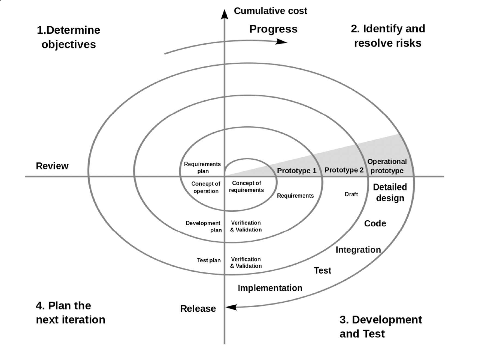
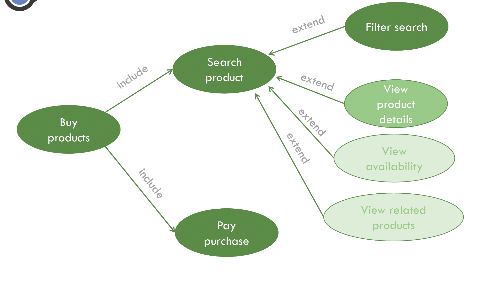

# 03. Planning

- [03. Planning](#03-planning)
  - [D6. Work Breakdown Structure (WBS), Prioritization, and Task Planning](#d6-work-breakdown-structure-wbs-prioritization-and-task-planning)
    - [1. Work Breakdown Techniques](#1-work-breakdown-techniques)
    - [2. Project Lifecycle Models](#2-project-lifecycle-models)
      - [Traditional (Waterfall) Model](#traditional-waterfall-model)
      - [Incremental Model](#incremental-model)
      - [Prototyping Model](#prototyping-model)
      - [Component-Based Model](#component-based-model)
      - [Rapid Application Development (RAD)](#rapid-application-development-rad)
      - [Spiral Model](#spiral-model)
      - [Formal Methods](#formal-methods)
      - [Rational Unified Process (RUP)](#rational-unified-process-rup)
      - [Agile Methodology](#agile-methodology)
    - [3. Iterative Incremental Model](#3-iterative-incremental-model)
      - [Example of Online Shop Requirements](#example-of-online-shop-requirements)
    - [4. Release Planning](#4-release-planning)
      - [Prioritizing User Stories:](#prioritizing-user-stories)
      - [Releases and Iterations:](#releases-and-iterations)
      - [Estimating Initial Velocity:](#estimating-initial-velocity)
    - [5. Iteration Planning](#5-iteration-planning)
      - [Decomposing a story into tasks:](#decomposing-a-story-into-tasks)
    - [6. Monitoring and Velocity Tracking](#6-monitoring-and-velocity-tracking)
      - [Evolution of story points](#evolution-of-story-points)
    - [7. Real-World Example: Online Bookshop](#7-real-world-example-online-bookshop)
    - [8. Task Scheduling](#8-task-scheduling)
      - [Task Scheduling Approaches](#task-scheduling-approaches)
  - [D7. Time Management and Scheduling](#d7-time-management-and-scheduling)
    - [Overview](#overview)
    - [Principles of Software Project Scheduling](#principles-of-software-project-scheduling)
      - [1. Compartmentalization](#1-compartmentalization)
      - [2. Interdependency](#2-interdependency)
      - [3. Time Allocation](#3-time-allocation)
      - [4. Defined Responsibilities](#4-defined-responsibilities)
      - [5. Effort Validation](#5-effort-validation)
      - [6. Defined Outcomes](#6-defined-outcomes)
      - [7. Defined Milestones](#7-defined-milestones)
    - [Scheduling Techniques](#scheduling-techniques)
      - [Gantt Diagrams](#gantt-diagrams)
      - [PERT (Program Evaluation and Review Technique)](#pert-program-evaluation-and-review-technique)
        - [Elements of PERT:](#elements-of-pert)
        - [PERT Chart Representation](#pert-chart-representation)
        - [Transforming Tables to PERT Charts](#transforming-tables-to-pert-charts)
    - [Estimating Time with PERT](#estimating-time-with-pert)
      - [Earliest and Latest Times](#earliest-and-latest-times)
      - [Slack/Float](#slackfloat)
      - [Critical Path](#critical-path)
    - [Practical Examples for Clarification](#practical-examples-for-clarification)
      - [Example 1: Task Dependencies and Critical Paths](#example-1-task-dependencies-and-critical-paths)
      - [Example 2: Complex Dependencies](#example-2-complex-dependencies)
      - [Example 3: Real-World Task Sequencing](#example-3-real-world-task-sequencing)
    - [Advantages of PERT Charts](#advantages-of-pert-charts)
    - [References](#references)

---

## D6. Work Breakdown Structure (WBS), Prioritization, and Task Planning

Effective project management starts with careful planning, using techniques to clarify project scope and task responsibilities. Among these techniques are the Work Breakdown Structure (WBS), prioritization strategies, and detailed task planning.

---

### 1. Work Breakdown Techniques

Work breakdown techniques enable project teams to define and organize project scope clearly.

- Allow to know the scope of a project
- Are applied before planning the project

**Types of Work Breakdown Techniques:**

- **Work Breakdown Structure (WBS)**: Defines scope with increasing detail at each subsequent level.
- **Workflow Diagrams & Workflow Systems**: Provide visual flow of tasks and responsibilities.

**Work Breakdown Structure (WBS) / Estructura de Descomposición del Trabajo (EDT):**

- The main goal is to organize and define the _scope_ of the project.
- Each level represents an increase in the detail of the description
- Software projects usually imply at least three levels:

  1. **Phases** in the life cycle of the project
  2. **Standard tasks** within each phase
  3. **Specific tasks** of the project

---

### 2. Project Lifecycle Models

Different lifecycle models dictate project planning and execution approaches. Key lifecycle models include:

#### Traditional (Waterfall) Model

- **Phases**: Requirements → Design → Implementation → Testing → Deployment → Maintenance
- **Characteristics**:
  - Difficult to accommodate changes
  - Limited client/user engagement
  - Testing occurs at the end
  - Clearly defined structure and objectives

#### Incremental Model

- Develops projects through incremental improvements
- Repeated cycles of Design → Develop → Test → Implement
- Regularly provides partial functionalities

#### Prototyping Model

- Quick design → Prototype → Client feedback → Refine → Engineering
- Allows quick client involvement and iterative feedback

#### Component-Based Model

- Focuses on reusing existing software components
- Phases: Requirements → Component analysis → Requirements modification → System design → Integration → Validation

#### Rapid Application Development (RAD)

- Iterative rapid cycles of Design and Production
- Typically completed in 60-90 days
- Strong emphasis on reuse and rapid prototyping

#### Spiral Model

- Combines elements of prototyping and waterfall, emphasizing risk analysis

#### Formal Methods

- Mathematical specification and verification
- High accuracy, suitable for critical systems

#### Rational Unified Process (RUP)

- Iterative, flexible framework
- Based on stakeholder needs and use cases

#### Agile Methodology

- Emphasizes collaboration, flexibility, continuous improvement
- Principles include frequent delivery, embracing change, sustainable development pace, and face-to-face communication

**Agile manifest**:

1. Customer satisfaction by **early and continuous delivery** of valuable software.
2. Welcome **changing requirements**, even in late development.
3. **Deliver** working software frequently (weeks rather than months).
4. Close, daily **cooperation** between business people and developers.
5. Projects are built around **motivated individuals**, who should be trusted.
6. **Face-to-face conversation** is the best form of communication (co-location).
7. **Working software** is the primary measure of progress.
8. Sustainable development, able to maintain a constant pace.
9. Continuous attention to **technical excellence and good design**.
10. **Simplicity**—the art of maximizing the amount of work not done—is essential.
11. Best architectures, requirements, and designs emerge from **self-organizing teams**.
12. Regularly, the **team reflects** on how to become more effective, and adjusts accordingly.

---

### 3. Iterative Incremental Model

Combines iterative cycles (mini-projects) with incremental functionality enhancements.

- **Iterative**: In each iteration, a similar work process is repite (iterations are similar to miniprojects).
- **Incremental**: Each iteration adds new functionality to the product.

#### Example of Online Shop Requirements

- Search products, filter by attributes, view details, check availability, make payments, view related products.

**Prioritizing requirements**:

- A user can search for products in the catalog indicating key words.
- A user can add products to the shopping cart, indicating size and amount.
- A user can filter the results of a search by category, sport or gender.
- A user can see the details of a product, including pictures, uses,
  materials and technical specifications.
- A user can see the availability of a product in the shops near a given address.
- A user can pay for the selected products with a credit card.
- The system shows those products related to a selected one, including similar and complementary products.

**Iterations and increments**:

Each iteration involves analysis, design, implementation, and testing.

**Phases**:

---

### 4. Release Planning

Involves selecting iterations, estimating velocity, prioritizing user stories, and allocating tasks to iterations.

#### Prioritizing User Stories:

- Maximize organizational value
- Consider:
  - Risk and complexity: the risk that the story cannot be completed as desired (for example, with desired performance characteristics or with a novel algorithm)
  - Impact on other stories: the impact that the story will have on other stories if deferred (we don't want to delay other stories until the last iteration to learn that the application is to be three-tiered and multi-threaded)
  - User desirability (both broad and niche groups)
  - Story cohesiveness
- Utilize MoSCoW rules:
  - **Must-have**, **Should-have**, **Could-have**, **Won't-have**

#### Releases and Iterations:

- Releases and iterations are planned by placing stories into iterations.
- **Velocity** is the amount of work the developers can complete in an iteration.
- **The sum of the estimates of the stories placed in an iteration cannot exceed the velocity the developers forecast for that iteration**.
- If a story won’t fit in an iteration, you can split the story into two or more smaller stories.
- Acceptance tests validate that a story has been developed with the functionality the customer team had in mind when they wrote the story.

#### Estimating Initial Velocity:

What are three ways of estimating a team's initial velocity?

- Historical data.
- Take a guess.
- Run an initial iteration and use the velocity of that iteration.

---

### 5. Iteration Planning

- Iteration planning takes release planning one step further but only for the iteration being started.
- To plan the iteration, the team discusses each story and disaggregated it into its constituent tasks.
- There is no mandatory size range for tasks (for example, three to five hours). Instead, stories are disaggregated into tasks to facilitate estimation or to encourage more than one developer to work on various parts of the story.
- Developers accept responsibility for the tasks.
- Developers assess whether they have over-committed themselves by estimating each task they have accepted.

#### Decomposing a story into tasks:

> “A user can view detailed information about a hotel.”

- Design the look of these web pages.
- Code the HTML to display hotel and room photos.
- Code the HTML to display a map showing where the hotel is.
- Code the HTML to display a list of hotel amenities and services.
- Figure out how we’re generating maps.
- Write SQL to retrieve information from the database.
- Document new functionality in help system and user’s guide

---

### 6. Monitoring and Velocity Tracking

Regular monitoring ensures project stays on track:

- **Burndown Charts:** Visual representation of remaining work

- Daily tracking helps in adapting to changes swiftly

#### Evolution of story points

Below is a step‐by‐step explanation of the table that shows how story points evolve across iterations, as well as a concise formula for calculating the start and end of each iteration.

**Table Overview**

The table typically includes these rows for each iteration:

1. Story points at start of iteration: How many story points (SPs) remain to be done (including carry‐over from the previous iteration).
2. Completed during iteration: How many story points the team actually finishes in that iteration.
3. Changed estimates: Adjustments to existing stories that were already in the backlog (e.g., a 5‐point story is discovered to be 8 points, so we add +3 to “Changed estimates”).
4. Story points from new stories: Newly introduced stories or backlog items added during the iteration.
5. Story points at end of iteration: Remaining story points after completing some items and accounting for changes and newly added items.

**Calculating Story Points at the Start of an Iteration**

- **Iteration 1**: If this is the very first iteration of the project, the start‐of‐iteration value is simply the sum of all initially planned or estimated story points.
- Iteration n (where n > 1):

  $$
  \text{Story points at start of iteration } n = \text{Story points at end of iteration } (n - 1)
  $$

  In other words, whatever remains at the end of one iteration becomes the “start” total for the next.

**Calculating Story Points at the End of an Iteration**

During a given iteration, the backlog can go up or down due to completion, re‐estimation, or new stories. Formally:

$$
\text{SP}_{\text{end}}(n) = \text{SP}_{\text{start}}(n) - \text{Completed SP} + \text{Changed estimates} + \text{New SPs}
$$

Where:

- SPend(n) is the number of story points remaining at the end of iteration n.
- SPstart(n) is the number of story points at the start of iteration n.
- Completed SP is the number of story points fully done in iteration n.
- Changed estimates is the net effect of any re‐estimates (e.g., if you go from 5 points to 8 points on an existing story, that is +3 to Changed estimates).
- New SPs is the total of newly added stories introduced during iteration n.

**Example Walk‐Through**

Looking at Iteration 1 from the sample table:

- Story points at start of iteration: 130
- Completed during iteration: 45
- Changed estimates: 10 (existing stories were re‐estimated and added 10 more points overall)
- Story points from new stories: 18
  Using the formula:

$$
\text{SP}_{\text{end}}(1)
= 130 - 45 + 10 + 18
= 130 - 45 + 28
= 113
$$

Therefore, the end of Iteration 1 leaves 113 story points remaining in the backlog. This 113 becomes the start value for Iteration 2.

**Why Track These Values?**

1. Progress Monitoring: It shows whether the team is truly reducing the backlog or if ongoing changes/introductions of new stories are causing the backlog to grow.

2. Predictability: The trend of completed story points and changes helps forecast how many iterations might be needed to finish all work.

3. Scope Management: When new stories exceed completed stories, the total might stay the same or even rise, indicating potential scope creep.

---

A story estimated at **one story point** actually took two days to complete. How much does it contribute to velocity when calculated at the end of the iteration?

### 7. Real-World Example: Online Bookshop

Detailed stories organized by priority:

- Basic search, shopping cart, account management, reviews, administrative tasks, order tracking, etc.

**Example of Release Planning for velocity=80**:

- Defined iterations with clear deliverables

---

### 8. Task Scheduling

$$
\text{Duration} = \frac{\text{Work}}{\text{Units} \times \text{Daily hours}}
$$

Key scheduling variables:

- **Duration**: Total time required
- **Work**: Hours needed
- **Units**: Number of people involved
- **Daily hours (hd)**: Constant work hours per day

#### Task Scheduling Approaches

- **Fixed Units**: Adjust duration/work if personnel or estimates change
- **Fixed Work**: Add resources to complete tasks within fixed deadlines
- **Fixed Duration**: Adjust workload or team size without changing deadlines

| Fixed Units | Fixed Work | Fixed Duration |
|-------------|------------|----------------|
|  |  |  |

---

**Understanding Fixed Units, Fixed Work, and Fixed Duration Scheduling**

Below is a quick breakdown of Fixed Units, Fixed Work, and Fixed Duration so you can see how each scheduling approach responds to changes in estimates, resources, or deadlines. You can think of each approach as locking in one variable while allowing the others to adjust:

---

**1. Fixed Units**

*What is "fixed"?*
- The number of resources (people or "units") dedicated to the task is fixed.

*How does scheduling adjust?*
- If the work increases (say the task is more complex or requires more hours than expected), the duration must increase because you cannot assign more people.
- Conversely, if you decide to shorten the time, the amount of work that can be done must go down because there are still only the same people working the same hours.

*Example*
- You have 1 developer working 8 hours/day (1 "unit"). If the original plan was for 80 hours of work (10 days), but new requirements push it to 100 hours total:
  - You cannot add more people (units are fixed at 1 developer).
  - The duration goes up from 10 days to 12.5 days.

---

**2. Fixed Work**

*What is "fixed"?*
- The total work (hours) or effort needed is fixed.

*How does scheduling adjust?*
- If you need to finish in fewer days, you have to add more people (units) so that the total work (80 hours, for example) is done in a shorter time span.
- If you reduce the number of people, it will take longer, but the overall total hours required (the "work") does not change.

*Example*
- You decide that a task always takes exactly 80 hours of effort, no matter what.
- If you discover you only have 5 days to do it, you must increase your team from 1 person to 2 (or more) so that 80 total hours of work are completed within the 5 days.

---

**3. Fixed Duration**

*What is "fixed"?*
- The duration (the total number of days or weeks) is non-negotiable—perhaps there's a hard deadline.

*How does scheduling adjust?*
- If the amount of work increases, you need to add more people to keep the deadline.
- If you have fewer people available, then you can only complete the amount of work that fits within that fixed timeframe (you might have to de-scope some features or do partial work).

*Example*
- A deadline is set for 2 weeks from now. No matter what happens, the delivery date does not shift.
- If partway through you realize there is more work than anticipated, you must either add more developers or reduce the scope to keep the same end date.

---

**How to Interpret the Images**

The images show the Duration formula:

$$
\text{Duration} = \frac{\text{Work}}{\text{Units} \times \text{hd}}
$$

where:
- Work = total hours of effort needed
- Units = the number of people (or the equivalent resource units)
- hd = hours per day each person works (e.g. 8 h/d)

Each example modifies one variable while holding another constant—like "what if we only have 8 days?" or "what if we add more people?"—to illustrate how the other variables must change (less or more time, more or fewer resources, etc.) depending on which approach (Fixed Units, Fixed Work, Fixed Duration) you are applying.
- In Fixed Units scenarios, the Units are locked (say, 1 person). Changing work or deadlines forces the duration or deliverable scope to adapt.
- In Fixed Work scenarios, the total work stays at 80 hours (or some fixed number). If you shorten the time, you have to increase the Units.
- In Fixed Duration scenarios, the time is locked (e.g., must be done in 10 days). Increasing work means you have to increase the number of people or accept that not all work can be completed.

Once you know which variable is considered "fixed," you can see how the other parts of the formula will shift to accommodate it.

## D7. Time Management and Scheduling

### Overview

Effective scheduling ensures achieving project goals within the allotted timeframe by distributing estimated effort across specific tasks.

- **Scheduling definition (Project Management Institute)**: Planning activities strategically to meet goals and priorities within available time.
- **Scheduling in Software Projects (Allen B. Tucker)**: Allocating estimated effort across the project's duration to specific engineering tasks.

---

### Principles of Software Project Scheduling

#### 1. Compartmentalization

- Breaking down a project into manageable tasks.
- Both product and process require decomposition.

#### 2. Interdependency

- Some tasks must follow a sequential order.
- Others can proceed independently.

#### 3. Time Allocation

- Assign work units (e.g., person-days) and define start/end dates.

#### 4. Defined Responsibilities

- Clearly assign each task to specific team members.

#### 5. Effort Validation

- Ensure allocated effort does not exceed available personnel capacity.

#### 6. Defined Outcomes

- Each task must have clear deliverables, usually forming part of larger work products.

#### 7. Defined Milestones

- Tasks are grouped around milestones, which represent significant project achievements after review and approval.

---

### Scheduling Techniques

#### Gantt Diagrams

- Visual timelines displaying task duration and dependencies.
- Facilitates easy understanding of project progress and schedule.

#### PERT (Program Evaluation and Review Technique)

- Visualizes task sequences and dependencies, suitable for complex projects.

##### Elements of PERT:

- **Activity**: Task to perform (shown by arrows).
- **Event**: Start/end of activities (shown by nodes).
- **Predecessor**: Tasks required to complete before others start.

##### PERT Chart Representation

- Clearly depicts task sequences and dependencies.
- Dummy activities indicate indirect dependencies.

##### Transforming Tables to PERT Charts

- Lists tasks, durations, and predecessors clearly, translating them visually to facilitate better understanding of the project timeline.

---

### Estimating Time with PERT

#### Earliest and Latest Times

- Calculate the earliest start and latest finish for activities to manage project timing effectively.
- Assess the impact of delays on subsequent activities.

#### Slack/Float

- Measures flexibility in scheduling tasks without delaying the project.

#### Critical Path

- Sequence of tasks with no slack; delays directly impact overall project duration.

---

### Practical Examples for Clarification

#### Example 1: Task Dependencies and Critical Paths

- Demonstrates task interdependencies and their impacts on project timing.

#### Example 2: Complex Dependencies

- Illustrates managing multiple dependencies clearly through graphical representation.

#### Example 3: Real-World Task Sequencing

- Offers clarity on managing practical complexities encountered in actual projects.

---

### Advantages of PERT Charts

- Clear graphical visualization.
- Effective handling of complex dependencies.
- Precise estimation of earliest/latest start and finish times.
- Easy identification of floats and critical paths.

---

### References

- "User Stories Applied for Agile Software Development" by Mike Crohn, Addison Wesley (2009)
- _A Guide to the Project Management Body of Knowledge (6th ed.)_, Project Management Institute, 2017.
- _Computer Science Handbook_, Allen B. Tucker, CRC Press, 2004.
- PM Project Manager - [PERT Chart Guide](https://www.projectmanager.com/guides/pert-chart)
- Corporate Finance Institute - [PERT Overview](https://corporatefinanceinstitute.com/resources/knowledge/other/project-evaluation-review-technique-pert/)
