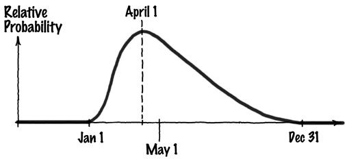
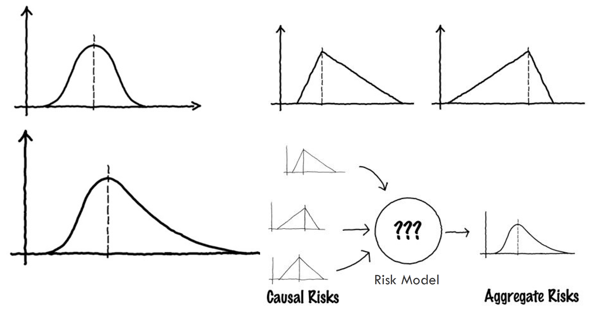
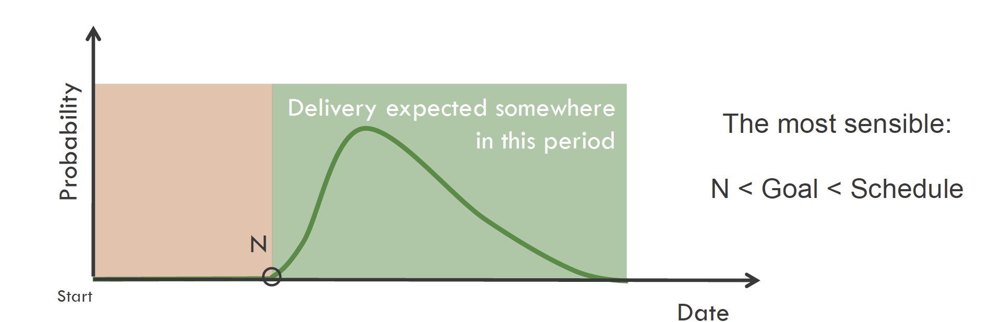
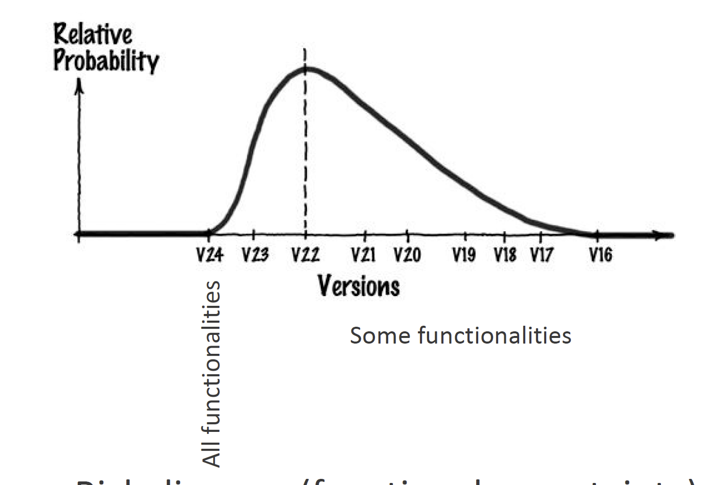
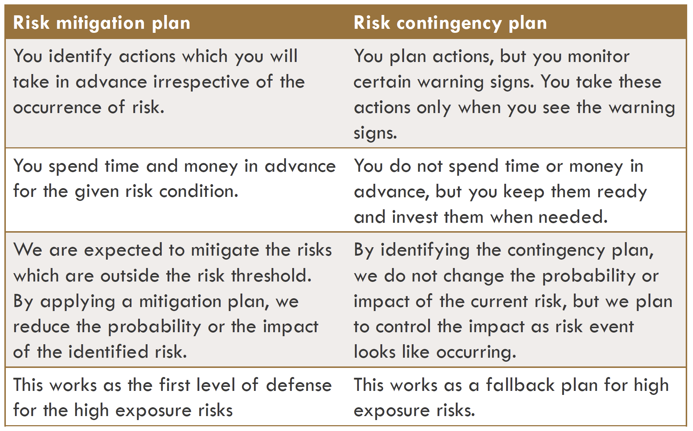
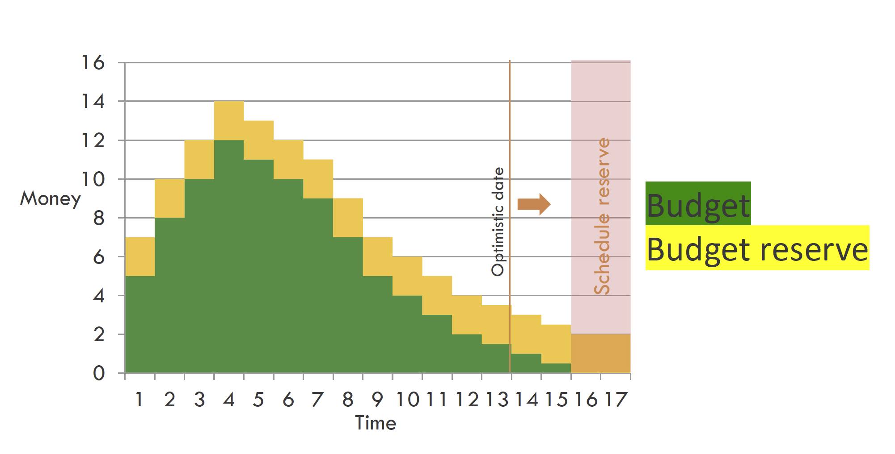
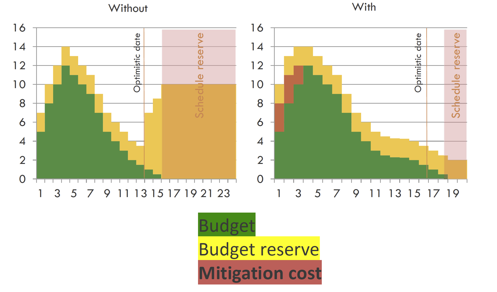

# Risk Management

- [Risk Management](#risk-management)
  - [D9. Exposure, taxonomy and discovery](#d9-exposure-taxonomy-and-discovery)
    - [What Is a Risk?](#what-is-a-risk)
    - [Risk vs. Crisis Management](#risk-vs-crisis-management)
    - [Risk Transition](#risk-transition)
    - [Risk Exposure](#risk-exposure)
    - [Showstopper Risks](#showstopper-risks)
    - [Why Risk Management?](#why-risk-management)
    - [Risk Taxonomy](#risk-taxonomy)
    - [⚠️ Risk Categories](#️-risk-categories)
      - [1. Technical Risks (Product)](#1-technical-risks-product)
      - [2. Management Risks (Project)](#2-management-risks-project)
      - [3. Organizational Risks (Business)](#3-organizational-risks-business)
      - [4. External Risks](#4-external-risks)
    - [Risk Discovery](#risk-discovery)
      - [Key Strategy: **Postmortem Mining**](#key-strategy-postmortem-mining)
      - [Key Strategy: **6-3-5 Brainwriting**](#key-strategy-6-3-5-brainwriting)
    - [Risks You Can Ignore](#risks-you-can-ignore)
    - [Key Takeaways](#key-takeaways)
    - [Deep Dive – D9 References \& Tools](#deepdive--d9-references--tools)
  - [D10. Uncertainty, mitigation and contingency](#d10-uncertainty-mitigation-and-contingency)
    - [Understanding Uncertainty](#understanding-uncertainty)
    - [Quantifying Uncertainty](#quantifying-uncertainty)
    - [Risk Response Strategies](#risk-response-strategies)
    - [Mitigation vs Contingency](#mitigation-vs-contingency)
    - [Risk Reserve](#risk-reserve)
    - [Transition Indicators](#transition-indicators)
    - [Real-World Examples of Risk Mitigation](#real-world-examples-of-risk-mitigation)
      - [Risk 1. **Estimation \& Scheduling**](#risk-1-estimation--scheduling)
      - [Risk 2. **Requirements Inflation**](#risk-2-requirements-inflation)
      - [Risk 3. **Employee Turnover**](#risk-3-employee-turnover)
      - [Risk 4. **Specification Breakdown**](#risk-4-specification-breakdown)
      - [Risk 5. **Poor Productivity**](#risk-5-poor-productivity)
      - [Risk 6. **Budget Overrun**](#risk-6-budget-overrun)
      - [7. **Knowledge Silos**](#7-knowledge-silos)
    - [Some other common risks](#some-other-common-risks)
    - [Key Takeaways](#key-takeaways-1)
    - [Deep Dive – D10 References \& Techniques](#deepdive--d10-references--techniques)
  - [References](#references)

## D9. Exposure, taxonomy and discovery

Effective risk management begins with understanding what risk is, how to measure its impact, and how to classify and identify it within a project environment. This section introduces foundational concepts, practical classification systems (taxonomy), and structured strategies for risk discovery.

---

### What Is a Risk?

- **Risk (PMBOK 7):** an _uncertain event or condition_ that, **if it occurs, has a positive (“opportunity”) or negative (“threat”) effect** on one or more project objectives – scope, schedule, cost, or quality.

  🔍 **Ejemplo:** Un fallo de integración con la API de pagos (amenaza) o una librería OSS que reduce el tiempo de desarrollo (oportunidad).

- **Problem / Issue:** a risk that **has already materialized** — the uncertainty is gone and the impact is real.

- Risks are defined by two key properties:
  - **Uncertainty** – the event may or may not happen.
  - **Potential loss** – if it does happen, it will have negative consequences.

💻 Dev‑Note: No descuides los **riesgos positivos**. Si descubres una API que reduce en 30 % la complejidad, planifica cómo explotar esa oportunidad.

---

### Risk vs. Crisis Management

- **Risk Management** involves identifying and mitigating risks _before_ they happen. Is the process of thinking out corrective actions before a problem occurs, while it's still an abstraction.
- **Crisis Management** is reactive, dealing with consequences _after_ a risk becomes a problem.

> **Metaphor:** Risk management is like installing smoke detectors and fire sprinklers. Crisis management is calling the fire department once the building is already burning.

---

### Risk Transition

A **risk transition** is when a potential risk becomes a **real problem**. When something that used to be a risk suddenly becomes a problem. This is the point at which the risk is said to **_materialize_**.

- **Transition indicators** are early warning signs that a risk may materialize.
- It’s acceptable to have **false positives** — better safe than sorry.

> Bob Charette: It’s the risks that you take that speed up the stairs for everyone else. Not taking them just assures that your world will come to be shaped and dominated by someone else.

---

### Risk Exposure

**Probability and Cost**

**Definition (EMV):** *Risk Exposure* = **Expected Monetary Value (EMV)** – the average cost (or time) you “buy” when you accept the risk.

$$
\text{Risk Exposure} = \text{Probability} \times \text{Cost}
$$


```
risk_exposure = probability * cost

Cost can be expressed in money or time:

  - If you identify a risk that is 20% likely to happen, and it will cost you a million dollars if it does, then the risk exposure is 200k.

  - If a risk is 20% likely to occur and will cost you five months if it does, then the risk exposure is 1 month of delay.
```

🧠 Deep Dive (PMBOK 7 / ISO 31000)

- _EMV_ is the foundation for **Quantitative Risk Analysis**, including **Monte Carlo simulations** that generate an S‑curve for schedule or cost.
- ISO 31000 recommends evaluating both **likelihood** and **consequence**; EMV merges them into a single metric.
  💻 Dev‑Note: Herramientas como **RiskyProject** o un simple notebook de Python con `numpy` pueden correr 10 000 iteraciones para ver la dispersión de tu fecha de release.

📝 Nota (ES): _Risk Exposure_ se traduce comúnmente como **“exposición al riesgo”**.  
💻 Dev‑Note: en un sprint planning, puedes estimar la _exposición al riesgo_ de un nuevo micro‑servicio multiplicando la probabilidad de fallo de despliegue (por ej. 15 %) por el tiempo de rollback (por ej. 4 h) ≈ 0,6 h de colchón que deberías reflejar en la story.

- **Cost** can be expressed in money, time, or other measurable impacts.
- Helps prioritize which risks are worth managing actively.

**Example:**

> A risk has a 20% chance of occurring and would cost €1,000,000 if it does.
>
> Risk Exposure = 0.2 × 1,000,000 = €200,000

Using quantitative values:

| Risk                                                                     | Probability (%) | Cost | Exposure |
| ------------------------------------------------------------------------ | --------------- | ---- | -------- |
| Add new marketing features                                               | 35              | 8    | 2.8      |
| Schedule is too optimistic for the implementation of the sales subsystem | 50              | 5    | 2.5      |
| Inappropriate design                                                     | 15              | 15   | 2.2      |
| The new toolkit does not provide the expected processing speed           | 30              | 5    | 1.5      |
| New requirements related to the automatic update from the server         | 5               | 20   | 1.0      |
| Unstable interface for plotting graphs                                   | 25              | 4    | 1.0      |
| Delay in the delivery of the tracking subsystem                          | 20              | 4    | 0.8      |

---

### Showstopper Risks

- **High-impact risks** that, if they occur, would force cancellation or complete redesign of a project.
- They cannot be effectively mitigated and must be managed through **project assumptions** (e.g., "assume this won’t happen").
- Still tracked, but not actively managed.

- Are difficult to price because they cost everything. They will force you either to completely rethink the product or to cancel the entire project.
- Can only be managed by what we call project assumptions. In order for you to continue your work, you must assume that the showstoppers will not occur.
- Still belongs on your risk list (since you still need to watch it), but it should be explicitly noted as a project assumption. That means it’s not going to be managed by you.

---

### Why Risk Management?

- Bounds uncertainty
- Makes risk-taking strategic, not reckless
- Prevents blame games by making risk visible
- Ensures attention goes where it matters most
- Encourages team growth through ownership

---

### Risk Taxonomy

Categorizing risks helps structure discovery and responsibility. PMBOK and industry practice define **four broad risk families**, each with subtypes:

| Category           | Examples                                                      |
| ------------------ | ------------------------------------------------------------- |
| **Technical**      | Requirements volatility, integration issues, high complexity  |
| **Management**     | Poor estimation, communication breakdowns, unclear priorities |
| **Organizational** | Budget shortfalls, lack of staff, policy conflicts            |
| **External**       | Supplier failures, regulatory changes, market instability     |

> **Tip:** Use the taxonomy to build a checklist or brainstorming guide.


💻 Dev‑Note: Puedes convertir cada categoría en etiquetas de tu issue tracker (Jira, GitHub Projects, etc.) para filtrar rápidamente _bugs_ con alto componente técnico frente a riesgos externos como proveedores de CDN.

---

### ⚠️ Risk Categories

#### 1. Technical Risks (Product)

Technical risks refer to anything that could **go wrong with your software, hardware**, or any manuals or other process documents related to your project.

- Consider whether you have experts on your staff to resolve any software glitches that may arise or if you have access to external vendors who could help.
- Ask if the project is feasible with the material resources you have available.
- Review whether you’ve created user-friendly reference guides for your project’s implementation.

Examples:

- Changing requirements.
- Ambiguous specification.
- Technical uncertainty.
- Advanced technology not available.
- Complexity of design or implementation.
- Difficult integration of modules.
- Difficulties with the interfaces.
- High performance, reliability or quality requirements.
- Obsolescence.
- Maintenance.

#### 2. Management Risks (Project)

Project management risks involve **how the team** directly working on your project **operates** and what internal aspects of your team could impact your project’s success.

- Take a look at the culture and morale of your team and whether interpersonal issues could impact results.
- Review whether you have clear communication channels established between team members and if people know whom to turn to for specific issues.
- Consider whether you have included everyone you need to in the planning phase of your project or if there are other voices you need to consult.

Related to estimation and planning:

- Inaccurate time estimation.
- Insufficient resource allocation.
- Complex functionalities which were not identified and require more than expected.
- Expansion of the scope.

Related to team coordination and operation:

- Undefined responsibilities.
- Wrong prioritization.
- Bad communication.
- Lack of control.
- Lack of training.

#### 3. Organizational Risks (Business)

Organizational risks refer to aspects of your company’s overall resources and culture which could impact your project’s implementation.

- See if you have enough staff available to cover the time and effort it will take to complete your project.
- Review whether your financial processes are functioning well enough to pay subcontractors in a timely fashion.
- Ask whether you have the budget available to implement your project as intended.
- Consider whether you have policies in place to know who will make decisions on critical project issues.

Examples:

- Budget problems.
- Financial problems.
- Inaccurate cost estimation.
- Unexpected expenses.
- Expansion of the project’s scope.
- Staff problems.
- Lack of resources.
- Project dependencies.

#### 4. External Risks

External risks are things that could impact your project that are outside of your organization’s direct control.

- Analyze the current state of your market.
- Consider what problems might occur with your subcontractors or suppliers.
- Review related local, state, and federal regulations that impact your company’s field.
- Ask if your customers might change over time and how that would affect your project.

Examples:

- Unfavorable market development.
- Changes in the client’s strategy or priorities.
- Changes in the rules or legislation.
- Problems with suppliers.
- Natural disasters.

---

### Risk Discovery

Common obstacles that prevent teams from identifying risks:

- **Fear of being seen as negative**
- **Belief that raising a risk implies owning the solution**
- Hesitation without absolute proof

#### Key Strategy: **Postmortem Mining**

- _Yesterday's problem is today's risk_
- Run a few postmortems of projects good and bad and look for ways in which they deviated from their initial expectations.
- Trace each deviation back to its cause and call that cause a risk.
- Use of the output of the postmortem process as input to the risk management process.


- Analyze past projects (successful and failed)
- Identify unexpected deviations
- Trace them to their root causes
- Reframe those causes as _future risks_ for upcoming projects

#### Key Strategy: **6-3-5 Brainwriting**

- 6 people, 3 ideas each, passed on 5 times
- Generates 108 risk ideas in ~30 minutes

---

### Risks You Can Ignore

Not all risks are worth managing:

- Extremely low probability or minimal impact
- If they occur, the project becomes irrelevant
- They belong to external parties (e.g., client, regulator)

Still, document these in a _risk backlog_ with clear justification.

---

### Key Takeaways

- Risks are future problems: manage them proactively
- Quantify exposure to prioritize mitigation
- Use taxonomies to systematically uncover risk areas
- Don’t ignore the human side—fear and ambiguity block discovery
- Use structured strategies (e.g., postmortems, brainwriting) to ensure completeness

---

### Deep Dive – D9 References & Tools

- **PMBOK 7**: Principles 3 & 4 (Stakeholders, Value) frame risk as a value‑protection exercise.
- **ISO 31000:2018**: Section 6 (Risk Assessment) outlines a generic process adaptable to any SDLC.
- **Practical Tools**:
  - **OWASP Risk Rating** for security‑centric projects.
  - **Chaos Engineering (Gremlin, Litmus)** to surface hidden technical risks in microservices.
  - **Observability (OpenTelemetry + Grafana)** as an early transition indicator.

---

## D10. Uncertainty, mitigation and contingency

Risk management is incomplete without understanding _uncertainty_—its origins, implications, and strategies to reduce or absorb its impact. This section covers sources of uncertainty, techniques for quantifying it, and two essential risk response strategies: **mitigation** and **contingency**.

---

### Understanding Uncertainty

**Uncertainty** is the absence of complete certainty about future events or conditions that could impact a project. Unlike risk, which is quantifiable, uncertainty may not yet be fully understood or measurable.

- **Requeriments**: What exactly does the system have to do?
- **Match**: How will the system interact with its human operators and other peer systems?
- **Changing environment**: How will needs and goals change during the period of development and beyond?
- **Resources**: What key human skills will be available as the project progresses?
- **Management**: Will management set up productive teams, maintain morale, keep turnover low, and coordinate the complex sets of interrelated tasks?
- **Supply Chain**: Will other parties to the development perform as hoped?
- **Politics**: What is the effect of political decisions on the project?
- **Conflict**: How do members of a diverse stakeholder community resolve their mutually incompatible goals?
- **Innovation**: How will technologies and approaches affect the eventual outcome?
- **Scale**: How will upscaling volume and scope beyond past experience impact project performance?

**Common Sources of Uncertainty:**

- **Requirements**: Incomplete or evolving expectations
- **Human-System Interaction**: Unknowns in usability and operational integration
- **Changing Environment**: Shifting goals during the development timeline
- **Resource Availability**: Unpredictability in staffing and skills
- **Management Performance**: Team cohesion, coordination, and morale
- **Supply Chain**: Dependability of external partners
- **Politics**: Government or corporate decisions influencing scope or feasibility
- **Conflict**: Misalignment among stakeholder goals
- **Innovation**: New or experimental technologies
- **Scaling**: Risks introduced when moving beyond known operational scope

### Quantifying Uncertainty

**Challenge**: Most software project managers do a reasonable job of predicting the tasks that _have to be done_ and a poor job of predicting the tasks that _might have to be done_.

**Risk diagram** (release date uncertainty)





- In general, uncertainty windows of 10 to 15 percent of N (nano-percent date) are proper.
- For the software industry as a whole, window size is in the range of 150 to 200 percent of N.
- The size of your window of uncertainty is a function of how much noise (variation) there is in your organization’s development processes
- Your past performance determines window size



**Schedule Uncertainty**

Release dates often fall within a **probability window**. Organizations with inconsistent processes have wider windows.

**Heuristic for software projects:**

- Best-case = N
- Realistic delivery = between N and the goal
- Published schedule = outer limit



The date is now fixed and the uncertainty is entirely a matter of what will be delivered on that date.

**Functional Uncertainty**

Sometimes, the **delivery date is fixed**, but what gets delivered is flexible—functionality becomes the uncertain factor.

---

### Risk Response Strategies

| Strategy     | Description                                                                   |
| ------------ | ----------------------------------------------------------------------------- |
| **Avoid**    | _Don’t do the task_ that entails the risk. You lose potential benefits.       |
| **Contain**  | _Set aside buffer_ (time, money) to absorb the impact if the risk happens.    |
| **Mitigate** | _Take actions beforehand_ to reduce either the probability or cost of a risk. |
| **Evade**    | _Let the risk expire_ or resolve itself without incurring cost.               |

- **Avoid**: You avoid a risk when **you don’t do the project or the part of the project that entails the risk**. The natural consequence of avoiding a risk is that you forgo the benefit that going into the risky area offered.

- **Contain**: You contain a risk when **you set aside sufficient time and money** to pay for it, should it materialize.

  - In practice, it doesn’t make much sense to contain a single risk; instead, you contain your entire set of risks. Some of them will materialize and others won’t.
  - A containment strategy sets aside enough resources, on average, to offset the risks that are likely to materialize.

- **Mitigate**: You mitigate a risk when **you take steps before its materialization** to reduce eventual containment costs or its probability.

  - This includes the steps required in advance so that the containment strategy you’ve chosen will be implementable at transition time.

- **Evade**: You evade a risk when **you do none of the other options** and the risk just doesn’t materialize. Fortunately, some risks expire during the course of a project.

The first three of these cost money:

- Avoidance costs you lost benefit.
- Containment costs you the portion of risk reserves that gets used up.
- Mitigation costs you whatever you spend to reduce containment cost or probability.
- Only risk evasion appears to be free.

---

### Mitigation vs Contingency



| Aspect                 | **Mitigation Plan** (First‑line Defense)            | **Contingency Plan** (Fallback)                         |
| ---------------------- | --------------------------------------------------- | ------------------------------------------------------- |
| **When you act**       | _Before_ the risk happens                           | _Only if_ warning signs appear or the risk materializes |
| **Primary objective**  | Reduce **probability and/or impact**                | **Control remaining impact** once the risk is imminent  |
| **Investment pattern** | Up‑front cost (time, money, tooling)                | Reserve cost (buffer) held in escrow                    |
| **Typical artefacts**  | Spike, prototype, automated tests, pair programming | Runbook, hot‑fix branch, extra cloud capacity           |
| **Effect on reserves** | Lowers required risk reserve                        | Consumes part of reserve                                |

> **Tip:** Mitigation is your first line of defense. Contingency is your fallback plan.

📝 Nota (ES):

- **Mitigación** = “prevenir o reducir impacto/probabilidad” (trabajo _up‑front_).
- **Contingencia** = “plan B” listo para activarse si la cosa se complica.

💻 Dev‑Note: piensa en **tests automatizados** (mitigación) vs. **feature‑flag para rollback rápido** (contingencia).

### Risk Reserve

- A risk reserve is, by definition, time and money that you may not need.
- If you calculate exposure for all your risks and set aside a risk reserve equal to the total exposure, that risk reserve will, on average, be sufficient to pay for the risks that do materialize.
- You may end up short on some projects and have some reserve left on others, but over the long run, your risk reserve will be about right.
- A more defensive strategy would be to allocate something more than aggregate exposure, while a less defensive strategy would be to allocate less.

A **risk reserve** is a buffer of time and money **set aside** to contain materialized risks.

**Best practice (PMBOK 7):**

1. **Identify** threats & opportunities.
2. **Quantify** exposure (EMV) and choose a confidence level (e.g., 80 %).
3. Create a **Contingency Reserve** for known‑unknowns (usually tied to WBS work packages).
4. Add a **Management Reserve** for unknown‑unknowns (controlled at portfolio/steering level).
5. Review reserves at each major baseline change.

> More defensive = allocate more than expected exposure  
> Less defensive = allocate less than expected exposure

**Mitigation reduces required reserves, but introduces fixed upfront costs.**

🔍 **Ejemplo:** Tu equipo guarda 3 días de buffer en el sprint. Tras añadir tests de contrato (mitigación) el buffer se reduce a 1 día, pero ya no necesitas tantas horas de soporte durante el release.

🧠 Deep Dive

- **Schedule Reserve** ≈ buffer in days/weeks; **Budget Reserve** ≈ monetary buffer.
- Agile teams often track reserve as **“Velocity × Buffer %”** inside the release burndown.



**Without and with mitigation**



- Without mitigation, the schedule reserve is large; The budget reserve can be enormous to pay for the additional cost.
- With mitigation, both reserves are considerably reduced. However, the budget has been increased by the cost of mitigation. The schedule has also been stretched out somewhat to the right, since mitigation has time cost as well as an economic cost. The result is that the optimistic date on the graph is somewhat less optimistic than it was in the no-mitigation plan.

---

### Transition Indicators

For each managed risk:

- Choose **early warning signals**
- Accept **some false positives**
- Balance **cost of early action vs. cost of delay**

---

### Real-World Examples of Risk Mitigation

#### Risk 1. **Estimation & Scheduling**

**Explanation**: Software development, given the intangible nature and uniqueness of software, is inherently difficult to estimate and schedule.

- Get the team more involved in planning and estimating.
- Get early feedback and address slips directly with stakeholders.
- By working in short increments the true velocity of the team quickly emerges and is visible to all stakeholders who are now more closely involved in the project.
- Always monitor existing projects so that you apply lessons learnt in the future.

#### Risk 2. **Requirements Inflation**

**Explanation**: As the project progresses more and more features that were not identified at the beginning of the project emerge that threaten estimates and timelines.

- Constant involvement of customers and developers.
- Plan discussions about features and estimates at every iteration boundary.
- Rather than utilizing change-suppression mechanisms, prioritization sessions are scheduled that allow worthwhile changes to proceed and initially envisioned features to be superseded if the business gives their authorization.
- Try to think big early on in the project, and anticipate the worst-case or heaviest-use scenario.

#### Risk 3. **Employee Turnover**

**Explanation**: Key personnel leave the project taking critical information with them that significantly delays or derails the project.

- Increased collaboration and information sharing on the team.
- Practice information sharing techniques such as pair programming, common code ownership, and frequent reporting at daily stand-ups specifically to reduce the "bus-factor".
- Multiple team members share key information and the risk due to employee turnover is small.
- When working in an engaging, rewarding, empowered, collaborative environment such as agile projects, people are far less likely to want to move elsewhere.

#### Risk 4. **Specification Breakdown**

**Explanation**: When coding and integration begin it becomes apparent that the specification is incomplete or contains conflicting requirements.

- Use a dedicated Product Manager to make critical trade off decisions.
- Make use of an ambassador user, subject matter expert, or customer proxy to play the product manager role. Agile projects have some form of product owner role to ensure decisions are made in a timely fashion.
- Joint Application Development (JAD) can be helpful to collect requirements, enhance user participation and improve the quality of specifications.

#### Risk 5. **Poor Productivity**

**Explanation**: Given long project timelines, the sense of urgency to work in earnest is often absent resulting to time lost in early project stages that can never be regained.

- Short iterations, right people on team, coaching and team development.
- Parkinson's Law says that: "Work expands to fill the time available" and Student Syndrome: "Given a deadline, people tend to wait until the deadline is nearly here before starting work." By having short iterations, work is time-boxed into a manageable iteration (typically 1-4 weeks) and there is always a sense of urgency.
- Set a realistic schedule, and stick to it.

#### Risk 6. **Budget Overrun**

**Explanation**: Projects exceed their budget. Goals may change, assumptions fail, and changes may be necessary to make the Project viable. Very frequent, sometimes related to other risks.

- In product development, you necessarily make assumptions that cannot be proven or disproven until more information becomes available. As development progresses, objectives or goals may shift, or the product may need to pivot to be viable.
- Rolling wave planning is designed to account for this. Teams make product decisions when they are in the best position to make them, rather than presenting very detailed plans at the beginning of the project. This mitigates budget risk because you do not have to waste time and resources for re-planning.

#### 7. **Knowledge Silos**

**Explanation**: Knowledge silos are a risk because they prevent the team from being able to learn from each other and from past projects. 

**Explanation**: Loss or absence of some members of the team. Even if it is for a short period, can result in delays or errors. Additional resources and cost for training may be needed.

- Encourage documentation, shared ownership, and mentoring
- Squad-based development: Squads are 10-12 person, colocated teams that plan together, share knowledge, complete code reviews and work together on a given project from beginning to end. They have a known maximum capacity and open flow of knowledge, which helps address both personnel and knowledge risk, as it eliminates knowledge silos and gives team members the ability to seamlessly take on tasks if somebody is absent or leaves the team.

---

### Some other common risks

- **Design shortcuts**: In order to start doing the next ‘real’ tasks, developers tend to rush the design-process. This is a waste of programming hours, as designing is the most critical part of software development, and having to revisit it later in the process risks dragging everything back a few steps to ensure things like UX remain at a high level.
- **Gold plating**: Adding unneeded features burns budget
- **Reduced functionality**: Trimming scope to meet deadlines can hurt quality
- **Operational misalignment**: Poor process clarity or conflicting roles slow execution
- **Gold plating**: Developers sometimes like to show off their skills by adding unnecessary features. Again, this is a waste of programming hours, which could be better spent on sticking to the timeline for development and getting the software completed.
- **Compromising on functionalities**: Sometimes software development firms reduce the functionality of the software to compensate for overruns pertaining to high budgets and scheduling. There is always a conflict between achieving maximum functionality of the software and peak performance. This is a particularly dangerous moment in terms of app security.
- **Procedural risks**: Day-to-day operational activities might hamper the software development plan and procedure, due to improper process implementation, conflicting priorities, or a lack of clarity in responsibilities.

---

### Key Takeaways

- Uncertainty is inevitable—don’t ignore it, plan for it
- Use both mitigation (prevention) and contingency (response)
- Keep risk reserves proportional to project size and risk profile
- Transition indicators should trigger risk responses early
- Address root causes in estimation, knowledge sharing, and requirements clarity

---

### Deep Dive – D10 References & Techniques

- **Schedule Risk Analysis** (PERT β‑distribution, Monte Carlo) to model release‑date windows.
- **Continuous Delivery** reduces containment cost by making rollback cheap and fast.
- **Feature Flags & Canary Releases**: real‑time mitigation + built‑in contingency.
- **SRE Error Budgets**: quantify acceptable uncertainty in reliability vs. change velocity.

---

## References

- **Waltzing with Bears: Managing Risk on Software Projects**  
  _by Tom Demarco, Timothy Lister_  
  Addison Wesley Professional, 2013

- **Know the Difference Between Mitigation Plan and Contingency Plan**  
  _by Izenbridge_  
  [https://www.izenbridge.com/blog/know-the-differencebetween-mitigation-plan-and-contingency-plan/](https://www.izenbridge.com/blog/know-the-differencebetween-mitigation-plan-and-contingency-plan/)

- **Top 10 Software Development Risks**  
  _by IT Pro Portal_  
  [https://www.itproportal.com/features/top-10-softwaredevelopment-risks/](https://www.itproportal.com/features/top-10-softwaredevelopment-risks/)

- **Top Five Software Project Risks**  
  _by Project Smart_  
  [https://www.projectsmart.co.uk/risk-management/topfive-software-project-risks.php](https://www.projectsmart.co.uk/risk-management/topfive-software-project-risks.php)
