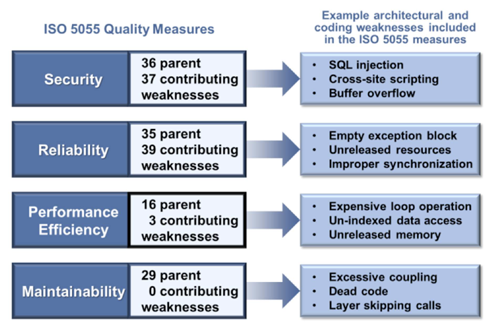
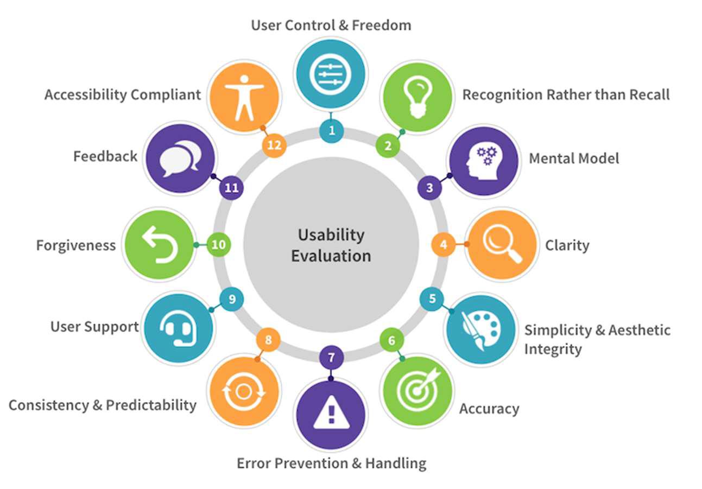
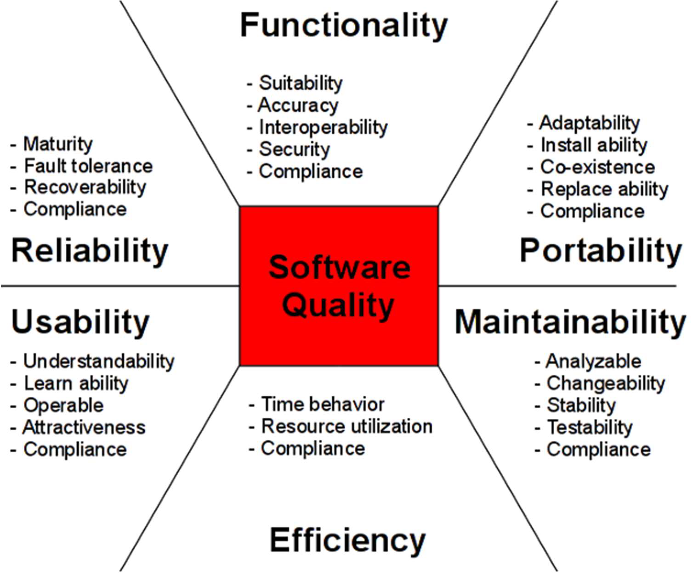
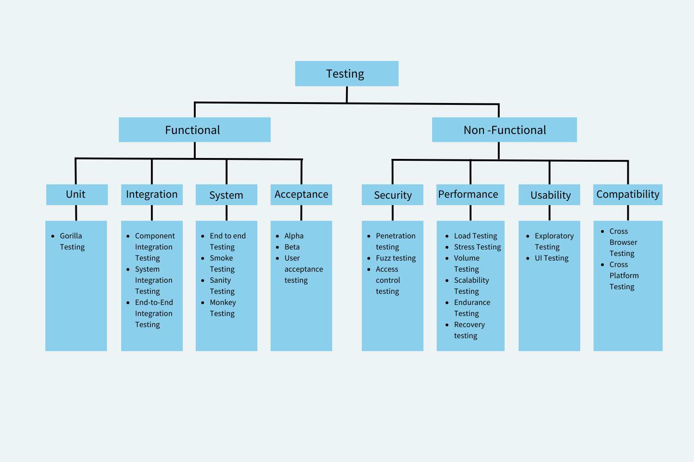

# Software Quality – Criteria, Metrics, Assurance & Techniques

This document is a comprehensive study guide for **D11: Software Quality**, following the official slides and extended with examples, developer-oriented notes, and professional clarification of concepts.

- [Software Quality – Criteria, Metrics, Assurance \& Techniques](#software-quality--criteria-metrics-assurance--techniques)
  - [Motivation for Software Quality](#motivation-for-software-quality)
  - [Standards and Structural Characteristics](#standards-and-structural-characteristics)
    - [ISO/IEC 5055:2021](#isoiec-50552021)
    - [CISQ Structural Characteristics](#cisq-structural-characteristics)
  - [Software Quality Factors (ISO/IEC 25010)](#software-quality-factors-isoiec-25010)
    - [Usability](#usability)
    - [Reliability](#reliability)
    - [Efficiency](#efficiency)
    - [Reusability](#reusability)
    - [Maintainability](#maintainability)
    - [Testability](#testability)
  - [🧠 Shneiderman’s 8 Golden Rules for UI Design](#-shneidermans-8-golden-rules-for-ui-design)
  - [Static vs Dynamic Quality Assessment](#static-vs-dynamic-quality-assessment)
    - [Dynamic Analysis](#dynamic-analysis)
  - [🧪 Testing Taxonomy](#-testing-taxonomy)
    - [By Nature](#by-nature)
    - [By Level](#by-level)
    - [By Strategy](#by-strategy)
  - [Non-Functional Testing Examples](#non-functional-testing-examples)
  - [Key Metrics and Tools](#key-metrics-and-tools)
    - [Cyclomatic Complexity](#cyclomatic-complexity)
    - [SonarQube Rule Categories](#sonarqube-rule-categories)
  - [Vulnerabilities](#vulnerabilities)
  - [Technical Debt](#technical-debt)
  - [Summary Table: Static vs Dynamic](#summary-table-static-vs-dynamic)
  - [Final Notes](#final-notes)

---

## Motivation for Software Quality

Software quality is driven by two major reasons:

1. **Software failures cause more than inconvenience** — they can result in loss of life, financial damage, or reputation loss.
2. **High-quality software is cheaper to maintain**, easier to understand, and faster to modify in response to business needs.

> 📝 _Hint Dev (ES):_ Cuanto más limpio y comprensible sea tu código hoy, menos sorpresas y “bugs tendrás mañana.

---

## Standards and Structural Characteristics

### ISO/IEC 5055:2021

This standard defines four business-critical structural factors:

- **Security** – Protects the software from vulnerabilities and malicious attacks.
- **Reliability** – Ensures the system performs under predefined conditions for a period.
- **Performance Efficiency** – Delivers functionality with optimal use of resources.
- **Maintainability** – Facilitates understanding, fixing, and improving the software.

### CISQ Structural Characteristics

The **Consortium for IT Software Quality (CISQ)** adds a fifth desirable factor:

- 📏 **Adequate Size** – A healthy ratio between code volume and delivered functionality.

---

## Software Quality Factors (ISO/IEC 25010)

| Factor              | Description                                                                         |
| ------------------- | ----------------------------------------------------------------------------------- |
| **Usability**       | Ability of a system to help users perform tasks safely, effectively, and enjoyably. |
| **Reliability**     | Probability of failure-free operation in a given time and environment.              |
| **Efficiency**      | Adequate performance relative to resources used.                                    |
| **Reusability**     | Capability to reuse code/components in new applications.                            |
| **Maintainability** | Degree to which an application can be understood, modified, or enhanced.            |
| **Portability**     | Ease of adapting the software to different platforms/OSes.                          |
| **Testability**     | Degree to which the software allows for efficient, systematic testing.              |

### Usability

Usability can be described as the capacity of a system to provide a condition for its users to perform the tasks safely, effectively, and efficiently while enjoying the experience.

### Reliability

Software reliability is the probability of failure-free operation of a computer program for a specified period in a specified environment.

### Efficiency

Efficiency is the software ability to provide appropriate performance, relative to the amount of resources used, under stated conditions at a given point in time.

### Reusability

Reusability is the capacity to repurpose pre-existing code when developing new software applications.

### Maintainability

Software portability is a characteristic attributed to a computer program if it can run with minimal rework on operating systems (OSes) other than the one for which it was created

### Testability

Software testability is the degree to which a software artifact (i.e. a software system, software module, requirements- or design document) supports testing in a given test context.

> 📝 _Hint Dev (ES):_ “¿Podré testearlo?” = pregunta fundamental cuando diseñas una clase o servicio.

---

## 🧠 Shneiderman’s 8 Golden Rules for UI Design

1. **Strive for consistency** – Visual, terminology, layout consistency reduces user confusion.

   - Familiar icons, colors, menu hierarchy, call-to-actions,
   - Users are able to apply knowledge from one click to another.
   - Identical terminology
   - Exceptions, such as required confirmation of the delete command or no echoing of passwords, should be comprehensible and limited in number

2. **Seek universal usability** – Address diversity (novices, experts, disabilities, international users).

   - Novice to expert differences, age ranges, disabilities, international variations, and technological diversity each enrich the spectrum of requirements that guides design.
   - Adding features for novices, such as explanations, and features for experts, such as shortcuts and faster pacing.
   - Enable frequent users to use shortcuts. With increased use comes the demand for quicker methods of completing tasks.

3. **Offer informative feedback** – Responses for every action; proportionate to its importance.

   - For every user action, there should be an appropriate,
   - For frequent and minor actions, the response can be modest.
   - For infrequent and major actions, the response should be more substantial.
   - Visual presentation of the objects of interest provides a convenient environment for showing changes explicitly.

4. **Design dialogues for closure** – Clear start–middle–end in action sequences.

   - Sequences of actions should be organized into groups with a beginning, middle, and end.
   - Informative feedback at the completion of a group of actions gives users the satisfaction of accomplishment.
   - Don’t keep your users guessing. Tell them what their action has led them to.

5. **Offer simple error handling** – Prevent errors; support easy, informative recovery paths.

   - As much as possible, design the interface so that users cannot make serious errors.
   - If users make an error, the interface should offer simple, constructive, and specific instructions for recovery.
   - Erroneous actions should leave the interface state unchanged, or the interface should give instructions about restoring the state.

6. **Permit easy reversal of actions** – Enable undo or rollback to reduce fear of exploration.

   - As much as possible, actions should be reversible.
   - This feature relieves anxiety, since users know that errors can be undone, and encourages exploration of unfamiliar options.
   - The units of reversibility may be a single action , a dataentry task, or a complete group of actions, such as entry of a name-address block.
   - Designers should aim to offer users obvious ways to reverse their actions. These reversals should be permitted at various points whether it occurs after a single action, a data entry or a whole sequence of actions.

7. **Support internal locus of control** – Let users feel in control; avoid surprises.

   - Experienced users strongly desire the sense that they are in charge of the interface and that the interface responds to their actions.
   - They don’t want surprises or changes in familiar behavior, and they are annoyed by tedious data-entry sequences, difficulty in obtaining necessary information, and inability to produce their desired result.
   - Avoid surprises, interruptions, or anything that hasn’t be prompted by the users.
   - Allow your users to be the initiators of actions.
   - In personality psychology, locus of control is the degree to which people believe that they have control over the outcome of events

8. **Reduce short-term memory load** – Don’t force users to remember info between screens.

   - Humans’ capacity for information processing in short-term memory is limited (people can remember “seven plus or minus two chunks” of information).
   - This requires that designers avoid interfaces in which users must remember information from one display and then use that information on another display.
   - Choose recognition over recall.

> 💡 _Example:_ Confirmation before delete + undo = golden rule combo.

---

## Static vs Dynamic Quality Assessment

**Static Analysis**

- **Definition:** Examines source code without executing it.
- **Goals:** Find errors, vulnerabilities, non-compliance early.
- **Techniques:** Code reviews, linters, model checking.
- **Tools:** SonarQube, ESLint, FindBugs

**Advantages:**

- No runtime required.
- Full-path coverage.
- Detects type, syntax, style, and structure issues.

**Limitations:**

- False positives.
- Doesn’t detect runtime behaviors.
- Limited insight into performance or external environment.

---

### Dynamic Analysis

- **Definition:** Assesses the software while it runs.
- **Focus:** Behavior under real workloads or test cases.
- **Techniques:** Unit, integration, system, performance testing.
- **Tools:** JMeter, Selenium, profilers.

**Advantages:**

- Detects runtime defects (memory leaks, bottlenecks, concurrency).
- Reflects real user behavior and environments.

**Limitations:**

- Requires deployment/test cases.
- Doesn’t cover all execution paths.
- More resource-intensive.

---

## 🧪 Testing Taxonomy

### By Nature

| Type               | Focus                                                  |
| ------------------ | ------------------------------------------------------ |
| **Functional**     | Verifies that software behaves as specified (features) |
| **Non-functional** | Evaluates qualities like speed, security, usability    |

### By Level

- **Unit Testing** – Individual functions/modules
- **Integration Testing** – Interfaces between units
- **System Testing** – End-to-end feature behavior
- **Acceptance Testing** – Stakeholder/client validation

---

- **Functional testing** ensures that each discrete function of a software application operates according to requirement.
- **Non-functional testing** focuses on the software's attributes, such as security, performance, and scalability, rather than specific behaviors.
- **Unit testing** is the process of verifying the smallest testable parts of an application, individually and independently.
- **Integration testing** involves combining individual units of code and testing them as a group to uncover interface defects between the units.
- **System testing** is a holistic testing process that evaluates the complete system's compliance with specified requirements.
- **Incremental testing** refers to testing an application step by step with incremental builds, where modules are added one by one to check for proper functionality.
- **Non-incremental testing** is a method where the entire software system is tested as a whole after all the components are developed.
- **Performance testing** assesses how well the software performs under specific conditions, focusing on responsiveness and stability under a particular workload.
- **Usability testing** evaluates how user-friendly, efficient, and convenient the software is for end-users.
- **Compatibility testing** checks if the software can run in different browsers, databases, hardware, operating systems, mobile devices, and networks.
- **Load testing** examines the software's behavior under normal load conditions to ensure it can handle anticipated usage.
- **Stress testing** is used to evaluate how the software behaves under extreme conditions, often beyond its operational capacity.
- **Scalability testing** determines if the software application can handle projected increases in user traffic or data volume.
- **Stability testing** checks if the application remains stable over prolonged periods under normal load conditions.

### By Strategy

- **Incremental Testing** – Build → test → extend → retest
- **Non-incremental Testing** – Full app tested post-build

---

## Non-Functional Testing Examples

| Test Type         | Purpose                                  |
| ----------------- | ---------------------------------------- |
| **Performance**   | Speed under expected load                |
| **Usability**     | User experience, intuitiveness           |
| **Compatibility** | Runs across platforms, browsers, devices |
| **Load**          | Stability under expected usage volume    |
| **Stress**        | Behavior beyond normal capacity          |
| **Scalability**   | Growth in users/data                     |
| **Stability**     | Long-term reliability under normal use   |

---

**Functional vs Structural Quality**

| Aspect        | Functional Quality                                     | Structural Quality                       |
| ------------- | ------------------------------------------------------ | ---------------------------------------- |
| Definition    | Meets defined functional requirements                  | Enables and supports functional delivery |
| Evaluated via | Mainly dynamic testing                                 | Mainly static analysis                   |
| Examples      | Correct login behavior                                 | Modular architecture, secure code        |
| Edge Cases    | Some overlaps: usability = dynamic, reliability = both |

> 📝 _Hint Dev (ES):_ Fiabilidad depende también del hardware, así que no todo es código: prueba tu sistema en entornos reales.

**Vulnerabilities**: A software vulnerability is a defect in software that could allow an attacker to gain control of a system. These defects can be because of the way the software is designed, or because of a flaw in the way that it's coded.

---

## Key Metrics and Tools

### Cyclomatic Complexity

Quantitative metric used to calculate the number of paths through the code. Whenever the control flow of a function splits, the complexity counter gets incremented by one. Each function has a minimum complexity of 1.

- Quantifies the number of decision paths in a function.
- Formula: `#Edges - #Nodes + 2`
- Higher = harder to test

> 📝 _Hint Dev (ES):_ Si una función tiene más de 10 caminos, probablemente necesita ser dividida.

---

### SonarQube Rule Categories

| Rule Type            | Domain                          |
| -------------------- | ------------------------------- |
| **Code Smell**       | Maintainability                 |
| **Bug**              | Reliability                     |
| **Vulnerability**    | Security                        |
| **Security Hotspot** | Risk-prone logic needing review |

---

## Vulnerabilities

- Software flaws that can be exploited for unauthorized access or manipulation.
- May stem from:
  - Design issues (e.g. improper auth logic)
  - Coding mistakes (e.g. SQL injection)

---

## Technical Debt

- **Definition:** Cost of quick-and-dirty code that needs refactoring later.
- **Types:** Intentional (shortcut for deadline), unintentional (poor practice).
- **Effect:** Accrues “interest” — harder to change/test/scale later.

- Extra developmental work that arises when code that is easy to implement in the short run is used instead of applying the best overall solution.
- It occurs as the result of a "**build now, fix later**" mentality.
- **Leaders delay features and functionality, cut corners, or settle for suboptimal performance to push the project forward**.
- In software engineering, tech debt is sometimes called code debt.
- Technical debt is like a financial debt that incurs interest, *making it more costly to fix the issue later than it would have been to do it right the first time*.

**Examples:**

- Skipping tests
- Hardcoded config
- Overly coupled modules

> 📝 _Hint Dev (ES):_ Aceptar deuda técnica a veces es válido… si la documentas y luego la pagas.

---

## Summary Table: Static vs Dynamic

| Category      | Static Analysis            | Dynamic Analysis             |
| ------------- | -------------------------- | ---------------------------- |
| Code required | Source code only           | Executable version needed    |
| Focus         | Structure, standards, bugs | Behavior, runtime conditions |
| Tools         | Linters, SonarQube         | Selenium, profilers, JMeter  |
| Coverage      | Full theoretical paths     | Based on test coverage       |
| Cost          | Lower                      | Higher                       |

---

## Final Notes

Software quality is more than "it works". It means:

- It’s safe.
- It scales.
- It performs.
- It evolves easily.
- It _makes users happy_.

> “Testing is not a phase — it's a mindset.”

---
