# 08. Standards

Modern projects rarely succeed on inspiration alone; they succeed because team members share a common language, set of expectations, and repeatable practices. That shared foundation is what a standard or methodology provides.

- [08. Standards](#08-standards)
  - [1. What Are Project Management Standards?](#1-what-are-project-management-standards)
  - [2. Métrica 3](#2-métrica-3)
  - [3. PRINCE2](#3-prince2)
  - [4. Scrum](#4-scrum)
  - [5. Extreme Programming (XP)](#5-extreme-programming-xp)
  - [6. Lean Software Development](#6-lean-software-development)
  - [7. Kanban](#7-kanban)
  - [8. PMBOK](#8-pmbok)
    - [Process Groups](#process-groups)
    - [Knowledge Areas](#knowledge-areas)
    - [Data / Information / Reports](#data--information--reports)
    - [Responsibility assignment matrix](#responsibility-assignment-matrix)
  - [Final Notes](#final-notes)

---

## 1. What Are Project Management Standards?

**Project Management Standards** are structured frameworks that guide how projects are initiated, planned, executed, monitored, and closed. Their purpose is to ensure repeatability, quality, and alignment with business goals.

**Why They Matter:**

- **Consistency:** Prevents reinventing the wheel with every project.
- **Efficiency:** Reduces miscommunication and wasted effort.
- **Accountability:** Defines clear roles, responsibilities, and deliverables.
- **Scalability:** Makes it easier to manage projects of varying complexity.

---

## 2. Métrica 3

**Purpose:** Designed for information systems in Spain's public sector.

**Definition:** A methodology for the planning, development, and maintenance of Information Systems (IS).

- An Information System is a set of data which interact for a common goal.
- Computer information systems help manage, collect, process, store and distribute relevant information for the fundamental process and the particularities of each organization.

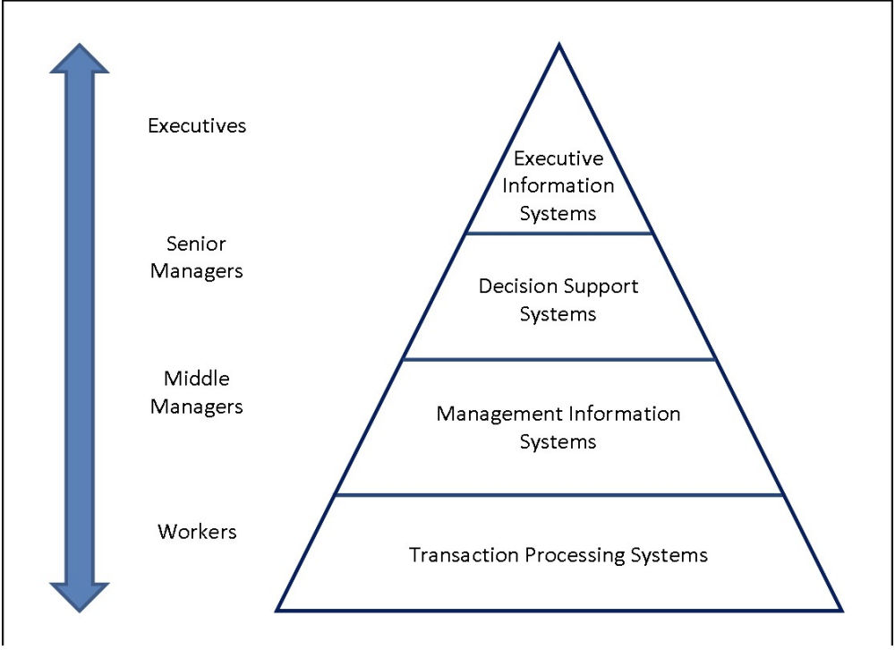

**Key Foundations:**

- Based on ISO/IEC 12207 (Software Life Cycle Processes)
- Inspired by ISO/IEC 15504 (SPICE – Software Process Improvement and Capability Determination)

**Structure:** Métrica 3 divides the system lifecycle into defined phases, each with specific deliverables and quality gates.

**Example Workflow (Diseño Técnico Phase):**

- **Inputs:** Validated functional requirements
- **Tasks:**
  - Define logical architecture
  - Design physical data model
  - Specify user interfaces
- **Outputs:**
  - Technical Design Document
  - UI Prototype
- **Control:** Quality assurance review before development begins

**Advantages:**

- Strong alignment with legal and procedural requirements in public administration
- Emphasis on traceability and documentation

---

## 3. PRINCE2

**Full Name:** **PR**ojects **IN** **C**ontrolled **E**nvironments (version 2)

**Origin:** UK Office of Government Commerce

**Goal:** Provide a standardized approach for managing and controlling projects throughout their lifecycle.

**Structure:**

- Emphasizes well-defined stages and roles
- Management organized into:
  - Corporate/Program Management
  - Project Direction
  - Project Management
  - Team Delivery

**Core Processes:**

1. Starting Up a Project
2. Initiating a Project
3. Managing Stage Boundaries
4. Controlling a Stage
5. Managing Product Delivery
6. Closing a Project
7. Directing a Project

Model diagram and processes:

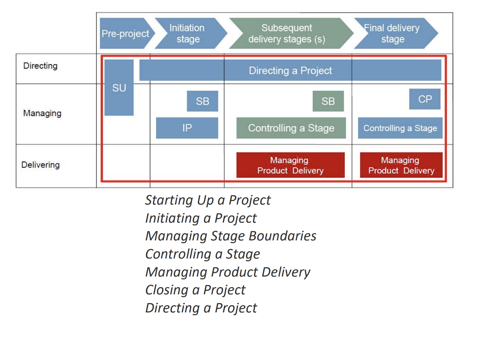

**Strengths:**

- Business Case at the center of every decision
- Facilitates formal reviews at each stage (stage boundaries)
- Adaptable to both traditional and agile projects

---

## 4. Scrum

**Type:** Agile methodology

**Core Characteristics:**

- Iterative and incremental delivery
- Short, time-boxed development cycles (sprints)
- Adaptability to changing requirements

**Key Roles:**

- **Product Owner:** Manages the product backlog and priorities
- **Scrum Master:** Facilitates the process and removes obstacles
- **Developers/Testers:** Implement and test features

**Artifacts and Tools:**

- Product Backlog
- Sprint Backlog
- Task Board
- Burndown Chart

**Sprint Workflow:**

1. Sprint Planning
2. Daily Scrum
3. Sprint Review
4. Sprint Retrospective

**General view**

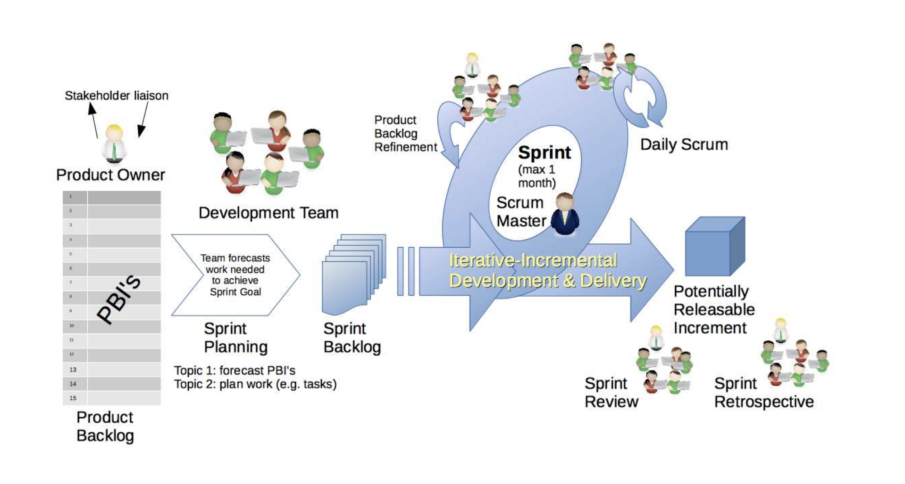

**Task Board Example:**

| Story  | To Do  | In Progress | To Verify | Done   |
| ------ | ------ | ----------- | --------- | ------ |
| Task A | Task B | Task C      | Task D    | Task E |
| Task F | Task G |             |           |        |
| Task H |        |             |           |        |
| Task I |        |             |           |        |
| Task J |        |             |           |        |

**Use Cases:** Fast-changing product environments, startups, feature-driven development

**Burndown Chart Example:**

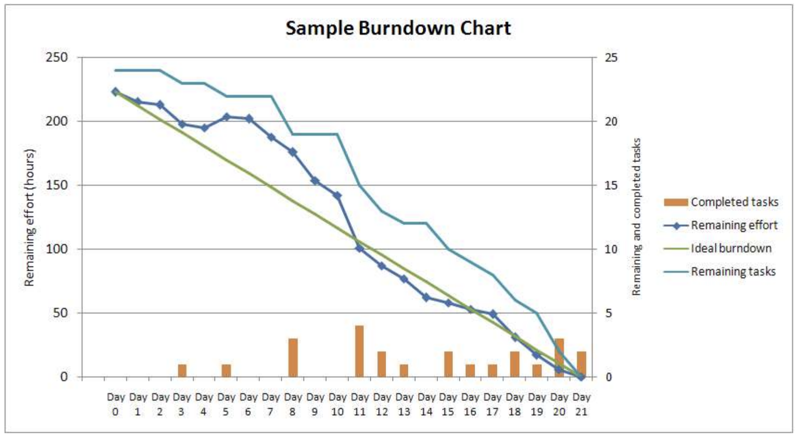

Purpose: Visualize work completed versus work remaining in a sprint

**Classical vs. Agile Scrum:**

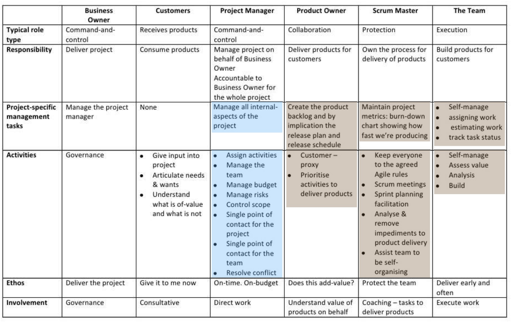

---

## 5. Extreme Programming (XP)

**Focus:** Software engineering practices for high-quality code

**Principles:**

- Test-Driven Development (TDD)
- Pair Programming
- Continuous Integration (CI)
- Frequent releases

**General View:**

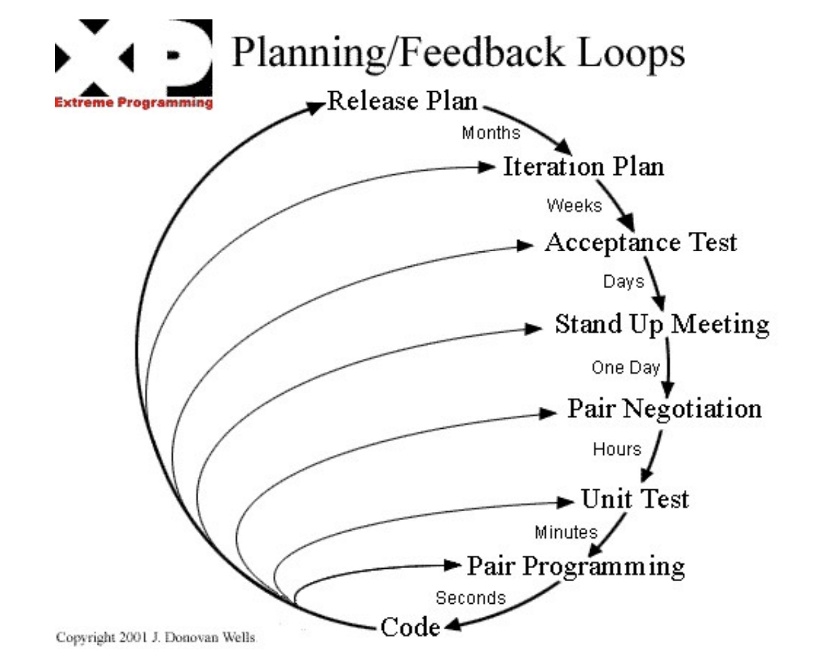

**Why Use It?**

- Encourages technical excellence
- Enables rapid response to customer feedback
- Reduces bugs through frequent testing and code reviews

**Example:** Two developers working together to write a test before implementing a feature, switching roles periodically.

---

## 6. Lean Software Development

**Inspiration:** Toyota Production System

**Core Principles:**

- Eliminate waste: Anything that does not add value to the customer

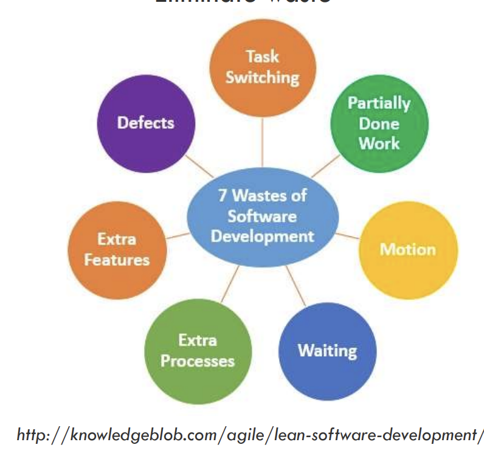

- Amplify learning: Encourage experimentation and feedback
- Deliver as fast as possible: Shorten cycle times
- Empower the team: Encourage self-organization and decision-making
- Build integrity in: Focus on quality at every stage
- Decide as late as possible: Keep options open until the last responsible moment
- See the whole: Understand the entire value stream

**Common Wastes Eliminated:**

- Partially done work
- Extra processes
- Handoffs
- Delays
- Defects

**Benefit:** Increases flow efficiency and delivers customer value faster

---

## 7. Kanban

**Focus:** Visualize workflow and limit Work In Progress (WIP)

**Principles:**

- Start with what you do now
- Agree to pursue incremental, evolutionary change
- Respect current roles and responsibilities

**Practices:**

- Visual task boards (e.g., columns for To Do → In Progress → Done)
- WIP limits to reduce multitasking and bottlenecks

**Example Kanban Board:**

| To Do  | In Progress (WIP 2) | Review (WIP 1) | Done   |
| ------ | ------------------- | -------------- | ------ |
| Task A | Task B              |                | Task D |
| Task C |                     | Task E         | Task F |

**Use Cases:** Maintenance, support, DevOps

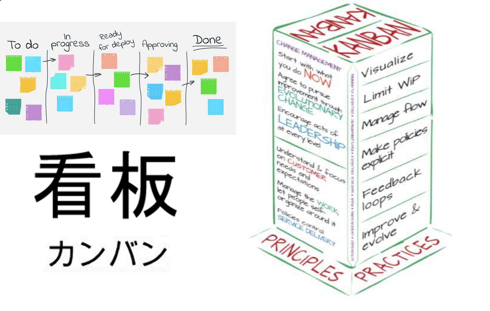

---

## 8. PMBOK

A project is a temporary endeavor undertaken to create a unique product, service, or result. A project is temporary in that it has a defined beginning and end in time, and therefore defined scope and resources. A project is unique in that it is not a routine operation, but a specific set of operations designed to accomplish a singular goal.

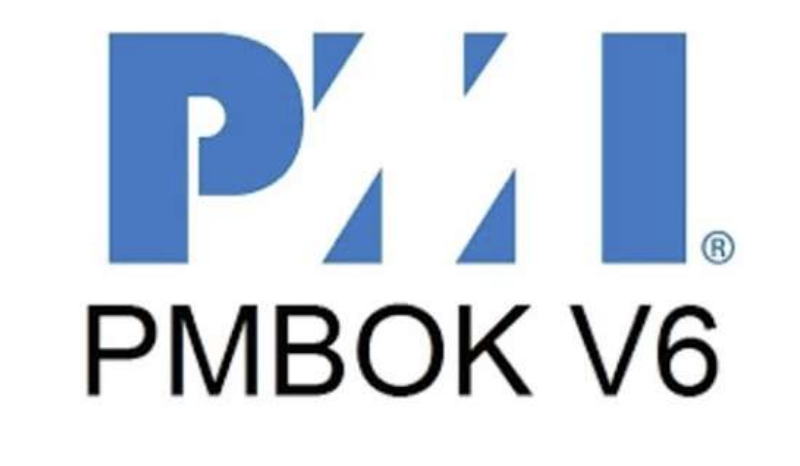

**Full Name:** Project Management Body of Knowledge  
**Published by:** PMI (Project Management Institute)

**Definition:** A collection of processes, best practices, terminologies, and guidelines for managing projects.

- **Unique product, service or result**. Projects are undertaken to fulfill objectives by producing deliverables. Deliverables are the outputs of the project that are produced to satisfy the project requirements.
- **An objetive** is defined as an outcome toward which work is to be directed, a strategic position to be attained, a purpose to be achieved, a result to be obtained, a product to be produced, or a service to be performed.
- **A deliverable** is defined as any unique and verifiable product, result, or capability to perform a service that is required to be produced to complete a process, phase or project.
- **Deliverables** may be tangible or intangible, and may be an outcome of a process or a component of another deliverable.

**Core Concepts:**

- **Project:** Temporary endeavor producing a unique result
- **Deliverables:** Verifiable outputs required by the project
- **Phases:** Stages like initiation, planning, execution, monitoring, closing

**Three Contexts of Project Work:**

- **Project:** One-off endeavor
- **Program:** Coordinated set of related projects
- **Portfolio:** Strategic grouping of programs and projects

**Project initiation context:**

- **Project:**
  - Create, improve or fix products, processes or services
  - Satisfy stakeholder needs and expectations
  - Implement or change business or technology strategies
  - Meet regulatory, legal or social requirements

- **Project / Program / Portfolio:**

  - A project may be managed in three separate scenarios:

    - as a stand-alone project (outside of a portfolio or program),
    - within a program,
    - or within a portfolio.

  - A **program** is defined as a group of related projects, subsidiary programs, and program activities managed in a coordinated manner to obtain benefits not available from managing them individually. Programs are not large projects. A very large project may be referred to as a megaproject.

  - A **portfolio** is defined as projects, programs, subsidiary portfolios, and operations managed as a group to achieve strategic objectives.

> Program and project management focus on doing programs and projects the "right way," while portfolio management focuses on doing the right programs and projects.

### Process Groups

1. Initiating
2. Planning
3. Executing
4. Monitoring and Controlling
5. Closing

**Components in the life cycle of a project:**

| Component                         | Description                                                                                                                                                                                                                                                           |
| --------------------------------- | --------------------------------------------------------------------------------------------------------------------------------------------------------------------------------------------------------------------------------------------------------------------- |
| Project life cycle                | A collection of logically related project activities that culminates in the completion of one or more deliverables.                                                                                                                                                   |
| Project phase                     | A review at the end of a phase in which a decision is made to continue to the next phase, to continue with modification, or to end a program or project.                                                                                                              |
| Phase gate                        | A systematic series of activities directed toward causing an end result where one or more inputs will be acted upon to create one or more outputs.                                                                                                                    |
| Project management processes      | A logical grouping of project management inputs, tools and techniques, and outputs. The Project Management Process Groups include Initiating, Planning, Executing, Monitoring and Controlling, and Closing. Project Management Process Groups are not project phases. |
| Project Management Process Group  | A logical grouping of project management processes.                                                                                                                                                                                                                   |
| Project Management Knowledge Area | An identified area of project management defined by its knowledge requirements and described in terms of its component processes, practices, inputs, outputs, tools, and techniques.                                                                                  |

**Knowledge Areas (examples):**

- Scope, Time, Cost, Quality, Resource, Communication, Risk, Procurement, Stakeholder Management

**Process groups**

A **Project Management Process Group** is a logical grouping of project management processes to achieve specific project objectives. Process Groups are independent of project phases. Project management processes are grouped into the following five Project Management Process Groups:

- **Initiating Process Group**. Those processes performed to define a new project or a new phase of an existing project by obtaining authorization to start the project or
  phase.
- **Planning Process Group**. Those processes required to establish the scope of the project, refine the objectives, and define the course of action required to attain the objectives that the project was undertaken to achieve.
- **Executing Process Group**. Those processes performed to complete the work defined in the project management plan to satisfy the project requirements.
- **Monitoring and Controlling Process Group**. Those processes required to track, review, and regulate the progress and performance of the project; identify any areas in which changes to the plan are required; and initiate the corresponding changes.
- **Closing Process Group**. Those processes performed to formally complete or close the project, phase, or contract.

**Process Types**

The number of process iterations and interactions between processes varies based on the needs of the project. Processes generally fall into one of three categories:

- **Processes used once or at predefined points in the project**. The processes Develop Project Charter and Close Project or Phase are examples.
- **Processes that are performed periodically as needed**. The process Acquire Resources is performed as resources are needed. The process Conduct Procurements is performed prior to needing the procured item.
- **Processes that are performed continuously throughout the project**. The process Define Activities may occur throughout the project life cycle, especially if the project uses rolling wave planning or an adaptive development approach. Many of the monitoring and control processes are ongoing from the start of the project, until it is closed out.

### Knowledge Areas

PMBOK defines **10 Knowledge Areas**, each representing a critical domain of project management expertise. These areas span all five process groups: Initiating, Planning, Executing, Monitoring & Controlling, and Closing.

- 1. **Integration Management**: Includes the processes and activities to identify, define, combine, unify, and coordinate the various project management processes.
- 2. **Schedule Management**: Includes the processes required to manage the timely completion of the project.
- 3. **Quality Management**: Includes the processes for incorporating the organization’s quality policy regarding planning, managing, and controlling project and product quality requirements to meet stakeholders’ expectations.
- 4. **Communication Management**: Includes the processes required to define, manage, and control the project communication needs as defined by stakeholders.
- 5. **Procurement Management**: Includes the processes necessary to purchase or acquire products, services, or results needed from outside the project team.
- 6. **Scope Management**: Includes the processes required to ensure the project includes all the work required—and only the work required—to complete the project successfully.
- 7. **Cost Management**: Includes the processes involved in planning, estimating, budgeting, financing, funding, managing, and controlling costs to complete the project within the approved budget.
- 8. **Resource Management**: Includes the processes to identify, acquire, and manage the resources needed for the successful completion of the project.
- 9. **Risk Management**: Includes the processes of conducting risk management planning, identification, analysis, response planning, response implementation, and monitoring risk on a project.
- 10. **Stakeholder Management**: Includes the processes to identify stakeholders, analyze their expectations, their impact on the project, and develop effective engagement strategies.

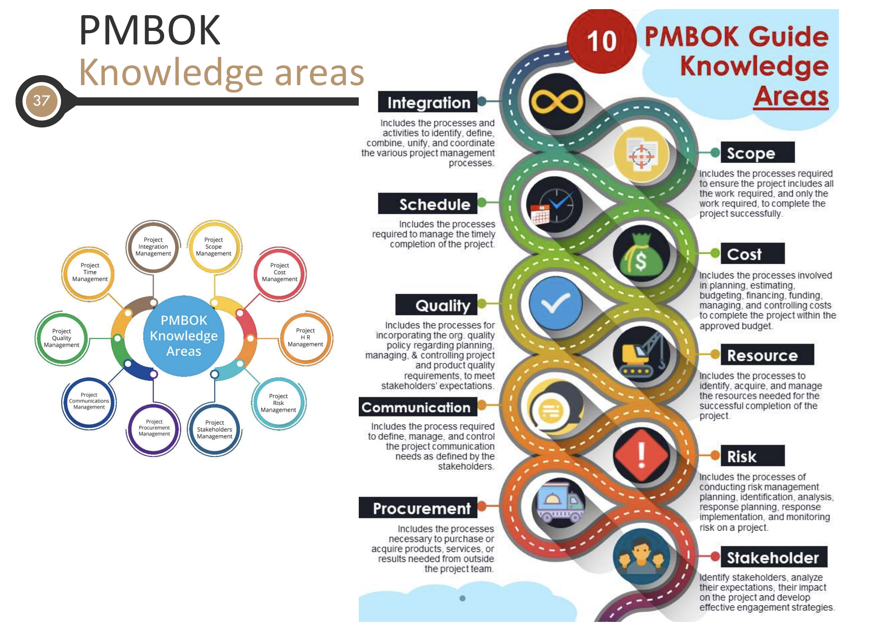

> 📚 **Tip:** These knowledge areas are often represented in RACI matrices, process group mappings, and planning templates within PMBOK-aligned methodologies.

**Processes according to group and area**

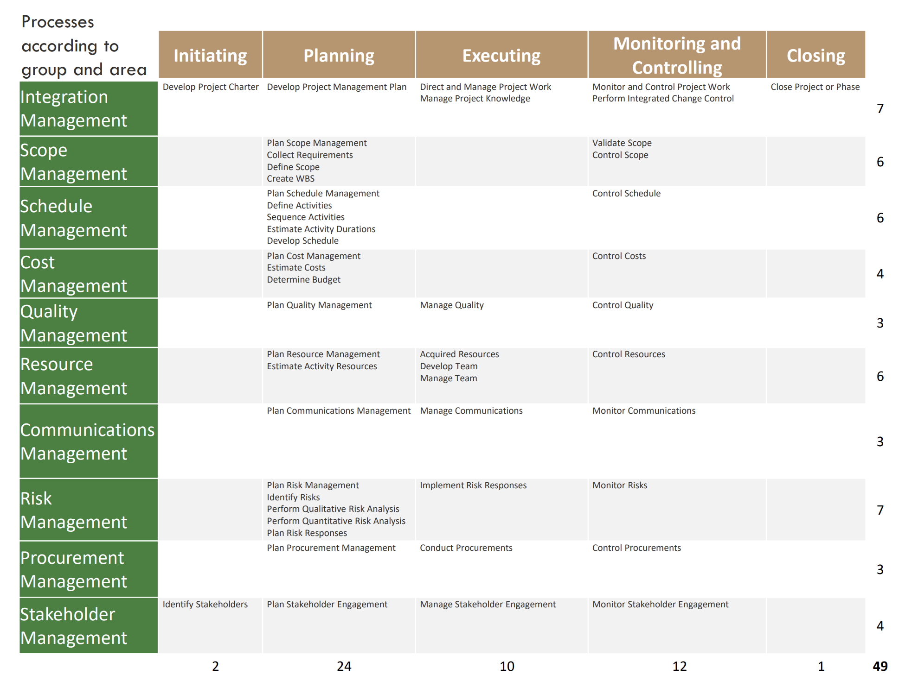

This image shows a matrix that maps all the 49 project management processes defined by the PMBOK Guide. It organizes them across two dimensions:

**Two Dimensions in the Matrix**

1. Process Groups (Columns) – These represent the phases of a project lifecycle:

| Group                    | Description                                               |
| ------------------------ | --------------------------------------------------------- |
| Initiating               | Defining and authorizing the project                      |
| Planning                 | Setting the scope, objectives, and course of action       |
| Executing                | Completing the work defined in the plan                   |
| Monitoring & Controlling | Tracking progress and making corrections                  |
| Closing                  | Finalizing everything and formally completing the project |

2. Knowledge Areas (Rows) – These represent specialized domains of knowledge:

| Knowledge Area            | Examples of Topics                         |
| ------------------------- | ------------------------------------------ |
| Integration Management    | Coordination of processes and stakeholders |
| Scope Management          | Defining what's in/out of the project      |
| Schedule Management       | Time estimation and scheduling             |
| Cost Management           | Budgeting and controlling costs            |
| Quality Management        | Ensuring outputs meet standards            |
| Resource Management       | Team building, equipment planning          |
| Communications Management | Who talks to whom, when, and how           |
| Risk Management           | Planning for uncertainty                   |
| Procurement Management    | Buying from outside suppliers              |
| Stakeholder Management    | Managing stakeholder expectations          |

**How to Read the Matrix**

The matrix represents the intersection of process groups and knowledge areas. Each cell contains a specific process that belongs to both a process group and a knowledge area. For example:

- **Process**: "Develop Project Charter"
- **Location**: Row (Integration) × Column (Initiating)
- **Meaning**: This is an Integration process performed during the Initiating phase

**Key Points**

- **Rows** represent the type of activity (e.g., quality management, risk management, communication)
- **Columns** indicate when in the project lifecycle the activity occurs (initiating, planning, executing, etc.)

**Helpful Example**

Let’s say you’re in the Executing phase and want to handle people and resources:

- Go to the Executing column
- Find Resource Management row
- You’ll see:
  - Acquire Resources
  - Develop Team
  - Manage Team

These are your actions to manage human and physical resources during execution.

**RACI Matrix (Responsibility Assignment):**

| Task             | Responsible | Accountable   | Consulted     | Informed        |
| ---------------- | ----------- | ------------- | ------------- | --------------- |
| Sprint Demo      | Dev Team    | Product Owner | UX Lead       | Stakeholders    |
| Release Decision | QA Lead     | CTO           | Ops, Security | All departments |

### Data / Information / Reports

- **Work performance data.** The raw observations and measurements identified during activities performed to carry out the project work. Examples include reported percent of work physically completed, quality and technical performance measures, start and finish dates of schedule activities, number of change requests, number of defects, actual costs, actual durations, etc.

- **Work performance information.** The performance data collected from various controlling processes, analyzed in context and integrated based on relationships across areas. Examples of performance information are status of deliverables, implementation status for change requests, and forecast estimates to complete.

- **Work performance reports.** The physical or electronic representation of work performance information compiled in project documents, which is intended to generate decisions or raise issues, actions, or awareness. Examples include status reports, memos, justifications, information notes, electronic dashboards, recommendations, and updates.

### Responsibility assignment matrix

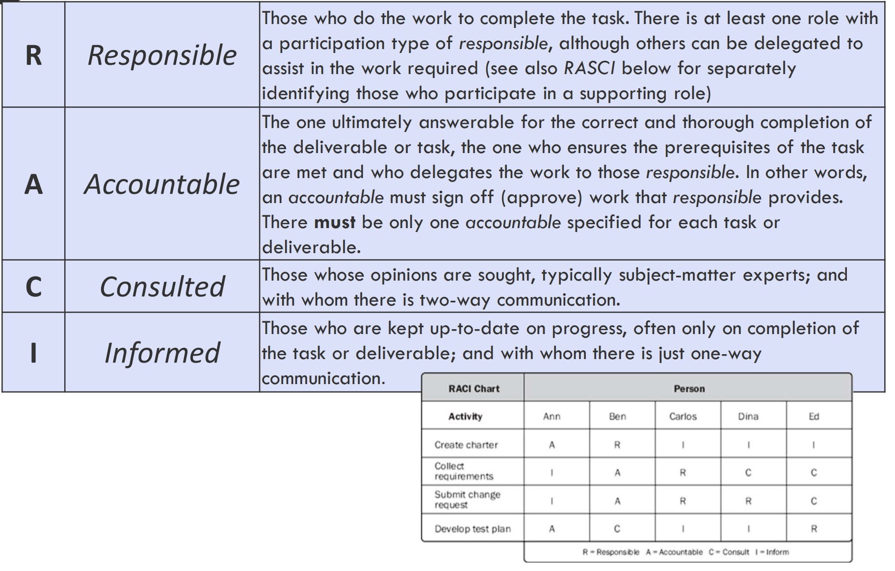

This image explains the RACI Matrix—a fundamental tool in project management used to assign roles and responsibilities for tasks and deliverables.

**What is the RACI Matrix?**

RACI is an acronym that breaks down responsibilities into four categories:

| Letter | Role        | Description                                                                                                             |
| ------ | ----------- | ----------------------------------------------------------------------------------------------------------------------- |
| R      | Responsible | The person(s) who actually do the work to complete the task. There must be at least one "R" per task.                   |
| A      | Accountable | The person who is ultimately answerable for the task. They approve work and ensure it's completed. Only one A per task. |
| C      | Consulted   | People who provide input and are consulted before a decision or action. Involves two-way communication.                 |
| I      | Informed    | People who are kept up to date on progress or results. Involves one-way communication.                                  |

**Key Rules of RACI**

- ✅ One A per task – Only one person can be ultimately accountable.
- ✅ At least one R – Work won’t get done unless someone is responsible.
- 🚫 Don’t overload with too many Cs or Is—it creates bottlenecks or noise.
- 🔁 R can be delegated, but A cannot be shared.

**Example Mini-RACI Table (from image)**

| Task                  | Ann | Ben | Carlos | Dina | Ed  |
| --------------------- | --- | --- | ------ | ---- | --- |
| Create charter        | A   | R   |        | I    |     |
| Collect requirements  | I   | A   | C      | R    |     |
| Submit change request | C   | A   | R      |      |     |
| Develop test plan     | R   | C   | A      |      |     |

R = Responsible ; A = Accountable ; C = Consulted ; I = Informed

Explanation:

- For “Create charter,” Ben is Responsible for drafting, Ann is Accountable for approving, and Ed is just Informed.
- For “Develop test plan,” Dina is Accountable, Carlos is Consulted, and Ann is Responsible for doing the work.

🛠️ When to Use a RACI Matrix

- At project kickoff: clarify who does what
- For cross-functional teams
- When tasks have multiple stakeholders
- To avoid confusion or duplicate work

---

## Final Notes

**How to Choose a Methodology:**

- Consider project size, complexity, stakeholder involvement, and regulatory needs
- Tailor your approach—don’t apply a standard blindly

**Tip for Exams & Real Projects:**

- Use Métrica 3 for public IT projects in Spain
- Use Scrum or XP in fast-paced product teams
- Use PRINCE2 when control and documentation are key
- Use Lean or Kanban for continuous delivery and maintenance
- Use PMBOK for comprehensive portfolio and program oversight

---
